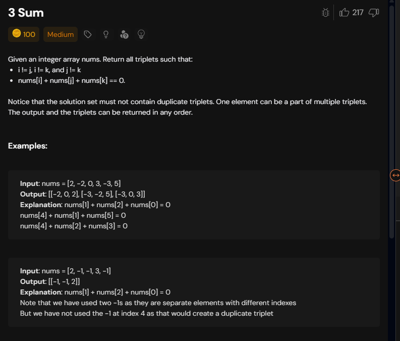
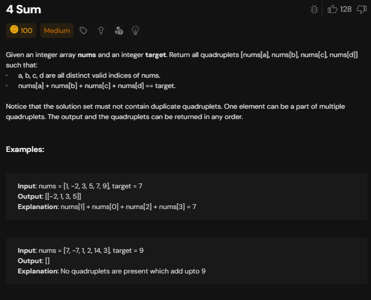

# Notes

## 3-sum 



```cpp

class Solution {
  void getAns(vector<vector<int>>& tres,vector<vector<int>>& res,int el){
        for(vector<int>temp:tres){
            res.push_back({el,temp[0],temp[1]});
        }
    }
    vector<vector<int>> twoSum(vector<int>& a,int tar,int si,int ei){
        vector<vector<int>> ans;
        while(si<ei){
            int sum=a[si]+a[ei];
            if(sum==tar){
                ans.push_back({a[si],a[ei]});
                si++;
                ei--;
                while(si<ei && a[si]==a[si-1]) si++;
                while(si<ei && a[ei]==a[ei+1]) ei--;
            }else if(sum>tar) ei--;
            else si++;
        }
        return ans;
    }
public:
    vector<vector<int>> threeSum(vector<int>& nums) {
        vector<vector<int>> res;
        int n = nums.size();
        sort(nums.begin(), nums.end());
        for(int i=0;i<n;){
           vector<vector<int>> tres= twoSum(nums,-nums[i],i+1,n-1);
           getAns(tres,res,nums[i]);
           i++;
           while(i<n && nums[i]==nums[i-1]) i++;
        }
        return res;
    }
};

```

Time Complexity:O(n log n) for sorting + O(n * n) for nested loops in threeSum and twoSum, resulting in O(n^2) overall.

Space Complexity:O(1) excluding the output array, as only a constant amount of extra space is used for variables. If we consider the space taken by the output array, then it will depend on the number of triplets formed. In the worst-case scenario, where many triplets are formed, the space complexity could be O(n^2).

## 4-sum using 3-sum



```cpp

class Solution {
    void getAns(vector<vector<int>>& tres,vector<vector<int>>& res,int el,bool threeSum){
        for(vector<int>temp:tres){
            if(threeSum==true) res.push_back({el,temp[0],temp[1]});
            else res.push_back({el,temp[0],temp[1],temp[2]});
        }
    }
    vector<vector<int>> twoSum(vector<int>& a,int tar,int si,int ei){
        vector<vector<int>> ans;
        while(si<ei){
            int sum=a[si]+a[ei];
            if(sum==tar){
                ans.push_back({a[si],a[ei]});
                si++;
                ei--;
                while(si<ei && a[si]==a[si-1]) si++;
                while(si<ei && a[ei]==a[ei+1]) ei--;
            }else if(sum>tar) ei--;
            else si++;
        }
        return ans;
    }
    vector<vector<int>> threeSum(vector<int>& nums,int si,int ei,int tar) {
        vector<vector<int>> res;
        for(int i=si;i<ei;){
           vector<vector<int>> tres= twoSum(nums,tar-nums[i],i+1,ei);
           getAns(tres,res,nums[i],true);
           i++;
           while(i<ei && nums[i]==nums[i-1]) i++;
        }
        return res;
    }
public:
    vector<vector<int>> fourSum(vector<int>& nums, int target) {
        vector<vector<int>> res;
        int n = nums.size();
        sort(nums.begin(), nums.end());
        for(int i=0;i<n;){
            vector<vector<int>> tres=threeSum(nums,i+1,n-1,target-nums[i]);
            getAns(tres,res,nums[i],false);
           i++;
           while(i<n && nums[i]==nums[i-1]) i++;
        }
        return res;
    }
};
```

Time Complexity:O(n^3) due to nested loops from fourSum, threeSum, and twoSum, with additional linear work in getAns.

Space Complexity:O(n) primarily due to the sorting algorithm's space usage.