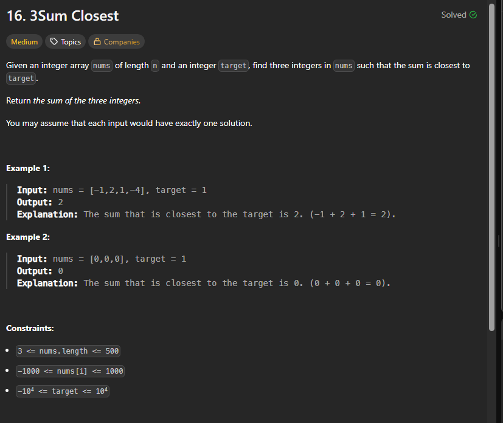

# Notes



```cpp
class Solution {
    int twoSum (int l,int r,int tar,vector<int>& arr){
        int tres=arr[l]+arr[r];
        while(l<r){
            int sum=arr[l]+arr[r];
            if(sum==tar) return sum;
            if(sum<tar) l++;
            else r--;
            if(abs(tar-sum)< abs(tar-tres)) tres=sum;
        }
        return tres;
    }
public:
    int threeSumClosest(vector<int>& nums, int tar) {
        int n=nums.size();
        int res=accumulate(nums.begin(), nums.begin()+3, 0);
        if(n==3){
            return res;
        }
        sort(nums.begin(),nums.end());
        for(int i=0;i<n-2;i++){
            int val=twoSum(i+1,n-1,tar-nums[i],nums);
            int tres=val+nums[i];
            if(tres==tar) return tres;
            if(abs(tar-tres)< abs(tar-res)) res=tres; 
        }
        return res;
    }
};
```

tc-->O(n*n)
sc-->O(1)

## Others solution just same but easy

```java
class Solution {
    public int threeSumClosest(int[] nums, int target) {
        Arrays.sort(nums);
        int n = nums.length;
        int result = nums[0] + nums[1] + nums[2]; // Initial best guess

        for (int i = 0; i < n - 2; i++) {
            int left = i + 1, right = n - 1;

            while (left < right) {
                int sum = nums[i] + nums[left] + nums[right];

                if (Math.abs(target - sum) < Math.abs(target - result)) {
                    result = sum;
                }

                if (sum == target) return target;
                else if (sum < target) left++;
                else right--;
            }
        }

        return result;
    }
}
```