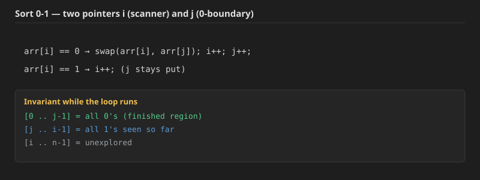
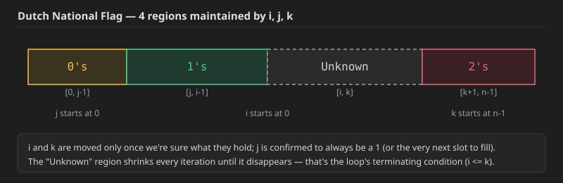

## Q1. Sort an array of 0s and 1s

**Problem:** Given a binary array (containing only `0`s and `1`s), sort it in-place so that all `0`s come before all `1`s.

**Approach (two pointers, Quicksort-partition basics):** Keep two pointers, `i` (a scanner that walks the whole array) and `j` (marks the boundary of the "0s finished" region, i.e. everything before `j` is already a confirmed `0`). Both start at index `0`.
- If `arr[i] == 0`: swap `arr[i]` with `arr[j]`, then move both `i` and `j` forward.
- If `arr[i] == 1`: just move `i` forward (leave `j` where it is, since the `1`-region hasn't been closed off yet).



**Dry run** on `[0,1,0,1,1,0,1,1,1,0]`:

| i | j | arr[i] | action | array after |
|---|---|---|---|---|
| 0 | 0 | 0 | swap(0,0), i++, j++ | `[0,1,0,1,1,0,1,1,1,0]` |
| 1 | 1 | 1 | i++ | `[0,1,0,1,1,0,1,1,1,0]` |
| 2 | 1 | 0 | swap(2,1), i++, j++ | `[0,0,1,1,1,0,1,1,1,0]` |
| 3 | 2 | 1 | i++ | unchanged |
| 4 | 2 | 1 | i++ | unchanged |
| 5 | 2 | 0 | swap(5,2), i++, j++ | `[0,0,0,1,1,1,1,1,1,0]` |
| 6 | 3 | 1 | i++ | unchanged |
| 7 | 3 | 1 | i++ | unchanged |
| 8 | 3 | 1 | i++ | unchanged |
| 9 | 3 | 0 | swap(9,3), i++, j++ | `[0,0,0,0,1,1,1,1,1,1]` |

`i` now reaches `10 = n`, loop stops. **Final: `[0,0,0,0,1,1,1,1,1,1]`** — 4 zeros followed by 6 ones, matching the original counts exactly.

**Java:**
```java
public static void sort01(int[] arr) {
    int i = 0;
    int j = 0;
    while (i < arr.length) {
        if (arr[i] == 1) {
            i++;
        } else {
            swap(arr, i, j);
            i++;
            j++;
        }
    }
}

// used for swapping ith and jth elements of array
public static void swap(int[] arr, int i, int j) {
    int temp = arr[i];
    arr[i] = arr[j];
    arr[j] = temp;
}
```

**C++:**
```cpp
void sort01(vector<int>& arr) {
    int i = 0;
    int j = 0;
    while (i < (int)arr.size()) {
        if (arr[i] == 1) {
            i++;
        } else {
            swap(arr[i], arr[j]);
            i++;
            j++;
        }
    }
}
```

**Time Complexity: `O(n)`** — `i` sweeps the array exactly once; `j` only ever moves forward and never past `i`. **Space Complexity: `O(1)`** — sorted in-place with just two index variables.

This same two-pointer idea generalizes directly to any "segregate into two categories" problem — e.g. segregate even/odd, or segregate values `<= x` vs `> x` (this is in fact the Lomuto partition step used inside Quicksort). A few concrete variations of it follow below.


## Q2. Segregate Even and Odd numbers (GFG)

**Problem:** Given an array `Arr[]`, write a program that segregates **even** and **odd** numbers. The program should put all even numbers first in sorted order, and then odd numbers in sorted order.

**Example 1:**
```
Input:
N = 7
Arr[] = {12, 34, 45, 9, 8, 90, 3}
Output: 8 12 34 90 3 9 45
Explanation: Even numbers are 12, 34, 8 and 90. Rest are odd numbers. After
sorting even numbers 8 12 34 90 and after sorting odd numbers 3 9 45. Then
concat both.
```

**Example 2:**
```
Input:
N = 5
Arr[] = {0, 1, 2, 3, 4}
Output: 0 2 4 1 3
Explanation: 0 2 4 are even and 1 3 are odd numbers.
```

**Your Task:** You don't need to read input or print anything. Your task is to complete the function `segregateEvenOdd()` which takes the array of integers `arr[]` and `n` as parameters and returns void. You need to modify the array itself.

**Expected Time Complexity:** `O(N log(N))`
**Expected Auxiliary Space:** `O(N)`

**Approach:** Just like Q1, but here `<=pivot` becomes "is even" (`arr[i] % 2 == 0`). Segregate evens to the front using the same two-pointer swap technique (`i` scans, `j` marks the even-region boundary). Since the problem also wants each half individually **sorted**, once the segregation pass finishes, sort `[0, j-1]` (the even region) and `[j, n-1]` (the odd region) separately — remembering that `Arrays.sort(arr, start, end)` sorts the half-open range `[start, end)`.

**Java:**
```java
void swap(int arr[], int i, int j) {
    int temp = arr[i];
    arr[i] = arr[j];
    arr[j] = temp;
}

void segregateEvenOdd(int arr[], int n) {
    int i = 0;
    int j = 0;
    while (i <= n - 1) {
        if (arr[i] % 2 == 0) {
            swap(arr, i, j);
            i++;
            j++;
        } else {
            i++;
        }
    }
    Arrays.sort(arr, 0, j);
    Arrays.sort(arr, j, arr.length);
}
```

**C++:**
```cpp
void swap(int arr[], int i, int j) {
    int temp = arr[i];
    arr[i] = arr[j];
    arr[j] = temp;
}

void segregateEvenOdd(int arr[], int n) {
    int i = 0;
    int j = 0;
    while (i <= n - 1) {
        if (arr[i] % 2 == 0) {
            swap(arr, i, j);
            i++;
            j++;
        } else {
            i++;
        }
    }
    sort(arr, arr + j);
    sort(arr + j, arr + n);
}
```

**Time Complexity: `O(n log n)`** — the segregation pass itself is `O(n)`, but sorting each half costs `O(n log n)` in the worst case (dominates). **Space Complexity: `O(n)`** — from the sort (Java's `Arrays.sort` on primitives uses a dual-pivot Quicksort variant that needs `O(log n)` extra stack space in practice, but GFG's expected `O(N)` bound accounts for a general comparison sort's auxiliary needs).


## Q3. Move Zeroes (LeetCode 283)

Another problem solvable with the same core technique.

**Problem:** Given an integer array `nums`, move all `0`'s to the end of it while maintaining the relative order of the non-zero elements.

Note that you must do this in-place without making a copy of the array.

**Example 1:**
```
Input: nums = [0,1,0,3,12]
Output: [1,3,12,0,0]
```

**Example 2:**
```
Input: nums = [0]
Output: [0]
```

**Approach:** Same `i`/`j` pattern as Q1 — but this time it's the **non-zero** elements that get swapped forward, so `<= pivot` becomes `nums[i] != 0`.

**Java:**
```java
class Solution {
    private void swap(int[] arr, int i, int j) {
        int temp = arr[i];
        arr[i] = arr[j];
        arr[j] = temp;
    }
    public void moveZeroes(int[] nums) {
        if (nums.length == 1) return;
        int i = 0;
        int j = 0;
        while (i < nums.length) {
            if (nums[i] == 0) {
                i++;
            } else {
                swap(nums, i, j);
                i++;
                j++;
            }
        }
    }
}
```

**C++:**
```cpp
class Solution {
    void swap(vector<int>& arr, int i, int j) {
        int temp = arr[i];
        arr[i] = arr[j];
        arr[j] = temp;
    }
public:
    void moveZeroes(vector<int>& nums) {
        if (nums.size() == 1) return;
        int i = 0;
        int j = 0;
        while (i < (int)nums.size()) {
            if (nums[i] == 0) {
                i++;
            } else {
                swap(nums, i, j);
                i++;
                j++;
            }
        }
    }
};
```

Notice in Example 1, the order of non-zero elements is preserved: input has `1, 3, 12` in that order, and so does the output. Since the `[0, j-1]` region only ever grows by swapping in the *next* non-zero element from wherever `i` currently is, the relative order among non-zero elements can never get scrambled.

**Time Complexity: `O(n)`. Space Complexity: `O(1)`** — sorted in-place, same reasoning as Q1.

## Q4. Variant: move zeroes to the *front* (still preserving non-zero order)

**Problem:** Same as Q3, but now the `0`s must end up at the **front** instead of the back, while the relative order of the non-zero elements is still preserved.

**Approach:** Since we no longer care about preserving the zeros' own order, but we still need to preserve the non-zero elements' order, run the same style of two-pointer scan **backward** (from the end of the array toward the front) instead of forward: `i` and `j` both start at the last index; whenever `arr[i]` is `0`, just move `i` left (don't touch `j`); whenever `arr[i]` is non-zero, swap it into position `j` (which is walking left too) and move both left.

```java
int i = arr.length - 1;
int j = arr.length - 1;
while (i >= 0) {
    if (arr[i] == 0) {
        i--;
    } else {
        swap(arr, i, j);
        i--;
        j--;
    }
}
```

**Dry run** on `[9,5,0,4,8,2,0,3,0,6]` (indices `0..9`):

| i | j | arr[i] | action |
|---|---|---|---|
| 9 | 9 | 6 | swap(9,9), i--, j-- |
| 8 | 8 | 0 | i-- |
| 7 | 8 | 3 | swap(7,8), i--, j-- |
| 6 | 7 | 0 | i-- |
| 5 | 7 | 2 | swap(5,7), i--, j-- |
| 4 | 6 | 8 | swap(4,6), i--, j-- |
| 3 | 5 | 4 | swap(3,5), i--, j-- |
| 2 | 4 | 0 | i-- |
| 1 | 4 | 5 | swap(1,4), i--, j-- |
| 0 | 3 | 9 | swap(0,3), i--, j-- |

`i` reaches `-1`, loop stops. **Final array: `[0,0,0,9,5,4,8,2,3,6]`** — 3 zeros at the front, and the non-zero elements `9,5,4,8,2,3,6` appear in exactly the same relative order as in the original array. This confirms the general insight: Sort-0-1-style partitioning can be pointed in either direction depending on which side needs its relative order destroyed (the zeros here) versus preserved (the non-zeros).

**Time Complexity: `O(n)`. Space Complexity: `O(1)`.**


## Q5. Partition An Array

**Problem:**
1. You are given an array (`arr`) of integers and a `pivot`.
2. You have to re-arrange the given array in such a way that all elements smaller or equal to pivot lie on the left side of pivot, and all elements greater than pivot lie on its right side.
3. You have to achieve this in linear time.

**Approach:** This is exactly Q1's code, generalized: `<= pivot` plays the role that `== 0` played there, and everything `> pivot` plays the role `1` played.

**Java:**
```java
public static void partition(int[] arr, int pivot) {
    int i = 0;
    int j = 0;
    while (i < arr.length) {
        if (arr[i] <= pivot) {
            swap(arr, i, j);
            i++;
            j++;
        } else {
            i++;
        }
    }
}

// used for swapping ith and jth elements of array
public static void swap(int[] arr, int i, int j) {
    int temp = arr[i];
    arr[i] = arr[j];
    arr[j] = temp;
}
```

**C++:**
```cpp
void partition(vector<int>& arr, int pivot) {
    int i = 0;
    int j = 0;
    while (i < (int)arr.size()) {
        if (arr[i] <= pivot) {
            swap(arr[i], arr[j]);
            i++;
            j++;
        } else {
            i++;
        }
    }
}
```

One detail worth noting: the condition is `<= pivot`, not `< pivot` — using `<=` means that when the scanner `i` reaches the pivot's own value, it also gets swapped into the left region, which is what lets the pivot end up sitting at its correct, final sorted position once the partition finishes (this is exactly the Lomuto partition scheme used inside Quicksort — see Q9 below).

**Time Complexity: `O(n)`. Space Complexity: `O(1)`.**

## Q6. Sort Colors / Dutch National Flag Algorithm (LeetCode 75)

**Problem:** Given an array `nums` with `n` objects colored red, white, or blue, sort them **in-place** so that objects of the same color are adjacent, with the colors in the order red, white, and blue.

We will use the integers `0`, `1`, and `2` to represent the color red, white, and blue, respectively.

You must solve this problem without using the library's sort function.

**Example 1:**
```
Input: nums = [2,0,2,1,1,0]
Output: [0,0,1,1,2,2]
```

**Example 2:**
```
Input: nums = [2,0,1]
Output: [0,1,2]
```

**Constraints:**
- `n == nums.length`
- `1 <= n <= 300`
- `nums[i]` is either `0`, `1`, or `2`.

**Follow up:** Could you come up with a one-pass algorithm using only constant extra space?

Three approaches, same escalation as before:
- **Brute force:** `Arrays.sort()` → `O(n log n)`.
- **Better:** count the `0`s, `1`s and `2`s, then overwrite the array with that many `0`s, then `1`s, then `2`s → `O(n)` time, but needs two full passes over the array.
- **Optimal — the Dutch National Flag algorithm:** a single pass, `O(1)` extra space. This is the same core idea as Q1's two pointers, except now there are **three** categories, so a **third** pointer is needed.

**The invariant:** maintain four regions using three pointers `i`, `j`, `k` — `i` and `j` both start at `0`, `k` starts at `n-1` (since we don't yet know anything about either end, both a "start" and an "end" pointer are needed, unlike Q1's single scanner):



- `[0, j-1]` → confirmed `0`s
- `[j, i-1]` → confirmed `1`s
- `[i, k]` → still unknown
- `[k+1, n-1]` → confirmed `2`s

At each step, look at `arr[i]` (the first unknown element):
- If it's `0`: swap it with `arr[j]` (extending the `0`-region), then advance both `i` and `j`.
- If it's `1`: it's already in the right place relative to the regions — just advance `i`.
- If it's `2`: swap it with `arr[k]` (extending the `2`-region from the other end), then only shrink `k` — **do not advance `i`**, since the value that just got swapped in from position `k` hasn't been examined yet (it could be a `0`, `1`, or `2` — there's no guarantee), so `i` must re-examine that same position on the next iteration.

**Dry run** on `[1,1,0,2,0,2,2,0,1,1]` (`i = j = 0`, `k = 9`):

| i | j | k | arr[i] | action | array |
|---|---|---|---|---|---|
| 0 | 0 | 9 | 1 | i++ | `[1,1,0,2,0,2,2,0,1,1]` |
| 1 | 0 | 9 | 1 | i++ | unchanged |
| 2 | 0 | 9 | 0 | swap(2,0), i++, j++ | `[0,1,1,2,0,2,2,0,1,1]` |
| 3 | 1 | 9 | 2 | swap(3,9), k-- | `[0,1,1,1,0,2,2,0,1,2]` |
| 3 | 1 | 8 | 1 (new value from k) | i++ | unchanged |
| 4 | 1 | 8 | 0 | swap(4,1), i++, j++ | `[0,0,1,1,1,2,2,0,1,2]` |
| 5 | 2 | 8 | 2 | swap(5,8), k-- | `[0,0,1,1,1,1,2,0,2,2]` |
| 5 | 2 | 7 | 1 (new value from k) | i++ | unchanged |
| 6 | 2 | 7 | 2 | swap(6,7), k-- | `[0,0,1,1,1,1,0,2,2,2]` |
| 6 | 2 | 6 | 0 (new value from k) | swap(6,2), i++, j++ | `[0,0,0,1,1,1,1,2,2,2]` |

Now `i = 7 > k = 6`, loop stops. **Final: `[0,0,0,1,1,1,1,2,2,2]`** — 3 zeros, 4 ones, 3 twos, matching the original counts exactly.

**Java:**
```java
class Solution {
    public void swap(int[] arr, int i, int j) {
        int temp = arr[i];
        arr[i] = arr[j];
        arr[j] = temp;
    }
    public void sortColors(int[] nums) {
        int i = 0;
        int j = 0;
        int k = nums.length - 1;
        while (i <= k) {
            if (nums[i] == 0) {
                swap(nums, i, j);
                i++;
                j++;
            } else if (nums[i] == 1) {
                i++;
            } else {
                swap(nums, i, k);
                k--;
            }
        }
    }
}
```

This exact algorithm is also given (in C++) further below under "Sort 0-1-2 → Optimal `O(n)`".

**Time Complexity: `O(n)`** — `i` and `k` between them cover the array exactly once (every index is looked at by `i` a bounded number of times, and `k` only ever moves left, `j` only ever moves right, `i` only ever moves right). **Space Complexity: `O(1)`** — a handful of index variables, no extra array.


## Q7. Generalized 3-way partition: segregate into `< lo`, `[lo, hi]`, and `> hi`

A natural follow-up question: sort an array into three regions relative to a **range** `[lo, hi]` instead of the fixed values `0`/`1`/`2` — everything `< lo` on the left, everything in `[lo, hi]` in the middle, and everything `> hi` on the right. This is the exact same Dutch National Flag algorithm, just with the three conditions generalized from "is it 0 / 1 / 2" to "is it below the range / inside the range / above the range":

```
while (i <= k) {
    if (arr[i] >= lo && arr[i] <= hi) {
        i++;                       // inside range — 1's role
    } else if (arr[i] > hi) {
        swap(arr, i, k);           // above range — 2's role
        k--;
    } else {
        swap(arr, i, j);           // below range — 0's role
        i++;
        j++;
    }
}
```

**Java:**
```java
public static void partitionRange(int[] arr, int lo, int hi) {
    int i = 0, j = 0, k = arr.length - 1;
    while (i <= k) {
        if (arr[i] >= lo && arr[i] <= hi) {
            i++;
        } else if (arr[i] > hi) {
            swap(arr, i, k);
            k--;
        } else {
            swap(arr, i, j);
            i++;
            j++;
        }
    }
}
```

**C++:**
```cpp
void partitionRange(vector<int>& arr, int lo, int hi) {
    int i = 0, j = 0, k = arr.size() - 1;
    while (i <= k) {
        if (arr[i] >= lo && arr[i] <= hi) {
            i++;
        } else if (arr[i] > hi) {
            swap(arr[i], arr[k]);
            k--;
        } else {
            swap(arr[i], arr[j]);
            i++;
            j++;
        }
    }
}
```

**Time Complexity: `O(n)`. Space Complexity: `O(1)`** — identical reasoning to Q6, just with a range check instead of an equality check.

## Q8. Quickselect — find the Kth smallest element without fully sorting

**Problem:** Given an unsorted array, find the `k`th smallest element **without** sorting the whole array, in `O(n)` average time.

**The idea:** partition the array around a pivot (last element), exactly like Q5's `partition`, using `<= pivot` to decide which side an element belongs on. Once partitioned, the pivot sits at its final, correct sorted position — call that position `pidx`. Compare `pidx` to the target index `k-1` (0-indexed):
- If they're equal, `arr[pidx]` **is** the answer.
- If `k-1 > pidx`, the target lies to the right of the pivot — recurse only into the right partition.
- If `k-1 < pidx`, the target lies to the left — recurse only into the left partition.

Since only **one** side is ever recursed into (never both), this is much cheaper than fully sorting.

**Dry run:** find the 4th smallest element of `[17,9,3,2,6,8,5]` (target index `k-1 = 3`).
- Partition around pivot `arr[6] = 5`: scanning left to right and swapping every element `<= 5` to the front gives `[3,2,5,9,6,8,17]`. The pivot `5` lands at index `2`.
- `targetIndex(3) > pivotIndex(2)` → recurse into the right side, range `[3,6]` = `[9,6,8,17]`.
- Partition that range around its last element, `17`: every element in `[9,6,8,17]` is `<= 17`, so nothing moves — `17` stays at index `6` (its own position, since it's already the max of this sub-range).
- `targetIndex(3) < pivotIndex(6)` → recurse into the left side, range `[3,5]` = `[9,6,8]`.
- Partition that range around its last element, `8`: `9 > 8` (skip), `6 <= 8` (swap into position `3`) → `[6,9,8]`, then `8 <= 8` (pivot itself, swap into position `4`) → `[6,8,9]`. Pivot `8` lands at index `4`.
- `targetIndex(3) < pivotIndex(4)` → recurse into the left side, range `[3,3]` = `[6]`, a single element — that **is** the answer.

**Answer: 6** — and indeed, the sorted array `[2,3,5,6,8,9,17]` confirms `6` is the 4th smallest.

**Java:**
```java
public static int quickSelect(int[] arr, int lo, int hi, int k) {
    int pivot = arr[hi];
    int pidx = partition(arr, pivot, lo, hi);
    if (k == pidx) return arr[pidx];
    else if (k > pidx) {
        return quickSelect(arr, pidx + 1, hi, k);
    } else {
        return quickSelect(arr, lo, pidx - 1, k);
    }
}

public static int partition(int[] arr, int pivot, int lo, int hi) {
    int i = lo, j = lo;
    while (i <= hi) {
        if (arr[i] <= pivot) {
            swap(arr, i, j);
            i++;
            j++;
        } else {
            i++;
        }
    }
    return (j - 1);
}

public static void main(String[] args) throws Exception {
    Scanner scn = new Scanner(System.in);
    int n = scn.nextInt();
    int[] arr = new int[n];
    for (int i = 0; i < n; i++) {
        arr[i] = scn.nextInt();
    }
    int k = scn.nextInt();
    System.out.println(quickSelect(arr, 0, arr.length - 1, k - 1));
}
```

**C++:**
```cpp
int partition(vector<int>& arr, int pivot, int lo, int hi) {
    int i = lo, j = lo;
    while (i <= hi) {
        if (arr[i] <= pivot) {
            swap(arr[i], arr[j]);
            i++;
            j++;
        } else {
            i++;
        }
    }
    return j - 1;
}

int quickSelect(vector<int>& arr, int lo, int hi, int k) {
    int pivot = arr[hi];
    int pidx = partition(arr, pivot, lo, hi);
    if (k == pidx) return arr[pidx];
    else if (k > pidx) return quickSelect(arr, pidx + 1, hi, k);
    else return quickSelect(arr, lo, pidx - 1, k);
}

int findKthSmallest(vector<int>& arr, int k) {
    return quickSelect(arr, 0, arr.size() - 1, k - 1);
}
```

**Time Complexity: `O(n)` average case.** The recurrence is `T(n) = T(n/2) + O(n)` on average (each partition step costs `O(n)`, but only one half is ever recursed into again): expanding it out, `T(n) = n + n/2 + n/4 + ... + 1 = n(1 + 1/2 + 1/4 + ... + 1/2^k)` with `k = log n`, which is a geometric series summing to `T(n) = 2n(1 - 1/n) = 2n - 2 = O(n)`. (Worst case, if the pivot is unlucky every time — e.g. an already-sorted or reverse-sorted array — this degrades to `O(n^2)`, same risk as Quicksort below.)
**Space Complexity: `O(log n)`** average-case recursion depth (`O(n)` worst case), since only one recursive call is ever made per level (no extra array is allocated).

**Kth Largest instead of Kth smallest:** exactly the same algorithm — the only change needed is the comparison inside `partition`, from `arr[i] <= pivot` to `arr[i] >= pivot` (so that larger elements get pushed to the front instead of smaller ones), and the target index passed in becomes `k - 1` measured from the *largest* end. This is used directly in Q9 below.


## Q9. Kth Largest Element in an Array (LeetCode 215)

**Problem:** Given an integer array `nums` and an integer `k`, return *the* `k`th *largest element in the array*.

Note that it is the `k`th largest element in the sorted order, not the `k`th distinct element.

**Example 1:**
```
Input: nums = [3,2,1,5,6,4], k = 2
Output: 5
```

**Example 2:**
```
Input: nums = [3,2,3,1,2,4,5,5,6], k = 4
Output: 4
```

**Constraints:**
- `1 <= k <= nums.length <= 10^4`
- `-10^4 <= nums[i] <= 10^4`

### Approach 1: Min-heap of size `k`

Keep a min-heap containing the `k` largest elements seen so far. Push the first `k` elements in; for every element after that, compare it against the heap's minimum (its root) — if the new element is bigger, the current minimum can't be among the true top-`k` anymore, so pop it and push the new element instead. After processing every element, the heap's root is the `k`th largest.

**Java:**
```java
class Solution {
    public int findKthLargest(int[] arr, int k) {
        PriorityQueue<Integer> pq = new PriorityQueue<>();
        for (int i = 0; i < k; i++) {
            pq.add(arr[i]);
        }
        for (int i = k; i < arr.length; i++) {
            int val = pq.peek();
            if (val < arr[i]) {
                pq.remove();
                pq.add(arr[i]);
            }
        }
        return pq.peek();
    }
}
```

**C++:**
```cpp
class Solution {
public:
    int findKthLargest(vector<int>& arr, int k) {
        priority_queue<int, vector<int>, greater<int>> pq;
        for (int i = 0; i < k; i++) {
            pq.push(arr[i]);
        }
        for (int i = k; i < (int)arr.size(); i++) {
            int val = pq.top();
            if (val < arr[i]) {
                pq.pop();
                pq.push(arr[i]);
            }
        }
        return pq.top();
    }
};
```

**Time Complexity: `O(n log k)`** — the heap never holds more than `k` elements, and each of the `n` elements does at most one `O(log k)` push/pop pair. **Space Complexity: `O(k)`** for the heap.

### Approach 2: Quickselect (as in Q8, flipped for "largest")

Reuse Q8's `quickSelect`/`partition` exactly, but flip the comparison to `>=` so bigger elements get pushed toward the front, and ask for the `(k-1)`th position (0-indexed) from that end.

**Java:**
```java
class Solution {
    public void swap(int[] arr, int i, int j) {
        int temp = arr[i];
        arr[i] = arr[j];
        arr[j] = temp;
    }

    public int partition(int[] arr, int pivot, int lo, int hi) {
        int i = lo, j = lo;
        while (i <= hi) {
            if (arr[i] >= pivot) {
                swap(arr, i, j);
                i++;
                j++;
            } else {
                i++;
            }
        }
        return j - 1;
    }

    public int quickSelect(int[] arr, int lo, int hi, int k) {
        int pivot = arr[hi];
        int pidx = partition(arr, pivot, lo, hi);
        if (k == pidx) return arr[pidx];
        else if (k > pidx) return quickSelect(arr, pidx + 1, hi, k);
        else return quickSelect(arr, lo, pidx - 1, k);
    }

    public int findKthLargest(int[] arr, int k) {
        return quickSelect(arr, 0, arr.length - 1, k - 1);
    }
}
```

**C++:**
```cpp
class Solution {
    void swap(vector<int>& arr, int i, int j) {
        int temp = arr[i];
        arr[i] = arr[j];
        arr[j] = temp;
    }

    int partition(vector<int>& arr, int pivot, int lo, int hi) {
        int i = lo, j = lo;
        while (i <= hi) {
            if (arr[i] >= pivot) {
                swap(arr, i, j);
                i++;
                j++;
            } else {
                i++;
            }
        }
        return j - 1;
    }

    int quickSelect(vector<int>& arr, int lo, int hi, int k) {
        int pivot = arr[hi];
        int pidx = partition(arr, pivot, lo, hi);
        if (k == pidx) return arr[pidx];
        else if (k > pidx) return quickSelect(arr, pidx + 1, hi, k);
        else return quickSelect(arr, lo, pidx - 1, k);
    }

public:
    int findKthLargest(vector<int>& arr, int k) {
        return quickSelect(arr, 0, arr.size() - 1, k - 1);
    }
};
```

This works correctly with duplicate values too, since `>=` (not strict `>`) is used consistently, same as Q5's `<=` reasoning.

**Time Complexity: `O(n)` average case** (same geometric-series argument as Q8), `O(n^2)` worst case.
**Space Complexity: `O(log n)`** average recursion depth, `O(n)` worst case — but no extra heap/array is needed, which is the advantage over Approach 1.


## Q10. Quicksort

**Algorithm:** First `partition` the array (exactly as in Q5/Q8, using the last element as pivot), which places the pivot at its final sorted index `pidx`. Then recursively `quickSort` the left part `[lo, pidx-1]` and the right part `[pidx+1, hi]` — unlike Quickselect, **both** sides are recursed into here, since the goal is to fully sort the whole array, not just find one element.

**Java:**
```java
public static void quickSort(int[] arr, int lo, int hi) {
    if (lo > hi) return;
    int pivot = arr[hi];
    int pidx = partition(arr, pivot, lo, hi);
    quickSort(arr, lo, pidx - 1);
    quickSort(arr, pidx + 1, hi);
}
```
(reusing the same `partition` and `swap` helpers from Q5/Q8.)

**C++:**
```cpp
void quickSort(vector<int>& arr, int lo, int hi) {
    if (lo > hi) return;
    int pivot = arr[hi];
    int pidx = partition(arr, pivot, lo, hi);
    quickSort(arr, lo, pidx - 1);
    quickSort(arr, pidx + 1, hi);
}
```

**Time Complexity — depends entirely on the pivot:**

- **Worst case — `O(n^2)`:** happens when the pivot ends up on one extreme side *every single time* (e.g. the array is already sorted, or reverse-sorted, and the last element is always chosen as pivot). Then `T(n) = T(n-1) + O(n)`, which expands to `T(n) = n + (n-1) + (n-2) + ... + 1 = O(n^2)`.
- **Best case — `O(n log n)`:** happens when the pivot lands near the middle every time, splitting the array roughly in half. Then `T(n) = 2T(n/2) + O(n)`, which (by the standard recursion-tree / substitution argument) solves to `O(n log n)`.
- **Average case — `O(n log n)`**, with the same `T(n) = 2T(n/2) + O(n)` recurrence holding "on average" across random pivot choices; full substitution:
  ```
  T(n)     = 2 T(n/2)   + O(n)
  T(n/2)   = 2 T(n/4)   + O(n/2)
  T(n/4)   = 2 T(n/8)   + O(n/4)
  ...
  T(1)     = T(0)       + O(1)
  ```
  Multiplying each level by the appropriate power of 2 and summing (`k = log n` levels, each contributing `O(n)` total work) gives `T(n) = O(n) * k = O(n log n)`.

**Space Complexity:** `O(log n)` average / `O(n)` worst case for the recursion stack — Quicksort sorts **in-place** (no extra array), which is its main advantage over Merge Sort (which needs `O(n)` extra space, even though Merge Sort has a guaranteed `O(n log n)` worst case). This is exactly why Quicksort is the default choice for many library sort implementations.


## Q11. Top K Frequent Elements (LeetCode 347)

**Problem:** Given an integer array `nums` and an integer `k`, return *the* `k` *most frequent elements*. You may return the answer in **any order**.

**Example 1:**
```
Input: nums = [1,1,1,2,2,3], k = 2
Output: [1,2]
```

**Example 2:**
```
Input: nums = [1], k = 1
Output: [1]
```

**Constraints:**
- `1 <= nums.length <= 10^5`
- `k` is in the range `[1, the number of unique elements in the array]`.
- It is **guaranteed** that the answer is **unique**.

`k = 2` on `nums = [1,1,1,2,2,3]` means "the 2 most frequent elements chosen from `{1,2,2,3,3,3}`... " — more simply: value `1` occurs 3 times, `2` occurs 2 times, `3` occurs 1 time, so the top 2 most frequent values are `1` and `2`.

**Approach:** This is Quickselect (Q8) applied to the array of **unique** elements, but partitioned by each element's **frequency** instead of by its own value.
1. Build a `HashMap<value, frequency>`.
2. Build an array `unique[]` of just the distinct values.
3. Run Quickselect on `unique[]`, partitioning by `count.get(unique[i])` instead of `unique[i]` directly, to find the boundary where the top-`k` most frequent values separate from the rest.
4. Return that top-`k` slice.

Two equally valid ways to set up the boundary:
- **Ascending partition** (`<= pivot_frequency` goes left, i.e. *least* frequent first): the `k` most frequent elements end up in the **last** `k` slots, so search for target index `n - k`, and return `unique[n-k .. n)`.
- **Descending partition** (`>= pivot_frequency` goes left, i.e. *most* frequent first): the `k` most frequent elements end up in the **first** `k` slots, so search for target index `k - 1`, and return `unique[0 .. k)`.

Both are shown below (they're the same idea as "Kth Smallest" vs "Kth Largest" from Q8/Q9, just applied to frequencies).

**Dry run** (descending-partition version) on `nums = [1,1,1,1,2,2,2,3,3,4]`, `k = 2`:
- Frequencies: `1→4, 2→3, 3→2, 4→1`. `unique = [1,2,3,4]` (order depends on `HashMap` iteration, but the algorithm works regardless), `n = 4`.
- Partition `unique` around the last element's frequency (pivot = freq of `4` = `1`), using `>=` (descending): every other frequency (`4,3,2`) is `>= 1`, so `1,2,3` all get swapped to the front, and `4` (whose own frequency is the pivot) ends up last. `unique` becomes `[1,2,3,4]` (already in descending-frequency order here), pivot index = `3`.
- Target index is `k - 1 = 1`. Since `1 < 3`, recurse into the left part `[1,2,3]` (indices `0..2`).
- Partition `[1,2,3]` around the last element's frequency (pivot = freq of `3` = `2`): `1`(freq4) and `2`(freq3) are both `>= 2`, no change needed; `3` itself (pivot) stays at the end of this sub-range, landing at index `2`.
- Target index `1 < 2` → recurse into `[1,2]` (indices `0..1`).
- Partition `[1,2]` around freq of `2` = `3`: `1`(freq4) `>= 3` → swapped to front (no-op, already there); `2` itself (pivot) ends at index `1`.
- Target index `1 == pivotIndex(1)` → **found!**

Final `unique[0..1] = [1, 2]`, matching the expected output `[1,2]` — value `1` (frequency 4) and value `2` (frequency 3) are indeed the two most frequent.

**Java (descending partition, top-k at the front):**
```java
class Solution {
    int[] unique;
    Map<Integer, Integer> count;

    public void swap(int a, int b) {
        int tmp = unique[a];
        unique[a] = unique[b];
        unique[b] = tmp;
    }

    public int partition(int left, int right, int pivot_index) {
        int pivot_frequency = count.get(unique[pivot_index]);
        int i = left, j = left;
        while (i <= right) {
            if (count.get(unique[i]) >= pivot_frequency) {
                swap(i, j);
                i++;
                j++;
            } else {
                i++;
            }
        }
        return j - 1;
    }

    public void quickselect(int left, int right, int k_smallest) {
        if (left == right) return;
        int pivot_index = right;
        pivot_index = partition(left, right, pivot_index);
        if (k_smallest == pivot_index) {
            return;
        } else if (k_smallest < pivot_index) {
            quickselect(left, pivot_index - 1, k_smallest);
        } else {
            quickselect(pivot_index + 1, right, k_smallest);
        }
    }

    public int[] topKFrequent(int[] nums, int k) {
        count = new HashMap();
        for (int num : nums) {
            count.put(num, count.getOrDefault(num, 0) + 1);
        }

        int n = count.size();
        unique = new int[n];
        int i = 0;
        for (int num : count.keySet()) {
            unique[i] = num;
            i++;
        }
        quickselect(0, n - 1, k - 1);

        return Arrays.copyOfRange(unique, 0, k);
    }
}
```

**C++ (same descending-partition version):**
```cpp
class Solution {
    vector<int> unique;
    unordered_map<int, int> count;

    void swapIdx(int a, int b) {
        int tmp = unique[a];
        unique[a] = unique[b];
        unique[b] = tmp;
    }

    int partition(int left, int right, int pivot_index) {
        int pivot_frequency = count[unique[pivot_index]];
        int i = left, j = left;
        while (i <= right) {
            if (count[unique[i]] >= pivot_frequency) {
                swapIdx(i, j);
                i++;
                j++;
            } else {
                i++;
            }
        }
        return j - 1;
    }

    void quickselect(int left, int right, int k_smallest) {
        if (left == right) return;
        int pivot_index = right;
        pivot_index = partition(left, right, pivot_index);
        if (k_smallest == pivot_index) {
            return;
        } else if (k_smallest < pivot_index) {
            quickselect(left, pivot_index - 1, k_smallest);
        } else {
            quickselect(pivot_index + 1, right, k_smallest);
        }
    }

public:
    vector<int> topKFrequent(vector<int>& nums, int k) {
        for (int num : nums) {
            count[num]++;
        }

        int n = count.size();
        unique.resize(n);
        int i = 0;
        for (auto& [num, freq] : count) {
            unique[i] = num;
            i++;
        }
        quickselect(0, n - 1, k - 1);

        return vector<int>(unique.begin(), unique.begin() + k);
    }
};
```

The alternative, ascending-partition version (`<=` instead of `>=`, target index `n - k`, return `unique[n-k .. n)`) works identically — it's the exact same relationship as "Kth Smallest via Quickselect" (Q8) versus "Kth Largest via Quickselect" (Q9), just applied here to build up the whole top-`k` set rather than a single element.

**Time Complexity: `O(n)` average case** — building the frequency map and `unique` array is `O(n)`, and Quickselect itself averages `O(n)` (same geometric-series argument as Q8); worst case `O(n^2)` if pivots are consistently unlucky.
**Space Complexity: `O(n)`** — for the `HashMap` and the `unique` array.


## Q12. Counting Sort

**Problem:** Sort an array of integers whose values lie in a known, fixed range, in `O(n + range)` time.

**Approach:**
1. Find `min` and `max` of the array; `range = max - min + 1`.
2. Build a frequency array `freq[]` of size `range`, where `freq[v - min]` counts how many times value `v` appears.
3. Convert `freq[]` into a **prefix-sum** array (`freq[i] += freq[i-1]`) — now `freq[v - min]` tells you how many elements are `<= v`, i.e. exactly how many slots at the front of the sorted output are filled up to and including value `v`.
4. Walk the original array **from right to left**, and for each element, look up `freq[value - min]` — that number *is* the 1-indexed final position of the *last remaining* copy of that value, so place it at `ans[freq[value-min] - 1]` and decrement `freq[value-min]` (so the next copy of that same value, if any, lands one slot earlier). Processing right-to-left this way is what keeps the sort **stable** (equal elements keep their original relative order) — if it's done left-to-right, later occurrences of the same value get placed before earlier ones, still with a fully correct sorted *result*, but the relative order among the duplicates ends up reversed.
5. Copy `ans[]` back into `arr[]`.

**Dry run** on `[5,3,7,3,5,7,2,5,2,7,6,5,6]` (`min = 2, max = 7, range = 6`):
- Frequencies (index `v - 2`): value `2`→2, `3`→2, `4`→0, `5`→4, `6`→2, `7`→3. So `freq = [2,2,0,4,2,3]`.
- Prefix sums: `freq = [2,4,4,8,10,13]`.
- Walking right to left and placing/decrementing gives the final sorted array: **`[2,2,3,3,5,5,5,5,6,6,7,7,7]`** — 2 twos, 2 threes, 4 fives, 2 sixes, 3 sevens, matching the original counts exactly and in ascending order.

**Java:**
```java
public static void countSort(int[] arr, int min, int max) {
    int range = max - min + 1;
    int[] freq = new int[range];
    int[] ans = new int[arr.length];
    for (int i = 0; i < arr.length; i++) {
        int ind = arr[i] - min;
        freq[ind]++;
    }
    for (int i = 1; i < freq.length; i++) {
        freq[i] += freq[i - 1];
    }
    for (int i = arr.length - 1; i >= 0; i--) {
        int ind = freq[arr[i] - min] - 1;
        ans[ind] = arr[i];
        freq[arr[i] - min]--;
    }
    for (int i = 0; i < arr.length; i++) {
        arr[i] = ans[i];
    }
}
```

**C++:**
```cpp
void countSort(vector<int>& arr, int mn, int mx) {
    int range = mx - mn + 1;
    vector<int> freq(range, 0);
    vector<int> ans(arr.size());
    for (int i = 0; i < (int)arr.size(); i++) {
        int ind = arr[i] - mn;
        freq[ind]++;
    }
    for (int i = 1; i < range; i++) {
        freq[i] += freq[i - 1];
    }
    for (int i = (int)arr.size() - 1; i >= 0; i--) {
        int ind = freq[arr[i] - mn] - 1;
        ans[ind] = arr[i];
        freq[arr[i] - mn]--;
    }
    for (int i = 0; i < (int)arr.size(); i++) {
        arr[i] = ans[i];
    }
}
```

**Time Complexity: `O(n + range)`** — one pass to build `freq` (`O(n)`), one pass to prefix-sum it (`O(range)`), one pass to place everything (`O(n)`), one pass to copy back (`O(n)`).
**Space Complexity: `O(n + range)`** — the `freq` array plus the `ans` array. This is used whenever the range is small and fixed — e.g. sorting students by marks out of 100, where the range is always `[0, 100]` regardless of how many students there are.

## Q13. Radix Sort

**Problem:** Sort an array of (non-negative) integers that may span a large range, faster than `O(n log n)` when the numbers don't have too many digits.

**Approach:** Apply Counting Sort **digit by digit**, starting from the least significant digit (ones place) and moving up to the most significant digit, using `place = 1, 10, 100, ...` to extract each digit via `(value / place) % 10`. Because each digit-wise Counting Sort pass is stable, sorting by increasingly significant digits (while keeping ties broken by the already-sorted lower digits) correctly builds up the full sort.

**Dry run** on `[423, 521, 998, 897, 884]`:
- **Pass 1 (ones digit, `place=1`):** digits are `3,1,8,7,4` → after this stable counting-sort pass: `[521, 423, 884, 897, 998]`.
- **Pass 2 (tens digit, `place=10`):** digits are `2,2,8,9,9` → array stays `[521, 423, 884, 897, 998]` (already correctly ordered by tens digit here).
- **Pass 3 (hundreds digit, `place=100`):** digits are `5,4,8,8,9` → after this pass: `[423, 521, 884, 897, 998]`.
- `max = 998`, and `998 / 1000 = 0`, so the loop stops after 3 passes (3 digits).

**Final: `[423, 521, 884, 897, 998]`** — correctly sorted ascending.

**Java:**
```java
public static void radixSort(int[] arr) {
    int mx = arr[0];
    for (var el : arr) {
        if (el > mx) {
            mx = el;
        }
    }
    int place = 1;
    while (mx / place > 0) {
        countSort(arr, place);
        place = place * 10;
    }
}

public static void countSort(int[] arr, int exp) {
    int[] freq = new int[10];
    int[] ans = new int[arr.length];
    for (int i = 0; i < arr.length; i++) {
        int val = (arr[i] / exp) % 10;
        freq[val]++;
    }
    for (int i = 1; i < freq.length; i++) {
        freq[i] += freq[i - 1];
    }
    for (int i = arr.length - 1; i >= 0; i--) {
        int val = (arr[i] / exp) % 10;
        int pos = freq[val];
        ans[pos - 1] = arr[i];
        freq[val]--;
    }
    for (int i = 0; i < arr.length; i++) {
        arr[i] = ans[i];
    }
}
```

**C++:**
```cpp
void countSortByDigit(vector<int>& arr, int exp) {
    vector<int> freq(10, 0);
    vector<int> ans(arr.size());
    for (int i = 0; i < (int)arr.size(); i++) {
        int val = (arr[i] / exp) % 10;
        freq[val]++;
    }
    for (int i = 1; i < 10; i++) {
        freq[i] += freq[i - 1];
    }
    for (int i = (int)arr.size() - 1; i >= 0; i--) {
        int val = (arr[i] / exp) % 10;
        int pos = freq[val];
        ans[pos - 1] = arr[i];
        freq[val]--;
    }
    for (int i = 0; i < (int)arr.size(); i++) {
        arr[i] = ans[i];
    }
}

void radixSort(vector<int>& arr) {
    int mx = arr[0];
    for (int el : arr) {
        if (el > mx) mx = el;
    }
    int place = 1;
    while (mx / place > 0) {
        countSortByDigit(arr, place);
        place *= 10;
    }
}
```

**Time Complexity: `O(d * (n + range))`**, where `d` is the number of digits in the largest number, and `range = 10` always (each digit is `0-9`) — so this simplifies to `O(d * n)`.
**Space Complexity: `O(n)`** — the `freq` array is a fixed size `10`, and `ans` is size `n`.

**Radix Sort vs Merge Sort:** for `n = 10^9 ≈ 2^30` elements, `O(n log n) = 2^30 * 30`, while `O(d*n) = 9 * 2^30` (since a number up to `10^9` has 9 digits) — so Radix Sort is faster here. In general, **Radix Sort beats Merge Sort only when the number of digits `d` is small** (e.g. sorting marks out of 100 — at most 3 digits) — once `d` grows large enough to exceed `log n`, Merge Sort's guarantee wins out instead.


## Q14. Segregate 0s, 1s, 2s and 3s

### Question

Given an array `arr` containing only `0`, `1`, `2`, and `3`, sort it in-place in one traversal so that equal values form four consecutive regions in ascending order.

**Example 1**

```text
Input:  arr = [0,3,2,1,3,3,0,2,2,1,1,2]
Output: [0,0,1,1,1,2,2,2,2,3,3,3]
```

**Example 2**

```text
Input:  arr = [3,2,1,0]
Output: [0,1,2,3]
```

**Constraints**

- `1 <= arr.length <= 100000`
- `arr[i]` is `0`, `1`, `2`, or `3`
- The rearrangement must be in-place.

### Explanation

This extends the Dutch National Flag idea to five regions: known `0`s, known `1`s, unknown values, known `2`s, and known `3`s.

- `p0` is the last index of the `0` region.
- `scan` is the first unclassified index from the left.
- `unknownEnd` is the final unclassified index from the right.
- `p3` is the first index of the `3` region.

On `0`, expand the zero region and advance `scan`. On `1`, only advance `scan`. On `2`, swap with `unknownEnd` and shrink the unknown region. On `3`, expand the three region from the right. The value swapped into `scan` after handling a `2` or `3` must be examined again.

The special `if (p3 == unknownEnd) unknownEnd--;` handles the moment at which the `3` boundary collides with the unknown boundary. It prevents a position already fixed as `3` from remaining classified as unknown.

.jpg>)
 .jpg>) 
 .jpg>) 
 .jpg>) 
 .jpg>) 
 .jpg>)

---

#### sort array 0,1,2

```cpp
class Solution {
public:
    void sortZeroOneTwo(vector<int>& nums) {
        int n=nums.size();
        int i=0,j=0;
        int k=n-1;
        while(i<=k){
            if(nums[i]==0){
                swap(nums[i],nums[j]);
                i++;
                j++;
            }else if(nums[i]==1){
                i++;
            }else{
                swap(nums[i],nums[k]);
                k--;
            }
        }
    }
};
```

#### segregate 0,1,2,3

```cpp
#include <bits/stdc++.h>
using namespace std;


void solve(){
   int arr[]={0,3,2,1,3,3,0,2,2,1,1,2};
   int size=sizeof(arr)/sizeof(arr[0]);
   int pt0=-1;
   int pt1=0;
   int ptu=size-1;
   int pt2=size;
   while(pt1<=ptu){
    if(arr[pt1]==0){
        pt0++;
        swap(arr[pt0],arr[pt1]);
        pt1++;
    }else if(arr[pt1]==1){
        pt1++;
    }else if(arr[pt1]==2){
        swap(arr[ptu],arr[pt1]);
        ptu--;
    }else{
        pt2--;
        swap(arr[pt2],arr[pt1]);
        if(pt2==ptu) ptu--;
    }
   }

   for(int i=0;i<size;i++){
    cout<<arr[i]<<" ";
   }
}


```


### Java Implementation

```java
class Solution {
    private void swap(int[] arr, int i, int j) {
        int temp = arr[i];
        arr[i] = arr[j];
        arr[j] = temp;
    }

    public void sortZeroOneTwoThree(int[] arr) {
        int n = arr.length;
        int p0 = -1;
        int scan = 0;
        int unknownEnd = n - 1;
        int p3 = n;

        while (scan <= unknownEnd) {
            if (arr[scan] == 0) {
                p0++;
                swap(arr, p0, scan);
                scan++;
            } else if (arr[scan] == 1) {
                scan++;
            } else if (arr[scan] == 2) {
                swap(arr, scan, unknownEnd);
                unknownEnd--;
            } else {
                p3--;
                swap(arr, scan, p3);
                if (p3 == unknownEnd) {
                    unknownEnd--;
                }
            }
        }
    }
}
```

### Time and Space Complexity

- **Time:** `O(n)`; every operation permanently shrinks the unknown region or advances `scan`.
- **Auxiliary space:** `O(1)`

---
