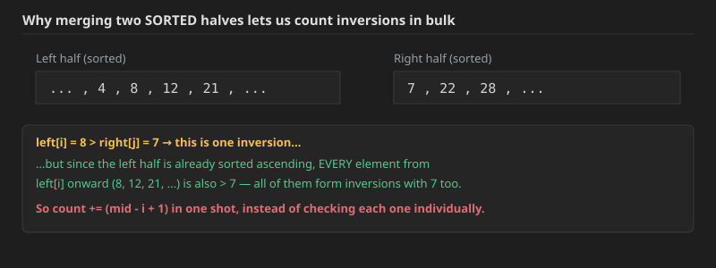

## Q1. Capacity To Ship Packages Within D Days (LeetCode 1011)

Not everything about Binary Search was discussed in the previous session, so before moving to this folder's main topic, here's one more "Binary Search on the Answer" example.

**Problem:** A conveyor belt has packages that must be shipped from one port to another within `days` days.

The `i`th package on the conveyor belt has a weight of `weights[i]`. Each day, we load the ship with packages on the conveyor belt (in the order given by `weights`). We may not load more weight than the maximum weight capacity of the ship.

Return the least weight capacity of the ship that will result in all the packages on the conveyor belt being shipped within `days` days.

**Example 1:**
```
Input: weights = [1,2,3,4,5,6,7,8,9,10], days = 5
Output: 15
Explanation: A ship capacity of 15 is the minimum to ship all the packages in 5 days like this:
1st day: 1, 2, 3, 4, 5
2nd day: 6, 7
3rd day: 8
4th day: 9
5th day: 10
Note that the cargo must be shipped in the order given, so using a ship of capacity 14 and splitting the packages into parts like (2, 3, 4, 5), (1, 6, 7), (8), (9), (10) is not allowed.
```

**Example 2:**
```
Input: weights = [3,2,2,4,1,4], days = 3
Output: 6
Explanation: A ship capacity of 6 is the minimum to ship all the packages in 3 days like this:
1st day: 3, 2
2nd day: 2, 4
3rd day: 1, 4
```

**Example 3:**
```
Input: weights = [1,2,3,1,1], days = 4
Output: 3
Explanation:
1st day: 1
2nd day: 2
3rd day: 3
4th day: 1, 1
```

**Constraints:**
- `1 <= days <= weights.length <= 5 * 10^4`
- `1 <= weights[i] <= 500`

**Approach — Binary Search on the answer:** The answer (minimum ship capacity) is some value between `max(weights)` (the ship must at least be able to carry the single heaviest package) and `sum(weights)` (a capacity that big always finishes in exactly 1 day). As capacity increases, the number of days needed to ship everything only ever decreases or stays the same — it's monotonic — which is exactly the condition needed to binary-search on it. For a candidate capacity `mid`, simulate greedily loading the ship day by day (keep adding the next package as long as it fits within `mid`; once it doesn't, start a new day) and count how many days that takes:
- If it takes **more** days than allowed, `mid` is too small — search the upper half.
- Otherwise (`mid` days needed is `<= days`), `mid` is a valid candidate — record it as a possible answer, then keep searching the lower half to see if an even smaller capacity also works.

**Dry run** on `weights = [1,2,3,4,5,6,7,8,9,10]`, `days = 5` (`max = 10`, `sum = 55`, so search range `[10, 55]`):

| lo | hi | mid | days needed at capacity `mid` | feasible (`<= 5` days)? | action |
|---|---|---|---|---|---|
| 10 | 55 | 32 | day1:[1..7]=28, day2:[8,9,10]=27 → 2 days | yes | `ans=32`, search `[10,31]` |
| 10 | 31 | 20 | day1:[1..5]=15, day2:[6,7]=13, day3:[8,9]=17, day4:[10] → 4 days | yes | `ans=20`, search `[10,19]` |
| 10 | 19 | 14 | day1:[1..4]=10, day2:[5,6]=11, day3:[7], day4:[8], day5:[9], day6:[10] → 6 days | no | search `[15,19]` |
| 15 | 19 | 17 | day1:[1..5]=15, day2:[6,7]=13, day3:[8,9]=17, day4:[10] → 4 days | yes | `ans=17`, search `[15,16]` |
| 15 | 16 | 15 | day1:[1..5]=15, day2:[6,7]=13, day3:[8]=8, day4:[9]=9, day5:[10]=10 → 5 days | yes | `ans=15`, search `[15,14]` (empty) |

Loop ends (`lo > hi`). **Answer: 15`** — matching the expected output exactly.

**Java:**
```java
public int shipWithinDays(int[] weights, int days) {
    int sum = 0;
    int mxwt = -1;
    for (int val : weights) {
        sum += val;
        mxwt = Math.max(val, mxwt);
    }
    int si = mxwt;
    int ei = sum;
    return binarySearch(weights, days, si, ei);
}

private int binarySearch(int[] wt, int k, int lo, int hi) {
    int si = lo;
    int ei = hi;
    int ans = -1;
    while (si <= ei) {
        int mid = (si + ei) / 2;
        int val = isItPossibleForKdays(wt, k, mid);
        if (val == 1) si = mid + 1;
        else {
            ans = mid;
            ei = mid - 1;
        }
    }
    return ans;
}

private int isItPossibleForKdays(int[] wtArr, int k, int wt) {
    int i = 0;
    int j = 0;
    while (j < wtArr.length) {
        int sum = 0;
        i++;
        while (j < wtArr.length && sum + wtArr[j] <= wt) {
            sum += wtArr[j];
            j++;
        }
    }
    return i > k ? 1 : 0;
}
```

**C++:**
```cpp
int isItPossibleForKdays(vector<int>& wtArr, int k, int wt) {
    int i = 0;
    int j = 0;
    while (j < (int)wtArr.size()) {
        int sum = 0;
        i++;
        while (j < (int)wtArr.size() && sum + wtArr[j] <= wt) {
            sum += wtArr[j];
            j++;
        }
    }
    return i > k ? 1 : 0;
}

int binarySearch(vector<int>& wt, int k, int lo, int hi) {
    int si = lo, ei = hi, ans = -1;
    while (si <= ei) {
        int mid = (si + ei) / 2;
        int val = isItPossibleForKdays(wt, k, mid);
        if (val == 1) si = mid + 1;
        else {
            ans = mid;
            ei = mid - 1;
        }
    }
    return ans;
}

int shipWithinDays(vector<int>& weights, int days) {
    int sum = 0, mxwt = -1;
    for (int val : weights) {
        sum += val;
        mxwt = max(val, mxwt);
    }
    return binarySearch(weights, days, mxwt, sum);
}
```

**Time Complexity: `O(n * log(sum - max))`** — the binary search runs over a range of size `sum - max`, giving `O(log(sum))` iterations, and each iteration's feasibility check (`isItPossibleForKdays`) scans the whole array once, `O(n)`.
**Space Complexity: `O(1)`** — no extra data structure beyond a few counters.

**A note on a common first-attempt bug:** an earlier, incorrect version of `isItPossibleForKdays` checked whether the packages could be shipped in **exactly** `k` days (`i == k`, `i > k`, or otherwise), but the problem actually asks for shipping **within** (`<=`) `k` days — a capacity that finishes early (in fewer days) is still valid and should count as feasible, not be rejected. The fix is the single boolean check shown above: `return i > k ? 1 : 0` (infeasible only when *more* than `k` days would be needed).


## Q2. Count Inversions (GFG)

**Problem:** Given an array of integers. Find the Inversion Count in the array.

**Inversion Count:** For an array, inversion count indicates how far (or close) the array is from being sorted. If array is already sorted then the inversion count is 0. If an array is sorted in the reverse order then the inversion count is the maximum.

Formally, two elements `a[i]` and `a[j]` form an inversion if `a[i] > a[j]` and `i < j`.

**Example 1:**
```
Input: N = 5, arr[] = {2, 4, 1, 3, 5}
Output: 3
Explanation: The sequence 2, 4, 1, 3, 5 has three inversions (2, 1), (4, 1), (4, 3).
```

**Example 2:**
```
Input: N = 5
arr[] = {2, 3, 4, 5, 6}
Output: 0
Explanation: As the sequence is already sorted so there is no inversion count.
```

**Expected Time Complexity:** `O(N LogN)`.
**Expected Auxiliary Space:** `O(N)`.

**Constraints:**
- `1 ≤ N ≤ 5*10^5`
- `1 ≤ arr[i] ≤ 10^18`

**Brute force:** check every pair, `O(n^2)` — too slow for `N` up to `5*10^5`. Let's use the Merge Sort approach instead.

**Why Merge Sort?** The problem needs the count of pairs `(arr[i], arr[j])` such that `i < j` and `arr[i] > arr[j]`. Now suppose we already have **two sorted arrays**, and we find some element `x` (at index `i`) in the left one that's bigger than some element `y` (at index `j`) in the right one, with `i < j` overall. Because the **left array is itself sorted ascending**, every element from `x` onward in that array is also `>= x`, hence also `> y` — so instead of comparing them one at a time, all of those pairs can be counted **in one shot**.



**The full algorithm:** this is just Merge Sort, with one extra piece of bookkeeping added to the merge step. Recursively:
```
totalInversions(arr) = countInversions(leftHalf) + countInversions(rightHalf) + countInversionsAcross(leftHalf, rightHalf)
```
The last term is counted *during* the merge step itself: walk both sorted halves with two pointers `i` (left) and `j` (right); whenever `arr[i] <= arr[j]`, take `arr[i]` into the merged output (no inversion — ties are also **not** inversions, since the definition requires strict `>`, so equal elements should always be taken from the left half first, never counted); whenever `arr[i] > arr[j]`, that's an inversion, and — thanks to the left half being sorted — every remaining element in the left half from `i` to `mid` also forms an inversion with `arr[j]`, so add `(mid - i + 1)` to the count in one step and take `arr[j]` into the merged output instead.

**Dry run** on `arr = [2, 4, 1, 3, 5]`:
- Split into `[2, 4, 1]` and `[3, 5]`.
  - `[2, 4, 1]` splits into `[2, 4]` and `[1]`.
    - `[2, 4]` splits into `[2]` and `[4]`; merging them: `2 <= 4`, no inversion. Merged: `[2, 4]`, count `0`.
    - `[1]` is a single element, count `0`.
    - Merging `[2, 4]` and `[1]`: `arr[i]=2 > arr[j]=1` → inversion, and everything remaining on the left (`2, 4` — both) also `> 1`, so `count += (mid - i + 1) = 2`. Merged: `[1, 2, 4]`, count `2`.
  - `[3, 5]` splits into `[3]` and `[5]`; merging: `3 <= 5`, no inversion. Merged: `[3, 5]`, count `0`.
  - Merging `[1, 2, 4]` and `[3, 5]`: `1 <= 3` (take 1), `2 <= 3` (take 2), `4 > 3` → inversion, remaining left elements from `4` onward = just `{4}`, so `count += 1`; take `3`. Then `4 <= 5` (take 4), then `5` remains (take 5). Merged: `[1, 2, 3, 4, 5]`, count from this merge `= 1`.
- **Total inversions = 2 (from the left-half merge) + 0 (right half) + 1 (final merge) = 3`** — matching the expected output exactly.


.jpg>) .jpg>) .jpg>) .jpg>) .jpg>) .jpg>) .jpg>) .jpg>) .jpg>) .jpg>) .jpg>) .jpg>) .jpg>) .jpg>) .jpg>) .jpg>) 

### Approach 1 — allocate a fresh temp array at every merge call

**Java:**
```java
static long mergeSort(long lb, long ub, long[] arr) {
    if (lb == ub) return 0;
    long mid = (lb + ub) / 2;
    long a1 = mergeSort(lb, mid, arr);
    long a2 = mergeSort(mid + 1, ub, arr);
    long a3 = merge(lb, mid, ub, arr);
    return a1 + a2 + a3;
}

static long inversionCount(long arr[], long N) {
    long lb = 0;
    long ub = N - 1;
    return mergeSort(lb, ub, arr);
}

static long merge(long lb, long mid, long ub, long[] arr) {
    long[] temp = new long[(int) (ub - lb + 1)];
    int k = 0;
    long inv = 0;
    int i = (int) lb;
    int j = (int) (mid + 1);
    while (i <= mid && j <= ub) {
        if (arr[i] <= arr[j]) temp[k++] = arr[i++];
        else {
            inv += (mid - i + 1);
            temp[k++] = arr[j++];
        }
    }
    while (i <= mid) {
        temp[k++] = arr[i++];
    }
    while (j <= ub) {
        temp[k++] = arr[j++];
    }
    k = 0; i = (int) lb;
    while (k < temp.length) {
        arr[i++] = temp[k++];
    }
    return inv;
}
```

**C++:**
```cpp
long long merge(long long lb, long long mid, long long ub, vector<long long>& arr) {
    vector<long long> temp(ub - lb + 1);
    int k = 0;
    long long inv = 0;
    int i = (int) lb;
    int j = (int) (mid + 1);
    while (i <= mid && j <= ub) {
        if (arr[i] <= arr[j]) temp[k++] = arr[i++];
        else {
            inv += (mid - i + 1);
            temp[k++] = arr[j++];
        }
    }
    while (i <= mid) {
        temp[k++] = arr[i++];
    }
    while (j <= ub) {
        temp[k++] = arr[j++];
    }
    k = 0; i = (int) lb;
    while (k < (int)temp.size()) {
        arr[i++] = temp[k++];
    }
    return inv;
}

long long mergeSort(long long lb, long long ub, vector<long long>& arr) {
    if (lb == ub) return 0;
    long long mid = (lb + ub) / 2;
    long long a1 = mergeSort(lb, mid, arr);
    long long a2 = mergeSort(mid + 1, ub, arr);
    long long a3 = merge(lb, mid, ub, arr);
    return a1 + a2 + a3;
}

long long inversionCount(vector<long long>& arr, long long N) {
    return mergeSort(0, N - 1, arr);
}
```

### Approach 2 — allocate one shared buffer once (better: less allocation overhead)

Same logic exactly, but instead of creating a brand-new `temp` array inside every single `merge` call (which adds up to a lot of small allocations across the recursion), allocate **one** buffer array up front and reuse it throughout.

**Java:**
```java
public static long inversionCount(long arr[], long N) {
    if (N == 0) return 0;
    long[] sortedArray = new long[(int) N];
    return inversionCount(arr, sortedArray, 0, N - 1);
}

public static long inversionCount(long[] arr, long[] sortedArray, long si, long ei) {
    if (si >= ei) return 0;
    long mid = (si + ei) / 2;
    long count = 0;
    count += inversionCount(arr, sortedArray, si, mid);
    count += inversionCount(arr, sortedArray, mid + 1, ei);
    count += totalInversionCount(arr, sortedArray, si, mid, ei);
    return count;
}

public static long totalInversionCount(long[] arr, long[] sortedArray, long si, long mid, long ei) {
    int i = (int) si, j = (int) mid + 1, k = (int) si;
    long count = 0;

    while (i <= mid && j <= ei) {
        if (arr[i] <= arr[j])
            sortedArray[k++] = arr[i++];
        else {
            sortedArray[k++] = arr[j++];
            count += mid - i + 1;
        }
    }

    while (i <= mid || j <= ei)
        sortedArray[k++] = arr[i <= mid ? i++ : j++];

    while (si <= ei)
        arr[(int) si] = sortedArray[(int) si++];

    return count;
}
```

**C++:**
```cpp
long long totalInversionCount(vector<long long>& arr, vector<long long>& sortedArray, long long si, long long mid, long long ei) {
    int i = (int) si, j = (int) mid + 1, k = (int) si;
    long long count = 0;

    while (i <= mid && j <= ei) {
        if (arr[i] <= arr[j])
            sortedArray[k++] = arr[i++];
        else {
            sortedArray[k++] = arr[j++];
            count += mid - i + 1;
        }
    }

    while (i <= mid || j <= ei)
        sortedArray[k++] = (i <= mid) ? arr[i++] : arr[j++];

    while (si <= ei)
        arr[(int) si] = sortedArray[(int) si++];

    return count;
}

long long inversionCount(vector<long long>& arr, vector<long long>& sortedArray, long long si, long long ei) {
    if (si >= ei) return 0;
    long long mid = (si + ei) / 2;
    long long count = 0;
    count += inversionCount(arr, sortedArray, si, mid);
    count += inversionCount(arr, sortedArray, mid + 1, ei);
    count += totalInversionCount(arr, sortedArray, si, mid, ei);
    return count;
}

long long inversionCount(vector<long long>& arr, long long N) {
    if (N == 0) return 0;
    vector<long long> sortedArray(N);
    return inversionCount(arr, sortedArray, 0, N - 1);
}
```

Both approaches use `long`/`long long` throughout rather than `int`: since `arr[i]` can be as large as `10^18`, individual values don't fit in a 32-bit `int`, and separately, for `N` up to `5*10^5`, the inversion *count* itself can be as large as `N*(N-1)/2 ≈ 1.25 * 10^11`, which also overflows a 32-bit `int`.

**Time Complexity: `O(N log N)`** — exactly the same recurrence as Merge Sort itself: `T(N) = 2T(N/2) + O(N)` (the `O(N)` being the merge/counting step), which solves to `O(N log N)`.
**Space Complexity: `O(N)`** — for the temporary buffer(s); Approach 2 keeps this to a single `O(N)` allocation total instead of `O(N log N)` worth of small allocations spread across every recursive call (both are technically `O(N)` auxiliary space at any given time, but Approach 2 does far less total allocation work).

