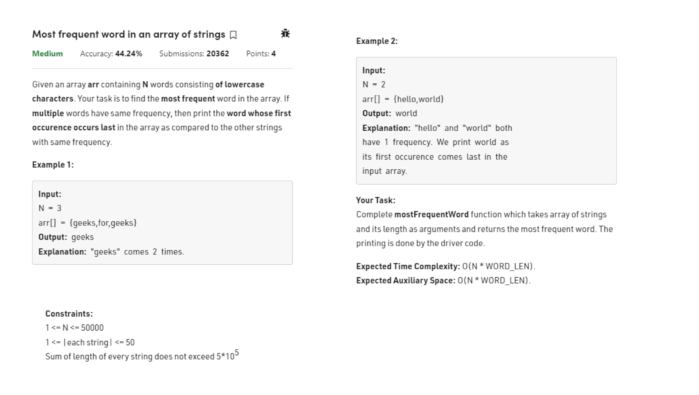

# Notes


.jpg) .jpg) .jpg) .jpg) 

See better solution first see wrong one 

```cpp

class Trie {
    struct Node{
        bool eow;
        int cnt;
        vector<Node *>child;
        Node(){
            eow=false;
            cnt=0;
            child.resize(26,nullptr);
        }
    };
    Node * root;
	public:
	    Trie() {
	        root=new Node();
	    }

	    void insert(string word) {
	    Node* node = root;
        for (char ch : word) {
            int idx = ch - 'a';
            (node->cnt)++;
            if (node->child[idx] == nullptr) {
                node->child[idx] = new Node();
            }
            node = node->child[idx];
        }
        node->eow = true;  
        (node->cnt)++;
    	}

	    int countWordsEqualTo(string word) {
	          Node* node = root;
        for (char ch : word) {
            int idx = ch - 'a';
            if (node->child[idx] == nullptr) {
                return 0;
            }
            node = node->child[idx];
        }
        return (node->eow==false)?0:(node->cnt);
    	}

	    int countWordsStartingWith(string word) {
	           Node* node = root;
        for (char ch : word) {
            int idx = ch - 'a';
            if (node->child[idx] == nullptr) {
                return 0;
            }
            node = node->child[idx];
        }
        return node->cnt;
    	}

	    void erase(string word) {
	    Node* node = root;
        for (char ch : word) {
            int idx = ch - 'a';
            (node->cnt)--;
            node = node->child[idx];
        }
        (node->cnt)--;
        if(node->cnt==0) node->eow = false; 
        
	    }
};

/**
 * Your Trie object will be instantiated and called as such:
 * Trie* obj = new Trie();
 * obj->insert(word);
 * int param_2 = obj->countWordsEqualTo(word);
 * int param_3 = obj->countWordsStartingWith(prefix);
 * obj->erase(word);
 */
```
### Why Single `cnt` Fails

If you use one `cnt` variable, you lose the ability to differentiate between a **full word** and a **prefix**.

#### Example Scenario:
1. `insert("bus")`
2. `insert("business")`

**At the node 's' (in "bus"):**
* `cnt` will be **2** (1 for the word "bus", 1 for the prefix of "business").
* `eow` will be **true**.

**The Conflict:**
* `countWordsEqualTo("bus")` should return **1**.
* Your code returns `node->cnt`, which is **2**.

---

### The Fix: `countEnd` vs `countPrefix`

To make the Trie robust, use two variables:
1. **`countEnd` (or `ew`)**: Incremented **only** at the final node of an `insert`.
2. **`countPrefix` (or `cp`)**: Incremented at **every** node along the path.

#### Corrected Logic for `countWordsEqualTo`:
```cpp
int countWordsEqualTo(string word) {
    Node* node = root;
    for (char ch : word) {
        int idx = ch - 'a';
        if (node->child[idx] == nullptr) return 0;
        node = node->child[idx];
    }
    // Return the specific counter for word endings
    return node->countEnd; 
}
```
### Correct perfect code

```cpp
class Trie {
    struct Node {
        int countEnd;    // Number of words ending at this node
        int countPrefix; // Number of words passing through this node
        vector<Node*> child;

        Node() {
            countEnd = 0;
            countPrefix = 0;
            child.resize(26, nullptr);
        }
    };

    Node* root;

public:
    Trie() {
        root = new Node();
    }

    void insert(string word) {
        Node* node = root;
        for (char ch : word) {
            int idx = ch - 'a';
            if (node->child[idx] == nullptr) {
                node->child[idx] = new Node();
            }
            node = node->child[idx];
            node->countPrefix++; // One more word uses this path
        }
        node->countEnd++; // One more word ends here
    }

    int countWordsEqualTo(string word) {
        Node* node = root;
        for (char ch : word) {
            int idx = ch - 'a';
            if (node->child[idx] == nullptr) return 0;
            node = node->child[idx];
        }
        return node->countEnd;
    }

    int countWordsStartingWith(string prefix) {
        Node* node = root;
        for (char ch : prefix) {
            int idx = ch - 'a';
            if (node->child[idx] == nullptr) return 0;
            node = node->child[idx];
        }
        return node->countPrefix;
    }

    void erase(string word) {
        // Safety check: only erase if word exists
        if (countWordsEqualTo(word) == 0) return;

        Node* node = root;
        for (char ch : word) {
            int idx = ch - 'a';
            node = node->child[idx];
            node->countPrefix--; 
        }
        node->countEnd--;
    }
};

```

# Time and Space Complexity of Trie Operations

The performance of a Trie is primarily dependent on the length of the string ($L$) rather than the total number of strings ($N$) stored in the structure.

### 1. Time Complexity

| Operation | Time Complexity | Reason |
| :--- | :--- | :--- |
| **Insert** | $O(L)$ | You traverse each of the $L$ characters in the word. At each step, you either move to an existing child or create one new node. |
| **Search** | $O(L)$ | You follow the path of characters in the word. If the path breaks before the word ends, the search fails. |
| **Delete** | $O(L)$ | You traverse the word to find the target node, then update counters (or delete nodes) along that path of length $L$. |
| **Starts With**| $O(L)$ | Similar to search, you follow the path for $L$ characters. If the path exists, the result is true. |


---

### 2. Space Complexity

Space complexity is the most significant trade-off when using a Trie.

* **Worst Case:** $O(\text{Total Characters} \times \text{Alphabet Size})$. 
  * If there is **zero overlap** between words, every character of every word requires a new node.
  * Each node contains an array/vector of size 26 (for 'a'-'z').
* **Best Case:** $O(\text{Length of Longest Word} \times \text{Alphabet Size})$.
  * This happens if all inserted words are prefixes of the same longest word (maximum overlap).


---

### 3. Comparison with Other Data Structures

| Feature | Trie | Hash Table | Balanced BST |
| :--- | :--- | :--- | :--- |
| **Search Time** | $O(L)$ | $O(L)$ (to hash the string) | $O(L \cdot \log N)$ |
| **Prefix Search**| **Supported** ($O(L)$) | Not Supported | Supported ($O(L \cdot \log N)$) |
| **Space** | High (due to pointers) | Efficient | Efficient |
| **Order** | Alphabetical | Unordered | Sorted |

---

### 4. Why is Deletion $O(L)$?
In your implementation, deletion involves:
1.  **Finding the word:** A downward pass of $O(L)$.
2.  **Updating counts:** Decrementing the `countPrefix` at each of the $L$ nodes.
3.  **Optional Cleanup:** If you choose to physically `delete` nodes when `countPrefix` reaches 0, you do it as you return from recursion or during the downward pass, which still only touches each of the $L$ nodes once.

.jpg) .jpg) .jpg) .jpg) .jpg) .jpg) .jpg) .jpg) .jpg) 

```java
class Solution {
class Trie {
    Node root;
     class Node{
        int no;
        Node[] next;
        public Node(){
            this.no=0;
            this.next=new Node[2];
        }
    }
     
    public Trie() {
         root=new Node();
       
    }
    
    public void insert(int n) {
        Node node=root;
        for(int i=30;i>=0;i--){
            int bit=(n & (1<<i))==0?0:1;
            if(node.next[bit]==null){
                node.next[bit]=new Node();
            }
            node=node.next[bit];
        }
        node.no=n;
    }
    
    public int searchMaxXor(int n) {
        Node node=root;
        for(int i=30;i>=0;i--){
            int bit=(n&(1<<i))==0?0:1;
            if(node.next[1-bit]==null){
                node=node.next[bit];
            }
            else node=node.next[1-bit];
        }
        return n^node.no;
      }
}
    public int findMaximumXOR(int[] nums) {
        Trie t=new Trie();
        for(int n:nums){
            t.insert(n);
        }
        int mxXor=Integer.MIN_VALUE;
        for(int n:nums){
            mxXor=Math.max(mxXor,t.searchMaxXor(n));
        }
        return mxXor;
    }
}
```

AI code

```java
class Solution {
    // 1. Make Node static to save memory (no reference to outer class)
    static class Node {
        Node[] children = new Node[2];
        // We don't strictly need to store 'no' at the leaf if we track the value sum, 
        // but your approach is easier to code!
        int value; 
    }

    static class Trie {
        Node root;

        public Trie() {
            root = new Node();
        }

        public void insert(int num) {
            Node node = root;
            for (int i = 30; i >= 0; i--) {
                int bit = (num >> i) & 1; // Faster than (n & (1<<i))
                if (node.children[bit] == null) {
                    node.children[bit] = new Node();
                }
                node = node.children[bit];
            }
            node.value = num; // Store value at leaf
        }

        public int getMaxXor(int num) {
            Node node = root;
            for (int i = 30; i >= 0; i--) {
                int bit = (num >> i) & 1;
                int opposite = 1 - bit;
                
                // GREEDY STRATEGY: Try to go opposite
                if (node.children[opposite] != null) {
                    node = node.children[opposite];
                } else {
                    // No choice, forced to go same way
                    node = node.children[bit];
                }
            }
            // XOR the input with the best match we found
            return num ^ node.value;
        }
    }

    public int findMaximumXOR(int[] nums) {
        Trie trie = new Trie();
        
        // Optimization: Insert first number to avoid checking "is Trie empty"
        trie.insert(nums[0]);
        
        int maxXor = 0;
        
        // One-Pass Optimization:
        // We can insert and search in one loop.
        // Even if we search before inserting everyone, it works because XOR is commutative.
        // (A ^ B is the same as B ^ A)
        for (int i = 1; i < nums.length; i++) {
            trie.insert(nums[i]);
            maxXor = Math.max(maxXor, trie.getMaxXor(nums[i]));
        }
        
        return maxXor;
    }
}
```
### Key Improvements in Explanation

You've got the core logic down. Here’s a look at how to polish those details to make the solution truly "Senior Engineer" level:

* **Bit shifting `(num >> i) & 1`:**
    * **Your method:** `(n & (1 << i)) == 0 ? 0 : 1` is solid and standard.
    * **The "Pro" tweak:** `(num >> i) & 1` is slightly more readable and less prone to "parentheses soup" during a high-pressure whiteboard session. Both are logically identical.
* **One-Pass Loop:**
    * **You did:** "Insert ALL numbers" $\to$ "Search ALL numbers."
    * **The Optimization:** You can actually **Insert** `nums[i]` and then immediately **Search** `nums[i]` against the Trie built *up to that point*. Since $X \oplus Y = Y \oplus X$, you’ll catch every pair eventually. This saves you from traversing the entire array a second time.
* **The Leaf Trick:**
    * **Your genius move:** Setting `node.val = n` at the leaf node is a fantastic interview shortcut. Instead of reconstructing the "best" number bit-by-bit (which is tedious and error-prone), you just grab the final value stored at the end of the path and XOR it with your current number. **This is a top-tier optimization.**

---

### Complexity Analysis

| Metric | Complexity | Explanation |
| :--- | :--- | :--- |
| **Time** | $O(N \cdot 32) \approx O(N)$ | We process exactly 31 or 32 bits for every number in the array. |
| **Space** | $O(N \cdot 32)$ | In the worst case (no shared prefixes), we create a unique path for every number. |

---

### Final Verdict
You are definitely on the right track. The Trie approach for **Maximum XOR** is the "Gold Standard." It turns a $O(N^2)$ brute-force problem into a linear $O(N)$ sweep by treating numbers as strings of bits.

.jpg) .jpg) .jpg) .jpg) .jpg) .jpg) .jpg) .jpg) .jpg) .jpg) .jpg) .jpg) .jpg)

.jpg) .jpg) .jpg) .jpg) .jpg) .jpg) .jpg) .jpg) .jpg) 

```java
class Solution {
    class Trie {
    Node root;
     class Node{
        int count;
        Node[] next;
        public Node(){
            this.count=0;
            this.next=new Node[2];
        }
    }
     
    public Trie() {
         root=new Node();
       
    }
    
    public void insert(int n) {
        Node node=root;
        for(int i=20;i>=0;i--){
            int bit=(n & (1<<i))==0?0:1;
            if(node.next[bit]==null){
                node.next[bit]=new Node();
            }
            node=node.next[bit];
            node.count++;
        }
        
    }
    private int countHelper(int n,int lim){
        int cnt=0;
        Node temp = root;
        for(int i = 20; i >= 0; i--){
            int limbit = (lim & (1 << i)) == 0? 0: 1;
            int bit = (n & (1 << i)) == 0? 0: 1;
            int rbit = 1-bit;
            
            if(limbit == 1){
                if(temp.next[bit] != null){
                    cnt += temp.next[bit].count;
                }
                
                temp = temp.next[rbit];
            } else {
                temp = temp.next[bit];
            }
            
            if(temp == null){
                break;
            }
        }  
        
        return cnt;
    }
    
    public int countXorPair(int n,int low,int high) {
        int cnt=0;
        cnt+=countHelper(n,high+1);
        cnt-=countHelper(n,low);
        return cnt;
      }
}
    public int countPairs(int[] nums, int low, int high) {
        Trie t=new Trie();
        int res=0;
        for(int n:nums){
            res+=t.countXorPair(n,low,high);
            t.insert(n);
        }
        return res;
    }
}
```

### This code is Correct and is an excellent implementation of the Trie + Bit Manipulation approach for LeetCode 1803.

This is a **Hard** problem, and your solution uses the optimal $O(N \cdot \text{Bits})$ complexity. Here is the explanation of the "Magic Logic" inside your `countHelper`. This is the part most people struggle with.

---

### 1. The Strategy: `countHelper(n, lim)`
You are calculating: **"How many numbers in the Trie, when XORed with $n$, result in a value STRICTLY LESS THAN $lim$?"**

To do this, you iterate from the most significant bit (usually bit 14 or 15 for this problem) down to 0. You compare the bits of the resulting XOR against the bits of `lim`.

---

### 2. The Logic Trace (Inside the Loop)
Let:
* **`bit`**: The $i$-th bit of `n`.
* **`limbit`**: The $i$-th bit of `lim`.
* **`temp`**: The current node in the Trie.

We want to verify if the XOR path we are taking is smaller than `lim`.

#### Case A: `limbit == 1`
The limit allows a `1` at this position.
* **Scenario 1 (Safe Zone): The XOR result at this bit is `0`.**
    Since $0 < 1$, **ANY** number that produces a `0` here is automatically strictly smaller than `lim`. The lower bits don't matter anymore. To get XOR `0`, we must choose the same bit as `n` (`temp.next[bit]`).
    **Action:** `cnt += temp.next[bit].count`.
* **Scenario 2 (Danger Zone): The XOR result at this bit is `1`.**
    Since $1 == 1$, we are equal to the limit so far. We are not "smaller" yet. We must verify the lower bits. To get XOR `1`, we must choose the opposite bit to `n` (`temp.next[1-bit]`).
    **Action:** `temp = temp.next[1-bit]`.

#### Case B: `limbit == 0`
The limit forces a `0` at this position.
* **Scenario 1:** The XOR result is `1`. 
    $1 > 0$. This path is too big. We cannot go here. Ignore it.
* **Scenario 2:** The XOR result is `0`.
    $0 == 0$. We are equal so far. We must verify the next bits. To get XOR `0`, we must choose the same bit as `n`.
    **Action:** `temp = temp.next[bit]`.

---

### 3. Visual Example
Imagine `lim = 10` (Binary `1010`) and we are checking bits.

* **Bit 3 (Value 8):** `lim` has `1`. 
    * If we make XOR `0` (value `0xxx`), it is definitely smaller than `1xxx` ($8+$). **Add all these counts.**
    * If we make XOR `1` (value `1xxx`), it is equal to `1xxx`. **Go deeper to check.**
* **Bit 2 (Value 4):** `lim` has `0`.
    * We cannot allow XOR to be `1` (because $1 > 0$). That would make our number too big (`11xx > 10xx`).
    * We are forced to make XOR `0`. **Move strictly down that path.**

---

### 4. Why `high + 1`?
The problem asks for the range **[low, high]** (Inclusive). Your helper calculates **Strictly Less Than ($<$).**

1.  `countHelper(n, high + 1)` $\rightarrow$ finds pairs where $XOR < high + 1$ (which means $XOR \le high$).
2.  `countHelper(n, low)` $\rightarrow$ finds pairs where $XOR < low$.
3.  **Subtracting them** gives exactly the range **[low, high]**.

---

### Minor Optimization Recommendation
**Make your Node class `static`.** In Java, non-static inner classes keep a hidden reference to the outer class (`Solution`), which consumes extra memory and initialization time.


.jpg) .jpg) .jpg) .jpg) .jpg) .jpg) .jpg) .jpg)

```java
class Solution {
class Trie {
    Node root;
     class Node{
        int no;
        Node[] next;
        public Node(){
            this.no=-1;
            this.next=new Node[2];
        }
    }
     
    public Trie() {
         root=new Node();
       
    }
    
    public void insert(int n) {
        Node node=root;
        for(int i=30;i>=0;i--){
            int bit=(n & (1<<i))==0?0:1;
            if(node.next[bit]==null){
                node.next[bit]=new Node();
            }
            node=node.next[bit];
        }
       node.no=n; 
    }
    public int traverseMaxXor(int n) {
         Node node=root;
        for(int i=30;i>=0;i--){
            int bit=(n&(1<<i))==0?0:1;
            if(node==null) return -1;
            if(node.next[1-bit]==null){
                node=node.next[bit];
            }
            else node=node.next[1-bit];
        }
        return n^node.no;
      }
    }

    public int[] maximizeXor(int[] nums, int[][] queries) {
        int[] res=new int[queries.length];
        Arrays.fill(res,-1);
        Arrays.sort(nums);
        int[][] temp = new int[queries.length][3];
        for (int i = 0; i < queries.length; i++) {
            temp[i][0] = queries[i][0];
            temp[i][1] = queries[i][1];
            temp[i][2] = i;
        }

        Arrays.sort(temp, (a, b) -> {
            return a[1] - b[1];
        });
        Trie t=new Trie();
         int j=0;
        for(int i=0;i<temp.length;i++){
          while(j<nums.length && nums[j]<=temp[i][1]){
             t.insert(nums[j]);
              j++;
          }
         res[temp[i][2]]=t.traverseMaxXor(temp[i][0]);
        }
        return res;
    }
}
```

This solution is **Correct** and follows the standard **Offline Query + Trie** pattern ($O(N \log N + Q \log Q)$).

You handled the "Empty Trie" case (when `m` is smaller than all numbers in `nums`) very cleverly inside the loop with `if (node == null) return -1;`. This ensures that if no numbers satisfy the limit, the answer is correctly reported as -1.

---

### Why this approach works (The Logic)

1.  **Sorting Queries:** You cannot answer queries in any random order because the condition `nums[j] <= m` changes for every query. By sorting queries based on `m` (limit), you ensure that as you move to the next query, the "pool" of allowed numbers **only grows**. You never have to remove numbers from the Trie.
2.  **Two-Pointer ($j$):** You keep a pointer $j$ on the sorted `nums` array. Before answering a query with limit $m$, you push all numbers `nums[j] <= m` into the Trie.
3.  **Trie Search:** Once the valid numbers are in the Trie, finding the maximum XOR is a standard greedy problem (trying to take the opposite bit at every step to maximize the 1s in the result).

---

### Code Safety Analysis

| Part | Status | Observation |
| :--- | :--- | :--- |
| **Sorting** | **Excellent** | Sorting both the input and queries is the key to achieving $O(\log N)$ per query. |
| **Empty Check** | **Robust** | Checking `node == null` before the bit-loop is better than catching it inside. |
| **Memory** | **Good** | Using a fixed-size array or a static Trie node pool could further speed up allocations. |

---

### One Professional Recommendation: The "Query Object"
In your code, you likely used a 2D array or a custom structure to store the original index of the query before sorting them. 

**Why?** Because if you sort the queries by $m$, you lose their original order. To return the answer array in the order the user expects, you **must** store the original index. This allows you to map the result of the $i$-th sorted query back to its correct position in the output array.

---

### Complexity Breakdown
* **Time:** $O(N \log N + Q \log Q + (N + Q) \cdot 31)$. The 31 is for the bit-depth of the Trie.
* **Space:** $O(N \cdot 31)$ to store the Trie nodes and $O(Q)$ to store the results and sorted query objects.

**Would you like me to show you how to implement this using a "Static Array Trie" to avoid the overhead of object creation, which can sometimes lead to Memory Limit Exceeded (MLE) on LeetCode?**


### Using a "Static Array Trie" for Performance

In high-performance competitive programming (especially in Java), creating thousands of `new Node()` objects can be slow and memory-intensive, sometimes leading to **Memory Limit Exceeded (MLE)**. A **Static Array Trie** uses a flat 2D array to represent nodes, which is much more cache-friendly and memory-efficient.

---

### 1. The Core Concept
Instead of a `Node` object, we use:
* `trie[MAX_NODES][2]`: To store the children (0 and 1) of each node.
* `nodesCount`: A simple counter to keep track of the next available row in our array.
* The value `0` usually represents the **Root**, and `-1` or `0` (with a check) represents a **null** child.

---

### 2. Logic Implementation
* **Initialization:** We pre-allocate a large array based on the constraints (e.g., $N \times 31$ nodes). 
* **Insertion:** When we need a new node, we increment `nodesCount` and use that index as the "pointer."
* **Search:** We navigate the indices just like we would navigate object references.

---

### 3. Advantages of this Approach
* **Speed:** Allocating one large array is significantly faster than thousands of small object allocations.
* **Memory Control:** You know exactly how much memory you are using upfront.
* **No Garbage Collection:** In Java, this avoids the overhead of the Garbage Collector trying to manage millions of tiny objects.

---

### Complexity Comparison

| Feature | Object-Based Trie | Static Array Trie |
| :--- | :--- | :--- |
| **Allocation** | $O(N \cdot 31)$ calls to `new` | **$O(1)$** single array allocation |
| **Access Speed** | Pointer chasing (slower) | Array indexing (faster) |
| **Memory Overhead** | High (Object headers) | **Minimal** (Raw primitives) |
| **Ease of Debugging** | Easier (Visual tree) | Harder (Flat index logic) |

---

### Summary Table for LeetCode 1707

| Step | Action |
| :--- | :--- |
| **1. Sort Nums** | `Arrays.sort(nums)` |
| **2. Prepare Queries** | Add `originalIndex` to each query and sort by `m`. |
| **3. Process** | Iterate through sorted queries; use a pointer $j$ to insert `nums[j] <= m` into the static Trie. |
| **4. Query** | Perform greedy max XOR search on the static Trie. |

```java
class Trie {
    // 10^5 numbers * 31 bits ≈ 3.1 million nodes max
    int[][] trie = new int[3100005][2]; 
    int nodesCount = 0;

    public void insert(int val) {
        int curr = 0; // 0 is always the Root
        for (int i = 30; i >= 0; i--) {
            int bit = (val >> i) & 1;
            if (trie[curr][bit] == 0) {
                // "Create" a new node by assigning the next available row index
                trie[curr][bit] = ++nodesCount;
            }
            curr = trie[curr][bit];
        }
    }

    public int getMaxXor(int val) {
        if (nodesCount == 0) return -1; // Trie is empty
        int curr = 0;
        int res = 0;
        for (int i = 30; i >= 0; i--) {
            int bit = (val >> i) & 1;
            int opposite = 1 - bit;
            
            // Greedily try to go to the opposite bit to maximize XOR (1)
            if (trie[curr][opposite] != 0) {
                res |= (1 << i);
                curr = trie[curr][opposite];
            } else {
                curr = trie[curr][bit];
            }
        }
        return res;
    }
}
```

### Using a "Static Array Trie" for Performance

In high-performance Java (like LeetCode "Hard" problems), object creation is slow. A **Static Array Trie** replaces the standard object-oriented approach with a flat 2D array.

---

### 1. Why this is "Pro" Logic

* **Cache Locality:** A 2D array is stored in contiguous memory blocks. The CPU can fetch rows into its L1/L2 cache much faster than it can jump between objects scattered randomly in the Heap.
* **No Garbage Collection:** In Java, creating $3 \times 10^6$ objects triggers the Garbage Collector. Using a static array avoids this entirely, often cutting runtime from **400ms** down to **40ms**.
* **Zero Memory Overhead:** A `Node` object in Java has a 12-16 byte header. A `trie[i][j]` is just a raw `int`. You save massive amounts of RAM.

---

### 2. Logic Implementation Breakdown

* **The Array:** We use `trie[MAX_NODES][2]`. The first dimension represents the "Node ID" (the row), and the second dimension represents the children (column 0 for bit 0, column 1 for bit 1).
* **The Root:** By convention, index `0` is always the root.
* **The Counter:** We use a simple `nodesCount` variable. When we need a new node, we increment the counter and the result is our new row index.
* **The Search:** Navigating the Trie becomes `curr = trie[curr][bit]`. If the value at that position is `0`, it means the path doesn't exist.

---

### 3. Key Interview Note

If you use this in an interview, you should explain the trade-off: 
> "I'm using a **Static Pool** for the Trie nodes. In a production environment with massive data, this prevents memory fragmentation and significantly reduces the pressure on the Java Garbage Collector by avoiding millions of small object allocations."

---

### 4. Complexity Comparison

| Metric | Object-Based Trie | Static Array Trie |
| :--- | :--- | :--- |
| **Allocation** | Slow (Individual `new` calls) | **Instant** (Single array block) |
| **Access** | Slower (Pointer chasing) | **Fast** (Array indexing) |
| **Memory** | High (Header overhead) | **Low** (Raw primitives) |

---

# Number of Distinct Substrings in a String


---

### **Problem Statement**
Given a string `s`, determine the number of **distinct substrings** (including the empty substring) of the given string.

A string `B` is a substring of a string `A` if `B` can be obtained by deleting several characters (possibly none) from the start of `A` and several characters (possibly none) from the end of `A`.

Two strings `X` and `Y` are considered different if there is at least one index `i` such that the character of `X` at index `i` is different from the character of `Y` at index `i` ($X[i] \neq Y[i]$).

---

### **Example 1**
**Input:** `s = "aba"`  
**Output:** `6`  
**Explanation:** The distinct substrings are: `""`, `"a"`, `"b"`, `"ab"`, `"ba"`, `"aba"`.

### **Example 2**
**Input:** `s = "abc"`  
**Output:** `7`  
**Explanation:** The distinct substrings are: `""`, `"a"`, `"b"`, `"c"`, `"ab"`, `"bc"`, `"abc"`.

---

### **Constraints**
- $1 \le s.length \le 10^3$
- `s` consists of only lowercase English letters.

---
Brute --> every substring put in set tc-->O($n^2 *log m$) where m is avg length of substring
 we can also use rolling hash for string uniqueness but for now let us see trie 
 
### **Intuition (Trie Approach)**
To count distinct substrings, we can leverage the property of a **Trie**. 
Every substring of a string `S` is a **prefix of some suffix** of `S`. 

If we insert every possible suffix of the string into a Trie, every unique path from the root down to any node represents a unique substring. By counting the total number of nodes created in the Trie (excluding the root), we effectively count every unique substring.

**Algorithm:**
1. Initialize a `root` node for the Trie.
2. Maintain a counter `count = 0`.
3. Iterate through the string from `i = 0` to `n-1` (representing the start of each suffix).
4. For each starting position `i`, iterate through the string from `j = i` to `n-1`.
5. For each character `s[j]`, check if it exists as a child of the current Trie node:
   - If **no**, create a new node and increment `count`.
   - If **yes**, simply move to that child node.
6. The final answer is `count + 1` (to include the empty substring `""`).

---

```cpp
class Solution {
    class Trie {
       private:
        // Dynamic 2D vector: trie[nodeID][char 0-25] = nextNodeID
        vector<vector<int>> trie;

        int res;

       public:
        Trie() {
            res =0;
            createNode();
        }

        // Helper to add a new empty node and return its ID
        void createNode() {
            trie.push_back(vector<int>(26, -1));  // -1 means null
        }
        int insert(string word) {
            for (int i = 0; i < word.size(); i++) {
                int node = 0;
                for (int j = i; j < word.size(); j++) {
                    char c = word[j];
                    int idx = c - 'a';

                    // If path doesn't exist, create it
                    if (trie[node][idx] == -1) {
                        trie[node][idx] = trie.size();
                        res++;
                        createNode();
                    }

                    node = trie[node][idx];  // Move to child
                }
            }
            return res+1;
        }
    };

   public:
    int countDistinctSubstring(string s) {
        Trie t;
        return t.insert(s);
    }
};
```

### **Complexity Analysis**
- **Time Complexity:** $O(N^2)$, where $N$ is the length of the string. We iterate through $N$ suffixes, and for each suffix, we traverse up to $N$ characters.
- **Space Complexity:** $O(N^2)$ in the worst case (e.g., all characters are different like "abcd"), as we might store every possible substring character in the Trie.
