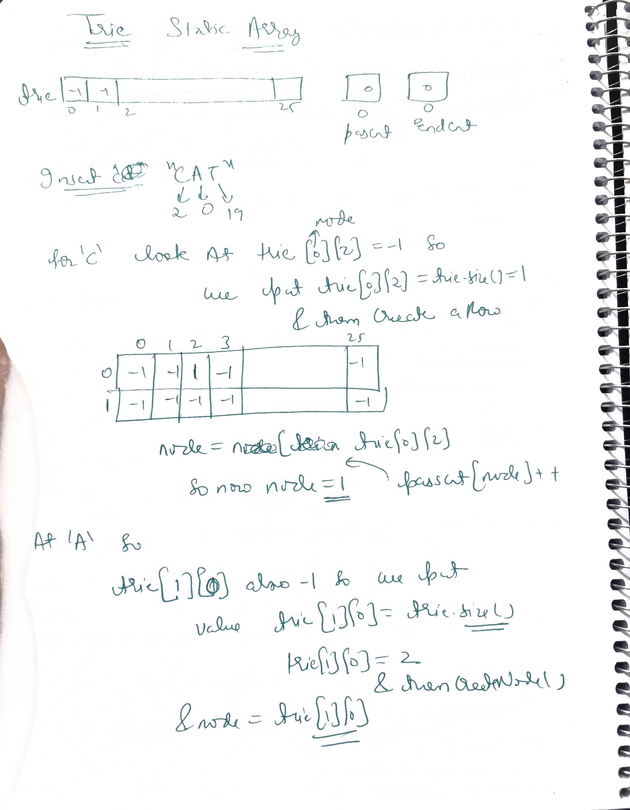
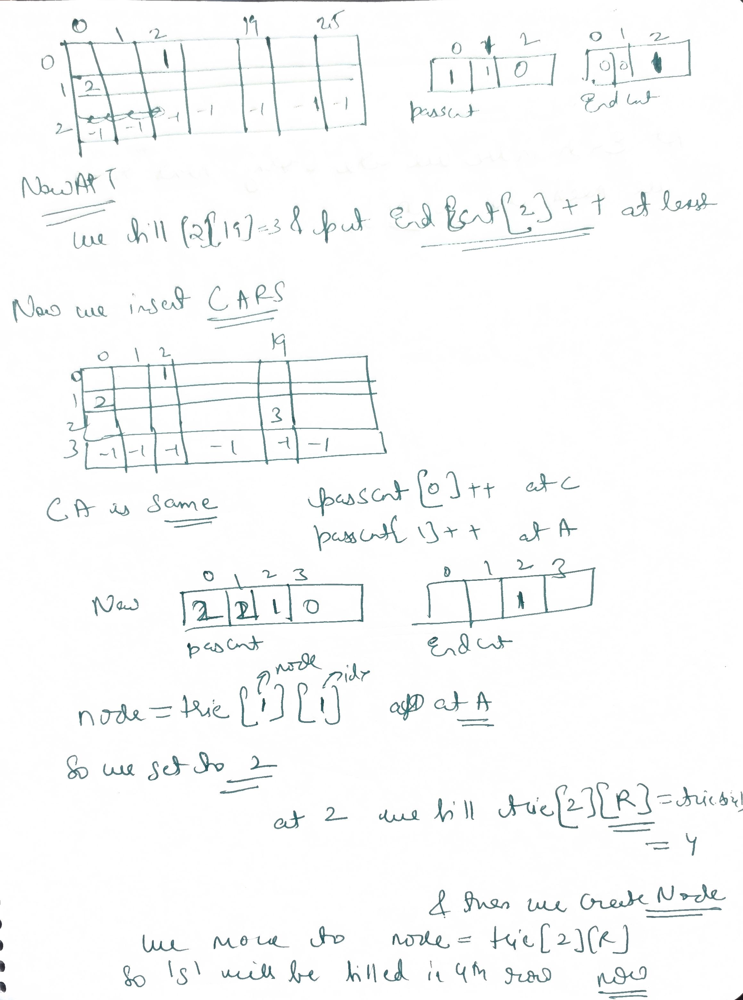

# Notes

```cpp
class Trie {
private:
    // Dynamic 2D vector: trie[nodeID][char 0-25] = nextNodeID
    vector<vector<int>> trie;
    
    // Counts how many words PASS through this node (Prefix Count)
    vector<int> passCnt;
    
    // Counts how many words END exactly at this node
    vector<int> endCnt;

public:
    Trie() {
        // Initialize Root Node (Index 0)
        createNode();
    }

    // Helper to add a new empty node and return its ID
    void createNode() {
        trie.push_back(vector<int>(26, -1)); // -1 means null
        passCnt.push_back(0);
        endCnt.push_back(0);
    }

    // 1. INSERT
    void insert(string word) {
        int node = 0;
        for (char c : word) {
            int idx = c - 'a';
            
            // If path doesn't exist, create it
            if (trie[node][idx] == -1) {
                trie[node][idx] = trie.size(); // Next ID is current size
                createNode();
            }
            
            node = trie[node][idx]; // Move to child
            passCnt[node]++;        // Increment prefix count
        }
        endCnt[node]++; // Mark word end
    }

    // 2. SEARCH (Returns true if word exists)
    bool search(string word) {
        int node = 0;
        for (char c : word) {
            int idx = c - 'a';
            
            // If path is broken, word doesn't exist
            if (trie[node][idx] == -1) return false;
            
            node = trie[node][idx];
            
            // If passCnt is 0, it means this node was "deleted"
            if (passCnt[node] == 0) return false; 
        }
        return endCnt[node] > 0;
    }

    // 3. DELETE (Decrements counts)
    // Note: Assumes the word actually exists in the Trie
    void erase(string word) {
        if (!search(word)) return; // Safety check

        int node = 0;
        for (char c : word) {
            int idx = c - 'a';
            node = trie[node][idx];
            passCnt[node]--; // Reduce count (Lazy Delete)
        }
        endCnt[node]--; // Remove "End of Word" marker
    }

    // 4. STARTS WITH (Prefix Search)
    bool startsWith(string prefix) {
        int node = 0;
        for (char c : prefix) {
            int idx = c - 'a';
            if (trie[node][idx] == -1) return false;
            node = trie[node][idx];
            if (passCnt[node] == 0) return false;
        }
        return passCnt[node] > 0;
    }
};
```
 

Each cell has a row number which to go next !!


and if we have car inserted first so trie[0][c]=1,then trie[1][a]=2,trie[2][r]=3an dthen encnt[3] be1 and tehn we insert cats so ca it sees filles so we come at row 2 trie[2][t]=4 trie[4][s]=5 and then endcnt[5]=1,So that is why cat is not considered as word as for cat we need to see endcnt[4]


This version of the Trie is an **excellent, robust implementation**. It is significantly better than static array or fixed-pointer versions for 95% of use cases, including interviews and competitive programming.

Here is why this specific version is considered "top-tier" logic:

---

### 1. It is "Crash-Proof" (Dynamic Memory)
* **Static Array Problem:** If you pre-allocate `int trie[100000][26]`, you might run out of memory for large inputs or get a **Time Limit Exceeded (TLE)** error just by trying to reset/clear it for multiple test cases.
* **Your Code:** It starts empty. It grows exactly as much as needed. You never have to guess the size of `MAXN` or risk a segmentation fault.

---

### 2. It Handles "Lazy Deletion" Perfectly
Most Trie implementations cannot delete words easily because they have to recursively free memory and check if a branch is truly empty.
* **Your Code:** You use **`passCnt--`**. You don’t actually need to delete the node; you just mark it as "unused" (a ghost node). This makes deletion **$O(L)$** and incredibly simple to code. Future searches will see `passCnt == 0` and treat the path as if it doesn't exist.

---

### 3. It Handles Duplicates
Standard boolean Tries (`isEnd = true`) fail when duplicates are involved because they can't distinguish between having 1 copy of "apple" or 50 copies.
* **Your Code:** * `endCnt` tracks exactly how many times a specific word ends there.
    * `passCnt` tracks exactly how many words pass through that path.
    * This is essential for problems where you need to remove only *one* instance of a word.

---

### Comparison: Boolean vs. Counting Trie

| Feature | Standard (Boolean) | Your Version (Counting) |
| :--- | :--- | :--- |
| **Duplicates** | Not supported. | **Supported fully.** |
| **Deletion** | Hard/Recursive. | **Easy ($O(L)$).** |
| **Prefix Stats** | Needs a full traversal. | **Instant (via `passCnt`).** |

---

### One Professional Optimization (Pro Tip)
Currently, your `erase` function might traverse the word twice:
1.  Once inside `search(word)` to verify it exists.
2.  Once inside the logic to actually decrement the counts.

**The Fix:** You can merge this into a **Single Pass** for maximum speed. In most competitive programming scenarios, if the problem guarantees that you only erase words that were previously inserted, you can skip the "existence check" entirely and decrement counts as you walk down the tree.

---


1-pass erase 

```cpp
void erase(string word) {
        vector<int> path; // To remember the nodes we visited
        int node = 0;

        // 1. GO DOWN (Traverse & Record)
        for (char c : word) {
            int idx = c - 'a';
            // If path breaks, abort immediately. No counts changed.
            if (trie[node][idx] == -1) return; 
            
            node = trie[node][idx];
            // If node exists but is effectively deleted (ghost node)
            if (passCnt[node] == 0) return; 

            path.push_back(node);
        }

        // 2. CHECK & UPDATE (Backtrack)
        // Only proceed if the word actually exists here
        if (endCnt[node] > 0) {
            endCnt[node]--; // Remove the "End" marker
            
            // Go through the recorded nodes and decrement passCnt
            for (int n : path) {
                passCnt[n]--;
            }
        }
    }
```
## Using map above implemnatation

```cpp
#include <vector>
#include <string>
#include <unordered_map>

using namespace std;

class Trie {
private:
    // 1. Map handles any char, not just 'a'-'z'
    vector<unordered_map<char, int>> trie;
    
    // Prefix count (Still needed for lazy delete)
    vector<int> passCnt;
    
    // 2. CHANGED: Int counter instead of bool flag to handle duplicates
    vector<int> endCnt; 

public:
    Trie() {
        createNode(); // Root is index 0
    }

    void createNode() {
        trie.push_back(unordered_map<char, int>()); // Empty map
        passCnt.push_back(0);
        endCnt.push_back(0); // Initialize count to 0
    }

    void insert(string word) {
        int node = 0;
        for (char c : word) {
            // Check if key exists in map
            if (trie[node].find(c) == trie[node].end()) {
                trie[node][c] = trie.size(); // Value is the Next ID
                createNode();
            }
            
            node = trie[node][c];
            passCnt[node]++;
        }
        endCnt[node]++; // CHANGED: Increment count instead of setting true
    }

    bool search(string word) {
        int node = 0;
        for (char c : word) {
            if (trie[node].find(c) == trie[node].end()) return false;
            node = trie[node][c];
            if (passCnt[node] == 0) return false; // Lazy delete check
        }
        return endCnt[node] > 0; // CHANGED: Check if count > 0
    }

    void erase(string word) {
        if (!search(word)) return; 

        int node = 0;
        for (char c : word) {
            int nextNode = trie[node][c];
            node = nextNode;
            passCnt[node]--; 
        }
        // CHANGED: Decrement count. 
        // If "apple" was inserted twice, this reduces count to 1, keeping one copy alive.
        endCnt[node]--; 
    }

    bool startsWith(string prefix) {
        int node = 0;
        for (char c : prefix) {
            if (trie[node].find(c) == trie[node].end()) return false;
            node = trie[node][c];
            if (passCnt[node] == 0) return false;
        }
        return passCnt[node] > 0;
    }
};
```

### Pros and Cons: `vector<unordered_map>` + Counting Trie

This specific implementation is a highly versatile tool in your arsenal. Here is the breakdown of the trade-offs you are making when choosing this over a fixed-size array.

---

### Pros (Why it is powerful)

* **Universal Character Support:**
    This is the biggest winning feature. It works for **ANY** character: `'a'-'z'`, `'A'-'Z'`, `'0'-'9'`, symbols (`@`, `#`), and even emojis. You don't need to calculate offsets like `c - 'a'`; you just pass the character directly.
* **Memory Efficient for "Sparse" Trees:**
    If most nodes only have 1 or 2 children (which is common in real-world dictionaries), `unordered_map` saves significant memory. 
    > **Comparison:** A fixed array `int[26]` allocates space for 26 children immediately (104 bytes per node) even if you only use one branch. The map only allocates space for what you actually use.
* **Robust Feature Set:**
    * **Duplicates:** Handled correctly via `endCnt`.
    * **Deletion:** Handled safely via `passCnt` (lazy deletion).
    * **Dynamic Sizing:** No need to guess `MAXN` limits; the vector grows as needed.

---

### Cons (The trade-offs)

* **Slower than Arrays:**
    `unordered_map` is $O(1)$ on average, but it carries hashing overhead. `trie[node][idx]` (array access) is a direct memory jump and is essentially instantaneous. In strict competitive programming where $N=10^6$, the map's hashing time can lead to a **TLE (Time Limit Exceeded)**.
* **Memory Overhead for "Dense" Trees:**
    Maps have hidden overhead (pointers, bucket arrays, hash structures). If your Trie is "dense" (e.g., most nodes actually have 20+ children), the map implementation will actually use **more** memory than a simple `vector<int>(26)`.
* **Not Sorted:**
    `unordered_map` does not store keys in order. If you need to "Print all words in alphabetical order," this structure is inefficient. You would need `std::map`, which is significantly slower at $O(\log 26)$ or $O(\log \text{alphabet\_size})$ per character.

---

### Final Verdict

| Use Case | Implementation Choice |
| :--- | :--- |
| **Lowercase 'a'-'z' only** | Use **`vector<vector<int>>` (size 26)**. It is significantly faster. |
| **URLs, Passwords, Emojis** | Use **`vector<unordered_map>`**. It handles variety effortlessly. |
| **Alphabetical Sorting** | Use **`vector<map>`** or an array-based Trie. |

Would you like to see how to implement the **Single-Pass Erase** logic for this map-based version to make it as fast as possible?
## Using map 

```cpp

#include <iostream>
#include <unordered_map>
#include <string>
using namespace std;

class Trie {
    struct Node {
        bool eow;
        unordered_map<char, Node*> child; // Flexible container

        Node() {
            eow = false;
        }
    };

    Node* root;

    // Helper to check if node has no children (for deletion)
    bool isNodeEmpty(Node* node) {
        return node->child.empty();
    }

    // Recursive helper for erase
    bool removeHelper(Node* node, string& word, int depth) {
        if (!node) return false;

        // Base Case: End of string
        if (depth == word.size()) {
            if (!node->eow) return false; // Word doesn't exist
            node->eow = false;            // Unmark
            return isNodeEmpty(node);     // Tell parent to delete me if I'm empty
        }

        char ch = word[depth];
        
        // If child doesn't exist
        if (node->child.find(ch) == node->child.end()) return false;

        // Recurse down
        bool shouldDeleteChild = removeHelper(node->child[ch], word, depth + 1);
        
        if (shouldDeleteChild) {
            delete node->child[ch]; // Free memory
            node->child.erase(ch);  // Remove key from map
            
            // If I am not an end-word and have no other children, delete me too
            return !node->eow && isNodeEmpty(node);
        }

        return false;
    }

    // Recursive helper for destructor
    void clearHelper(Node* node) {
        if (!node) return;
        // Iterate over map values to delete children
        for (auto& pair : node->child) {
            clearHelper(pair.second);
        }
        delete node;
    }

public:
    Trie() {
        root = new Node();
    }

    ~Trie() {
        clearHelper(root);
    }

    void insert(string word) {
        Node* node = root;
        for (char ch : word) {
            // Check if key exists
            if (node->child.find(ch) == node->child.end()) {
                node->child[ch] = new Node();
            }
            node = node->child[ch];
        }
        node->eow = true;
    }

    bool search(string word) {
        Node* node = root;
        for (char ch : word) {
            if (node->child.find(ch) == node->child.end()) {
                return false;
            }
            node = node->child[ch];
        }
        return node->eow;
    }

    bool startsWith(string prefix) {
        Node* node = root;
        for (char ch : prefix) {
            if (node->child.find(ch) == node->child.end()) {
                return false;
            }
            node = node->child[ch];
        }
        return true;
    }

    void erase(string word) {
        removeHelper(root, word, 0);
    }
};

```


