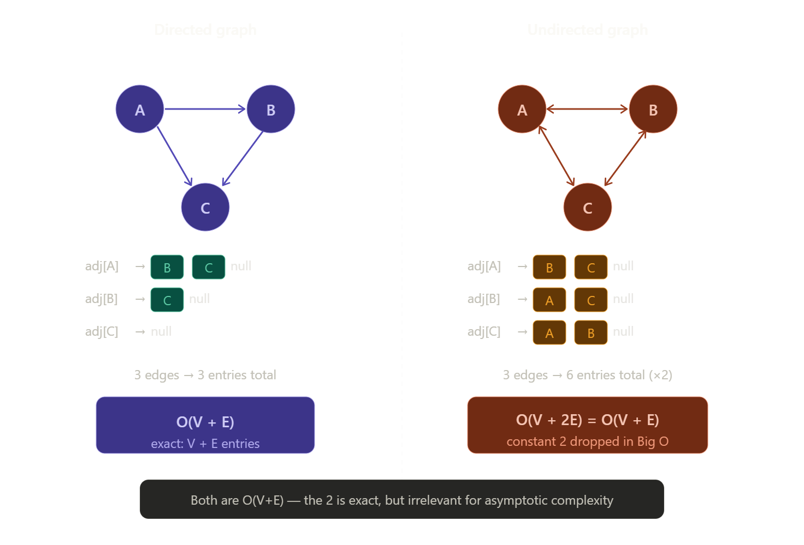

# Notes


.jpg>) .jpg>) .jpg>) .jpg>) .jpg>) .jpg>) .jpg>) .jpg>) .jpg>) .jpg>) .jpg>) .jpg>) .jpg>) .jpg>) .jpg>) .jpg>) .jpg>) .jpg>) .jpg>) .jpg>)


.jpg>) .jpg>) .jpg>) .jpg>) .jpg>) .jpg>) .jpg>) 


### Representations
#### Java

```java

import java.util.ArrayList;


public class adj_list_01{

    static class Graph{
        int V;

        // used this widely
        ArrayList<Integer>[] list;

        public Graph(int v){
            V = v;
            list = new ArrayList[v];
            for(int i = 0; i < v; i++){
                list[i] = new ArrayList<>();
            }
        }
        //no default parameter in java like cpp
        void addEdge(int i, int j, boolean unDirected){
            list[i].add(j);
            if(unDirected)
                list[j].add(i);
        }

        void printAdjList(){
            // Iterate over all the rows!!
            for(int i = 0; i < V; i++){
                System.out.print(i + " --> ");
                // Iterating over one row!
                for(int node: list[i]){
                    System.out.print(node + ", ");
                }

                System.out.println();
            }
        }
    }

    public static void main(String[] args){
        Graph g = new Graph(6);

        g.addEdge(0,1, true);
        g.addEdge(0,4, true);
        g.addEdge(2,1, true);
        g.addEdge(3,4, true);
        g.addEdge(4,5, true);
        g.addEdge(2,3, true);
        g.addEdge(3,5, true);
        g.printAdjList();

    }
}
/* Output:

0 --> 1, 4, 
1 --> 0, 2, 
2 --> 1, 3, 
3 --> 4, 2, 5, 
4 --> 0, 3, 5, 
5 --> 4, 3, 
*/

```
---


```java

import java.util.ArrayList;
import java.util.HashMap;
import java.util.Map;

public class adj_list_02_node {

    static class Node{
        String name;
        ArrayList<String> nbrs;

        Node(String name){
            this.name = name;
            nbrs = new ArrayList<>();
        }
    }

    static class Graph{

        HashMap<String, Node> mp;

        public Graph(ArrayList<String> cities){
            mp = new HashMap<>();
            for(String city: cities){
                mp.put(city, new Node(city));
            }
        }

        public void addEdge(String x, String y, boolean unDirected){
            mp.get(x).nbrs.add(y);
            if(unDirected){
                mp.get(y).nbrs.add(x);
            }
        }

        public void printAdjList(){
            for(Map.Entry<String, Node> cityPair: mp.entrySet()){
                System.out.print(cityPair.getKey() + " --> ");
                for(String nbrs: cityPair.getValue().nbrs){
                    System.out.print(nbrs + ", ");
                }
                System.out.println();
            }
        }


    }

    public static void main(String[] args){

        ArrayList<String> cities = new ArrayList<>();
        cities.add("Delhi");
        cities.add("London");
        cities.add("Paris");
        cities.add( "New York");

        Graph g = new Graph(cities);
        g.addEdge("Delhi", "London" , true);
        g.addEdge("New York","London", true);
        g.addEdge("Delhi","Paris" , true);
        g.addEdge("Paris","New York" , true);

        g.printAdjList();

    }
}

/*
Output:
Delhi --> London, Paris, 
New York --> London, Paris, 
London --> Delhi, New York, 
Paris --> Delhi, New York, 
*/


```

As graph as represented as adjajaency list then For traversal whether BFS or DFS it is `O(V+E)` because V size array each index store edges and we travel every vertex then every edge of that!!


## Why not `O(VE)`?

`VE` means for every vertex we are scannning whole edges in graph and thats not the case!!




#### Cpp

```cpp

#include <bits/stdc++.h>
using namespace std;

int main() {
    
    // Taking the input
    int n, m;
    cin >> n >> m;
    
    // adjacency list for undirected graph
    vector<int> adj[n+1];
    // vector<pair<int,int>> adj[n+1]; for weighted

    // Add the edges to the list
    for(int i = 0; i < m; i++) {
        
        // Taking the input
        int u, v;
        cin >> u >> v;
        
        // Adding the edges
        adj[u].push_back(v);
        adj[v].push_back(u);
    }
    return 0;
}
```
---

```cpp

#include<bits/stdc++.h>

using namespace std;

class Graph{

	int V;
	// array of list<int>
	vector<int>*l;

public:
	Graph(int v){
		V = v;
		l = new vector<int>[V];
	}

	void addEdge(int i,int j,bool undir=true){
		l[i].push_back(j);
		if(undir){
			l[j].push_back(i);
		}
	}

	void printAdjList(){
		
		for(int i=0;i<V;i++){
			cout<<i<<"-->";
			
			for(auto node:l[i]){
				cout << node <<",";
			}
			cout <<endl;

		}


	}

};

int main(){
	Graph g(6);
	g.addEdge(0,1);
	g.addEdge(0,4);
	g.addEdge(2,1);
	g.addEdge(3,4);
	g.addEdge(4,5);
	g.addEdge(2,3);
	g.addEdge(3,5);
	g.printAdjList();
	return 0;
}


/*Output:
0-->1,4,
1-->0,2,
2-->1,3,
3-->4,2,5,
4-->0,3,5,
5-->4,3,

*/


```

---

```cpp
#include<bits/stdc++.h>
using namespace std;


class Node{
public:
	string name;
	vector<string> nbrs;

	Node(string name){
		this->name = name;
	}
};

class Graph{
	//Node Name -- Pointer to Node Object
	//m is map having string key and Node pointer to node it is directed to
	
	unordered_map<string,Node*> m;
public:
	Graph(vector<string> cities){
		for(auto city : cities){
			m[city] = new Node(city);
		}
	}

	void addEdge(string x,string y,bool undir=false){
		m[x]->nbrs.push_back(y);
		if(undir){
			m[y]->nbrs.push_back(x);
		}
	}

	void printAdjList(){
		for(auto cityPair : m){
			auto city = cityPair.first;
			cout<<city<<"-->";
			Node *node = cityPair.second;
			for(auto nbr : node->nbrs){
				cout<<nbr<<",";
			}
			cout<<endl;
		}
	}
};


int main(){
	vector<string> cities = {"Delhi","London","Paris","New York"};
	Graph g(cities);
	g.addEdge("Delhi","London",true);
	g.addEdge("New York","London",true);
	g.addEdge("Delhi","Paris",true);
	g.addEdge("Paris","New York",true);

	g.printAdjList();
	

	return 0;
}

/*if undirected=false
Output:
New York-->London,
Paris-->New York,
Delhi-->London,Paris,
London-->
*/

/*
If undirected=true
Output:
New York-->London,Paris,
Paris-->Delhi,New York,
Delhi-->London,Paris,
London-->Delhi,New York,
*/
```


## Creating adjajency list from edge list

```cpp
#include <bits/stdc++.h>
using namespace std;

class Solution {
public:
    struct trip {
        int v, wt;
        trip(int v, int wt) : v(v), wt(wt) {}
    };

    vector<int> shortestPath(int n, int m, vector<vector<int>> &edges) {
        // Step 1: Create adjacency list
        vector<vector<trip>> graph(n + 1); // 1-based indexing

        // Step 2: Fill adjacency list from edge list
        for (int i = 0; i < m; i++) {
            int a = edges[i][0];
            int b = edges[i][1];
            int w = edges[i][2];

            // Undirected graph => add both directions
            graph[a].push_back(trip(b, w));
            graph[b].push_back(trip(a, w));
        }

        // Print adjacency list for testing
        for (int i = 1; i <= n; i++) {
            cout << i << " -> ";
            for (auto &t : graph[i]) {
                cout << "(" << t.v << "," << t.wt << ") ";
            }
            cout << "\n";
        }

        return {}; // empty list for now
    }
};

int main() {
    Solution sol;
    int n = 5, m = 6;
    vector<vector<int>> edges = {
        {1, 2, 2},
        {1, 4, 1},
        {2, 3, 4},
        {2, 5, 5},
        {3, 5, 1},
        {4, 3, 3}
    };

    sol.shortestPath(n, m, edges);
}

```

```java
class Solution {

    static class trip {
        int v, wt;
        trip(int v, int wt) {
            this.v = v;
            this.wt = wt;
        }
    }

    public List<Integer> shortestPath(int n, int m, int[][] edges) {
        // Step 1: Create adjacency list
        List<trip>[] graph = new ArrayList[n + 1]; // 1-based indexing
        for (int i = 1; i <= n; i++) {
            graph[i] = new ArrayList<>();
        }

        // Step 2: Fill adjacency list from edge list
        for (int i = 0; i < m; i++) {
            int a = edges[i][0];
            int b = edges[i][1];
            int w = edges[i][2];

            // Undirected graph => add both directions
            graph[a].add(new trip(b, w));
            graph[b].add(new trip(a, w));
        }

        // ✅ Now `graph` is ready to be used with Dijkstra or any graph algorithm
        // You can test it by printing:
        for (int i = 1; i <= n; i++) {
            System.out.print(i + " -> ");
            for (trip t : graph[i]) {
                System.out.print("(" + t.v + "," + t.wt + ") ");
            }
            System.out.println();
        }

        // Just returning an empty list for now, as shortestPath logic is not implemented here
        return new ArrayList<>();
    }

    public static void main(String[] args) {
        Solution sol = new Solution();
        int n = 5, m = 6;
        int[][] edges = {
            {1, 2, 2},
            {1, 4, 1},
            {2, 3, 4},
            {2, 5, 5},
            {3, 5, 1},
            {4, 3, 3}
        };

        sol.shortestPath(n, m, edges);
    }
}


```


.jpg>) .jpg>) .jpg>) .jpg>) .jpg>) .jpg>) .jpg>) .jpg>) .jpg>) .jpg>) .jpg>) .jpg>) 


# Question 1 — What Basic Graph and Tree Terminology Is Used?


A graph is a pair

$$
G=(V,E),
$$

where $V$ is the set of vertices and $E$ is the set of edges.

```text
Undirected edge:  A — B       Directed edge:  A → B

Self-loop:        A ↺         Parallel edges:  A ═ B
```

- A **simple graph** has neither self-loops nor multiple edges between the same pair.
- A **multigraph** may contain parallel edges.
- A **path** is a sequence of vertices in which consecutive vertices are joined by an edge.
- A **cycle** is a path that returns to its starting vertex.
- The **degree** of an undirected vertex is the number of incident edges. A self-loop contributes two.

For a rooted tree:

```text
             A                 level 0, depth 0
           /   \
          B     C              level 1
         / \     \
        D   E     F            level 2

parent of D = B
children of A = {B, C}
leaves = {D, E, F}
height of the tree = 2 edges
```

A tree with $N$ vertices has exactly

$$
N-1
$$

edges. It is connected and contains no cycle.

## Common mistakes

- A vertex's **depth** is measured from the root; its **height** is measured down to its deepest leaf.
- A path need not contain every vertex.
- The number of edges, not vertices, normally defines path length in an unweighted graph.

---

# Question 2 — How Can We Represent a Graph in Memory?


Assume $V$ vertices and $E$ edges.

## Approach 1 — Edge list

Store every edge as a pair, or as a triple when weights are present.

```text
Unweighted: (A,B), (A,C), (B,D)
Weighted:   (A,B,7), (A,C,2), (B,D,5)
```

This is compact and convenient when an algorithm processes all edges, but testing whether one particular edge exists takes $O(E)$.

- Space: $O(E)$
- Enumerate all edges: $O(E)$
- Test adjacency: $O(E)$

## Approach 2 — Adjacency matrix

Create a $V\times V$ matrix:

$$
M[u][v]=
\begin{cases}
1, & \text{if }(u,v)\in E,\\
0, & \text{otherwise.}
\end{cases}
$$

For a weighted graph, store the weight instead of `1`, with a separate sentinel for “no edge.”

```text
      A B C D
  A [ 0 1 1 0 ]
  B [ 1 0 0 1 ]
  C [ 1 0 0 0 ]
  D [ 0 1 0 0 ]
```

An undirected graph gives a symmetric matrix because $M[u][v]=M[v][u]$. A directed graph need not be symmetric.

- Space: $O(V^2)$
- Add, remove or test one edge: $O(1)$
- Enumerate neighbours of one vertex: $O(V)$

Use it when the graph is dense or constant-time edge lookup matters.

## Approach 3 — Adjacency list

Each vertex stores only its actual neighbours.

```text
A → B, C
B → A, D
C → A
D → B
```

For a weighted graph:

```text
A → (B,7), (C,2)
B → (A,7), (D,5)
```

- Space: $O(V+E)$
- Enumerate neighbours of $u$: $O(\deg(u))$
- Traverse the complete graph: $O(V+E)$
- Edge lookup: $O(\deg(u))$ with a list, expected $O(1)$ with a hash map

## Which representation should be chosen?

| Need | Best default |
|---|---|
| Iterate through all edges | Edge list |
| Dense graph or very fast edge lookup | Adjacency matrix |
| Sparse graph and graph traversal | Adjacency list |
| Weighted adjacency with updates | Map of neighbour → weight |

The central idea is that a representation is chosen by the operations an algorithm performs—not by memorising one “best” structure.

---

# Question 3 — How Do We Implement a Weighted Undirected Graph in Java?


The lecture represents every vertex by a name. Its neighbour map stores both adjacency and edge weight:

```text
vertices
  "A" → { "B": 7, "C": 2 }
  "B" → { "A": 7, "D": 5 }
```

An undirected edge must be written in **both** neighbour maps.

```java
import java.util.*;

final class WeightedGraph {
    private final Map<String, Map<String, Integer>> graph = new HashMap<>();

    void addVertex(String name) {
        graph.putIfAbsent(name, new HashMap<>());
    }

    void addEdge(String u, String v, int weight) {
        addVertex(u);
        addVertex(v);
        graph.get(u).put(v, weight);
        graph.get(v).put(u, weight);       // omit for a directed graph
    }

    boolean containsEdge(String u, String v) {
        return graph.containsKey(u) && graph.get(u).containsKey(v);
    }

    void removeEdge(String u, String v) {
        if (graph.containsKey(u)) graph.get(u).remove(v);
        if (graph.containsKey(v)) graph.get(v).remove(u);
    }

    void removeVertex(String vertex) {
        if (!graph.containsKey(vertex)) return;
        for (String neighbour : new ArrayList<>(graph.get(vertex).keySet())) {
            graph.get(neighbour).remove(vertex);
        }
        graph.remove(vertex);
    }

    int numberOfEdges() {
        int degreeSum = 0;
        for (Map<String, Integer> neighbours : graph.values()) {
            degreeSum += neighbours.size();
        }
        return degreeSum / 2;
    }

    void display() {
        for (var entry : graph.entrySet()) {
            System.out.println(entry.getKey() + " -> " + entry.getValue());
        }
    }
}
```

## Why divide the degree sum by two?

Every undirected edge $(u,v)$ appears once in $u$'s map and once in $v$'s map. Therefore:

$$
\sum_{v\in V}\deg(v)=2E
\quad\Longrightarrow\quad
E=\frac{1}{2}\sum_{v\in V}\deg(v).
$$

## Complexity

With hash maps, expected costs are:

- Add vertex: $O(1)$
- Add, remove or test an edge: $O(1)$
- Remove vertex $u$: $O(\deg(u))$
- Display the graph: $O(V+E)$
- Space: $O(V+E)$

## Implementation traps

- Update both directions for an undirected edge.
- When deleting a vertex, first delete its name from every neighbour.
- Do not use `0` as “no edge” if a valid edge may have weight zero.
- Parallel edges need a list of weights; a simple map keeps only one weight per neighbour.


