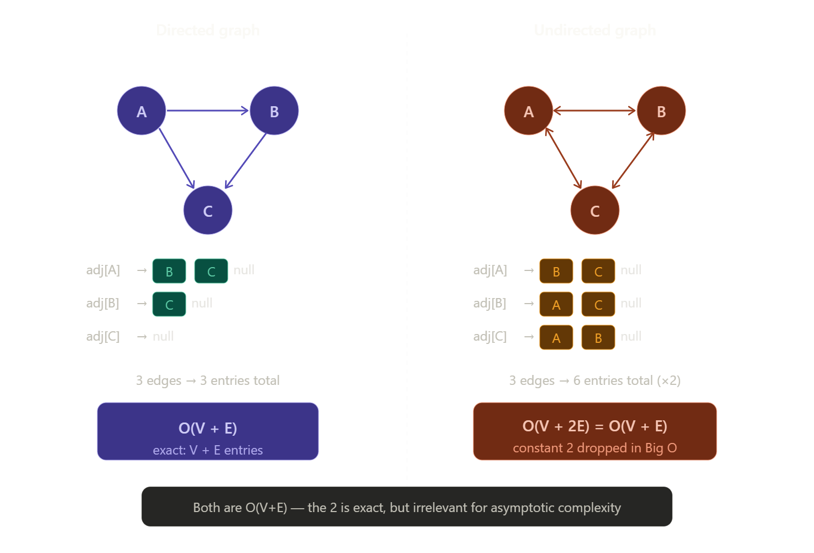

# Notes


.jpg>) .jpg>) .jpg>) .jpg>) .jpg>) .jpg>) .jpg>) .jpg>) .jpg>) .jpg>) .jpg>) .jpg>) .jpg>) .jpg>) .jpg>) .jpg>) .jpg>) .jpg>) .jpg>) .jpg>)


.jpg>) .jpg>) .jpg>) .jpg>) .jpg>) .jpg>) .jpg>) .jpg>) .jpg>) .jpg>) .jpg>) .jpg>) .jpg>) .jpg>) .jpg>) .jpg>) .jpg>) .jpg>) .jpg>) 

### Representations
#### Java

```java

import java.util.ArrayList;


public class adj_list_01{

    static class Graph{
        int V;

        // used this widely
        ArrayList<Integer>[] list;

        public Graph(int v){
            V = v;
            list = new ArrayList[v];
            for(int i = 0; i < v; i++){
                list[i] = new ArrayList<>();
            }
        }
        //no default parameter in java like cpp
        void addEdge(int i, int j, boolean unDirected){
            list[i].add(j);
            if(unDirected)
                list[j].add(i);
        }

        void printAdjList(){
            // Iterate over all the rows!!
            for(int i = 0; i < V; i++){
                System.out.print(i + " --> ");
                // Iterating over one row!
                for(int node: list[i]){
                    System.out.print(node + ", ");
                }

                System.out.println();
            }
        }
    }

    public static void main(String[] args){
        Graph g = new Graph(6);

        g.addEdge(0,1, true);
        g.addEdge(0,4, true);
        g.addEdge(2,1, true);
        g.addEdge(3,4, true);
        g.addEdge(4,5, true);
        g.addEdge(2,3, true);
        g.addEdge(3,5, true);
        g.printAdjList();

    }
}
/* Output:

0 --> 1, 4, 
1 --> 0, 2, 
2 --> 1, 3, 
3 --> 4, 2, 5, 
4 --> 0, 3, 5, 
5 --> 4, 3, 
*/

```
---


```java

import java.util.ArrayList;
import java.util.HashMap;
import java.util.Map;

public class adj_list_02_node {

    static class Node{
        String name;
        ArrayList<String> nbrs;

        Node(String name){
            this.name = name;
            nbrs = new ArrayList<>();
        }
    }

    static class Graph{

        HashMap<String, Node> mp;

        public Graph(ArrayList<String> cities){
            mp = new HashMap<>();
            for(String city: cities){
                mp.put(city, new Node(city));
            }
        }

        public void addEdge(String x, String y, boolean unDirected){
            mp.get(x).nbrs.add(y);
            if(unDirected){
                mp.get(y).nbrs.add(x);
            }
        }

        public void printAdjList(){
            for(Map.Entry<String, Node> cityPair: mp.entrySet()){
                System.out.print(cityPair.getKey() + " --> ");
                for(String nbrs: cityPair.getValue().nbrs){
                    System.out.print(nbrs + ", ");
                }
                System.out.println();
            }
        }


    }

    public static void main(String[] args){

        ArrayList<String> cities = new ArrayList<>();
        cities.add("Delhi");
        cities.add("London");
        cities.add("Paris");
        cities.add( "New York");

        Graph g = new Graph(cities);
        g.addEdge("Delhi", "London" , true);
        g.addEdge("New York","London", true);
        g.addEdge("Delhi","Paris" , true);
        g.addEdge("Paris","New York" , true);

        g.printAdjList();

    }
}

/*
Output:
Delhi --> London, Paris, 
New York --> London, Paris, 
London --> Delhi, New York, 
Paris --> Delhi, New York, 
*/


```

As graph as represented as adjajaency list then For traversal whether BFS or DFS it is `O(V+E)` because V size array each index store edges and we travel every vertex then every edge of that!!


## Why not `O(VE)`?

`VE` means for every vertex we are scannning whole edges in graph and thats not the case!!




#### Cpp

```cpp

#include <bits/stdc++.h>
using namespace std;

int main() {
    
    // Taking the input
    int n, m;
    cin >> n >> m;
    
    // adjacency list for undirected graph
    vector<int> adj[n+1];
    // vector<pair<int,int>> adj[n+1]; for weighted

    // Add the edges to the list
    for(int i = 0; i < m; i++) {
        
        // Taking the input
        int u, v;
        cin >> u >> v;
        
        // Adding the edges
        adj[u].push_back(v);
        adj[v].push_back(u);
    }
    return 0;
}
```
---

```cpp

#include<bits/stdc++.h>

using namespace std;

class Graph{

	int V;
	// array of list<int>
	vector<int>*l;

public:
	Graph(int v){
		V = v;
		l = new vector<int>[V];
	}

	void addEdge(int i,int j,bool undir=true){
		l[i].push_back(j);
		if(undir){
			l[j].push_back(i);
		}
	}

	void printAdjList(){
		
		for(int i=0;i<V;i++){
			cout<<i<<"-->";
			
			for(auto node:l[i]){
				cout << node <<",";
			}
			cout <<endl;

		}


	}

};

int main(){
	Graph g(6);
	g.addEdge(0,1);
	g.addEdge(0,4);
	g.addEdge(2,1);
	g.addEdge(3,4);
	g.addEdge(4,5);
	g.addEdge(2,3);
	g.addEdge(3,5);
	g.printAdjList();
	return 0;
}


/*Output:
0-->1,4,
1-->0,2,
2-->1,3,
3-->4,2,5,
4-->0,3,5,
5-->4,3,

*/


```

---

```cpp
#include<bits/stdc++.h>
using namespace std;


class Node{
public:
	string name;
	vector<string> nbrs;

	Node(string name){
		this->name = name;
	}
};

class Graph{
	//Node Name -- Pointer to Node Object
	//m is map having string key and Node pointer to node it is directed to
	
	unordered_map<string,Node*> m;
public:
	Graph(vector<string> cities){
		for(auto city : cities){
			m[city] = new Node(city);
		}
	}

	void addEdge(string x,string y,bool undir=false){
		m[x]->nbrs.push_back(y);
		if(undir){
			m[y]->nbrs.push_back(x);
		}
	}

	void printAdjList(){
		for(auto cityPair : m){
			auto city = cityPair.first;
			cout<<city<<"-->";
			Node *node = cityPair.second;
			for(auto nbr : node->nbrs){
				cout<<nbr<<",";
			}
			cout<<endl;
		}
	}
};


int main(){
	vector<string> cities = {"Delhi","London","Paris","New York"};
	Graph g(cities);
	g.addEdge("Delhi","London",true);
	g.addEdge("New York","London",true);
	g.addEdge("Delhi","Paris",true);
	g.addEdge("Paris","New York",true);

	g.printAdjList();
	

	return 0;
}

/*if undirected=false
Output:
New York-->London,
Paris-->New York,
Delhi-->London,Paris,
London-->
*/

/*
If undirected=true
Output:
New York-->London,Paris,
Paris-->Delhi,New York,
Delhi-->London,Paris,
London-->Delhi,New York,
*/
```


