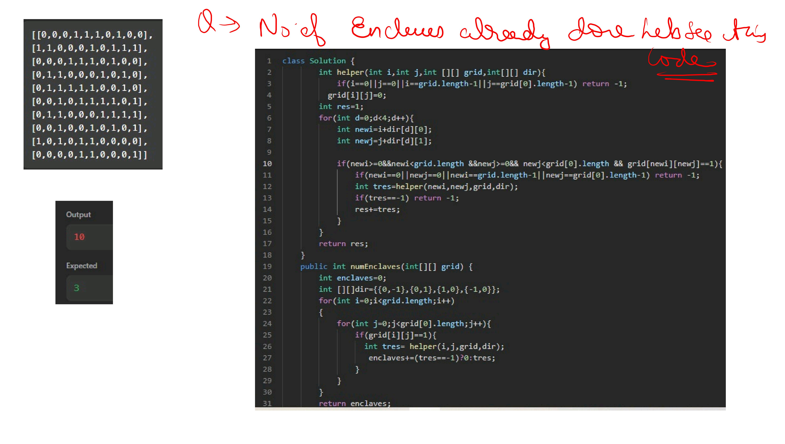

# Notes





.jpg) .jpg) .jpg) .jpg) .jpg) .jpg) .jpg) .jpg) .jpg) .jpg) .jpg) .jpg) .jpg)


```java


//User function Template for Java


class Solution
{
    private void dfs(int v,ArrayList<ArrayList<Integer>> adj,int[] vis,LinkedList<Integer>stk){
        vis[v]=1;
        for(var v1:adj.get(v)){
            if(vis[v1]==0){
                dfs(v1,adj,vis,stk);
                    
            }
        }
        
        stk.addFirst(v);
    }
       private void dfs2(int v,ArrayList<ArrayList<Integer>> adj,int[] vis){
        vis[v]=2;
        for(var v1:adj.get(v)){
            if(vis[v1]==1){
                dfs2(v1,adj,vis);
                    
            }
        }
        
    }
    private void transpose(ArrayList<ArrayList<Integer>> adj,ArrayList<ArrayList<Integer>> adj2){
       for(int i=0;i<adj.size();i++){
           for(int n:adj.get(i)){
               adj2.get(n).add(i);
           }
       }
    }
    //Function to find number of strongly connected components in the graph.
    public int kosaraju(int V, ArrayList<ArrayList<Integer>> adj)
    {
        LinkedList<Integer>stk=new LinkedList<>();
        int[] vis=new int[V+1];
        for(int v=0;v<V;v++){
            if(vis[v]==0){
                dfs(v,adj,vis,stk);
            }
        }
        ArrayList<ArrayList<Integer>> adj2=new ArrayList<>();
        for(int v=0;v<adj.size();v++){
            adj2.add(new ArrayList<>());
        }
        transpose(adj,adj2);
        int count=0;
        while(stk.size()>0){
            int el=stk.removeFirst();
            if(vis[el]==1){
                dfs2(el,adj2,vis);
                count++;
            }
        }
        return count;
    }
}
```

 .jpg) .jpg) .jpg) .jpg) .jpg) .jpg) .jpg) .jpg) .jpg) .jpg) .jpg) .jpg) .jpg) .jpg) .jpg) .jpg) .jpg) .jpg) .jpg) .jpg) .jpg) .jpg) .jpg) .jpg) .jpg) .jpg) .jpg)


