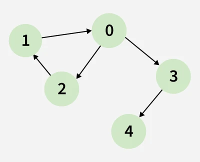

# Notes


Do not see code on left just start with Kosaraju!!


 .jpg) 
 
 ### 1. The Core Concept: "The Round Trip"
A **Strongly Connected Component (SCC)** is a group of nodes in a directed graph where you can get from any node to any other node within that group and get back.

Think of it as **"Two-Way Street" Zones**:
* If you can drive from $A \to B$ and find a way back from $B \to A$, then $A$ and $B$ are in the **same SCC**.
* If you can drive from $A \to B$ but can never return to $A$ (because the roads are one-way), then $A$ and $B$ are **NOT** in the same SCC.

### 2. Visualizing It (The "Islands" Analogy)
Imagine a directed graph as a collection of **Islands** connected by **One-Way Bridges**.

* **Inside an Island (The SCC):**
    * You can travel freely between any two points. It is a "cycle-rich" environment. Every node effectively belongs to a cycle with every other node.
* **Between Islands:**
    * Once you cross a bridge from Island 1 to Island 2, you can never go back.
    * This structure implies that if you shrink each SCC into a single "Super Node," the resulting graph is always a **DAG (Directed Acyclic Graph)**.

### 3. Real-World Examples
* **Social Networks (Twitter/X):**
    * **SCC:** A "Clique" where everyone follows everyone else. User A follows B, B follows C, and C follows A.
    * **Not SCC:** You follow a celebrity, but they don't follow you back. You are not in the same component.
* **The Web:**
    * **SCC:** A cluster of related Wikipedia pages that all link to one another.
    * **Not SCC:** A page that links to a PDF download. The PDF cannot link back to the page.

### Summary
* **Undirected Graph:** Being "Connected" is simple (is there a path?).
* **Directed Graph:** Being "Strongly Connected" is strict (is there a round trip?).
* **Key Property:** An SCC is the **largest possible** group of nodes that are all mutually reachable.
 
 .jpg) .jpg) .jpg) .jpg) .jpg) .jpg) .jpg) .jpg) .jpg) .jpg) .jpg)


```java


//User function Template for Java


class Solution
{
    private void dfs(int v,ArrayList<ArrayList<Integer>> adj,int[] vis,LinkedList<Integer>stk){
        vis[v]=1;
        for(var v1:adj.get(v)){
            if(vis[v1]==0){
                dfs(v1,adj,vis,stk);
                    
            }
        }
        
        stk.addFirst(v);
    }
       private void dfs2(int v,ArrayList<ArrayList<Integer>> adj,int[] vis){
        vis[v]=2;
        for(var v1:adj.get(v)){
            if(vis[v1]==1){
                dfs2(v1,adj,vis);
                    
            }
        }
        
    }
    private void transpose(ArrayList<ArrayList<Integer>> adj,ArrayList<ArrayList<Integer>> adj2){
       for(int i=0;i<adj.size();i++){
           for(int n:adj.get(i)){
               adj2.get(n).add(i);
           }
       }
    }
    //Function to find number of strongly connected components in the graph.
    public int kosaraju(int V, ArrayList<ArrayList<Integer>> adj)
    {
        LinkedList<Integer>stk=new LinkedList<>();
        int[] vis=new int[V+1];
        for(int v=0;v<V;v++){
            if(vis[v]==0){
                dfs(v,adj,vis,stk);
            }
        }
        ArrayList<ArrayList<Integer>> adj2=new ArrayList<>();
        for(int v=0;v<adj.size();v++){
            adj2.add(new ArrayList<>());
        }
        transpose(adj,adj2);
        int count=0;
        while(stk.size()>0){
            int el=stk.removeFirst();
            if(vis[el]==1){
                dfs2(el,adj2,vis);
                count++;
            }
        }
        return count;
    }
}
```

### 1. The Problem: "The Leak"
Imagine you have two castles, **Castle A** and **Castle B**.
Inside each castle, there are many rooms connected to each other (Strongly Connected).
There is a one-way bridge from **Castle A to Castle B**.

**If you run DFS on Castle A in the original graph:**
* You explore all the rooms in Castle A.
* Then, you accidentally cross the bridge and explore Castle B too.
* **Result:** Your DFS thinks A and B are one giant castle. You failed to separate them. The DFS "leaked" out.

### 2. The Solution: "The Trap" (Transpose)
Now, imagine you reverse the direction of every bridge (**Transpose**).
The bridge now goes from **Castle B $\to$ Castle A**.

**Now, run DFS on Castle A again:**
* You explore all the rooms in Castle A. (You can still move around inside because cycles work both ways).
* You try to leave Castle A. **You can't.**
* The bridge to B is gone (it now points towards you).
* Any other bridges that used to lead out now lead in.
* **Result:** The DFS is **trapped** inside Castle A. It marks only Castle A as visited and stops.
* **Success:** You have successfully counted "1 Component" and isolated it from the rest.

### 3. Why the Stack Matters
You might ask: *"Wait, if the bridge is now B $\to$ A, what if I start DFS at B? Won't I leak into A?"*

**Yes, you would.**
That is why the **First Pass (Stack)** is critical.
* The stack ensures you always start with **Castle A** (the one that was originally upstream).
* In the Reversed Graph, Castle A becomes a **"Sink"** (a dead end).
* By starting with the dead end, you guarantee you can't go anywhere else.

### Summary
* **Original Graph:** $A \to B$. DFS on A "leaks" into B.
* **Transposed Graph:** $B \to A$. DFS on A is trapped. It hits a wall because the edge points backward.

> **The Code:** `dfs2` is essentially walking around a room with all the doors locked from the outside. It finds everyone in the room but cannot leave.


### The "Component" Definition (For SCCs / Kosaraju)

In algorithms like **Kosaraju's** or **Tarjan's**, we don't just look at single nodes; we look at groups of nodes (**Strongly Connected Components**).

Imagine **"Source Island"** and **"Sink Island"**:

* **Source Component:**
    * The "Top of the Hill."
    * You can drive from here to *anywhere else* in the graph.
    * But you can never come back. Once you leave a Source Component, you fall down the hill.
    * **No incoming edges** from other islands.

* **Sink Component:**
    * The "Bottom of the Pit."
    * You can arrive here from *anywhere*.
    * But you can never leave. You are trapped.
    * **No outgoing edges** to other islands.

###  Why Kosaraju flips them?
This is the **"Aha!" moment** for the algorithm.

* **Original Graph:**
    * DFS naturally flows from **Source $\to$ Sink**.
    * If you start at the Source, you "leak" into the Sink. You can't separate them.

* **Transposed (Reversed) Graph:**
    * The **Source** becomes a **Sink**. (The "Tap" becomes a "Drain").
    * The **Sink** becomes a **Source**.
    * Now, if you start at the original Source (which is now a Sink), you are **trapped**. You can't flow anywhere. You are isolated. 

### Summary:
* **Source:** The start. "I can reach everyone, but nobody can reach me."
* **Sink:** The end. "Everyone can reach me, but I can't reach anyone."

### The stack stores nodes based on who finishes LAST.

#### 1. The "Boss" Analogy
Think of the DFS as a manager making phone calls.

* **Component A (Source)** calls **Component B (Sink)**.
* A cannot hang up the phone until B is done talking.
* Therefore, **B finishes first** and goes into the stack (bottom).
* **A finishes last** and goes into the stack (top).

#### 2. The Result on the Stack
Because the "Source Component" (the one that reaches everyone else) has to wait for everyone downstream to finish, its nodes end up at the **TOP** of the stack.

#### 3. Why is this perfect for Pass 2?
* **Top of Stack = Source Component.**
* **Transposed Graph:** The Source becomes a **Sink** (a trap).
* So, when you pop from the top of the stack, you are guaranteed to be starting in a **Trap**. You can't leak out to the rest of the graph because the edges are reversed.

#### Summary:

* **Stack Bottom:** The "Sink" components (finished early).
* **Stack Top:** The "Source" components (finished last).
* **Why?** Because the Source is responsible for visiting the Sink, so it must stay "active" longer.

Q--> A scc is always  a cycle

No, that is a common misconception. A Strongly Connected Component (SCC) is **NOT** always a simple cycle.

Here is the "Senior Engineer" distinction:

### 1. The Distinction: Cycle vs. SCC
* **A Cycle:** A simple path that starts and ends at the same node (e.g., $A \to B \to C \to A$).
* **An SCC:** A group of nodes where **everyone can reach everyone else**.

### 2. Why they are different (Counter-Examples)

**Case A: The "Messy Web" (Not a simple cycle)**
Imagine 4 nodes: $A, B, C, D$.
* $A \to B$
* $B \to C$
* $C \to A$ (This is a cycle $A-B-C$).
* **Now add extra edges:** $A \to C$ and $B \to A$.
* **Result:** This is a dense web of connections. You can go $A \to C \to A$, or $A \to B \to A$.
* **Verdict:** This whole group $\{A, B, C\}$ is an SCC, but it is much more complex than a single loop. It contains *multiple* overlapping cycles.

**Case B: The "Single Node" (Trivial SCC)**
Imagine a graph with just one node $A$ and no edges at all.
* **Is it an SCC?** Yes. By definition, $A$ can reach itself (trivial path of length 0).
* **Is it a cycle?** No. There are no edges.

### 3. The Relationship
* **Every Cycle is part of an SCC:** If you have a cycle, all nodes in that cycle belong to the same SCC.
* **Not every SCC is a Cycle:** An SCC can be a single node, or a complex combination of many intersecting cycles.

### Summary Table

| Feature | Simple Cycle | Strongly Connected Component (SCC) |
| :--- | :--- | :--- |
| **Structure** | A single loop (Ring). | A "blob" of nodes with full connectivity. |
| **Complexity** | Simple ($N$ edges for $N$ nodes). | Can be Dense ($N^2$ edges possible). |
| **Trivial Case** | Must have at least 1 edge ($A \to A$). | Can have 0 edges (Single isolated node). |
| **Logic** | $A \to \dots \to A$. | $\forall u,v: \text{path}(u \to v) \text{ AND } \text{path}(v \to u)$. |

> **Interview Tip:**
> If an interviewer asks this, say: *"An SCC is a set of mutually reachable nodes. While it **contains** cycles (if size > 1), it is often a complex union of multiple overlapping cycles, not just a single ring."*

 .jpg) .jpg) .jpg) .jpg) .jpg) .jpg) .jpg) .jpg) .jpg) .jpg) .jpg) .jpg) .jpg) .jpg) .jpg) .jpg) .jpg) 
 


### 1. What is a "Strongly Connected Component" (SCC)?
An **SCC** is a group of nodes where everyone can reach everyone else. It is like a "Round Trip" zone.
* If you start at **0**, you can go to **2**, then **1**, and back to **0**.
* If you start at **1**, you can go to **0**, then **2**, and back to **1**.

In your specific image, the nodes `{0, 1, 2}` form a single SCC. They are locked together in a cycle.

### 2. The "Super Node" View (Condensation Graph)
To understand the "First" SCC, imagine shrinking that cycle into a single big dot called **Team A**.

$$\text{Team A } (\{0, 1, 2\}) \to \text{Node 3} \to \text{Node 4}$$

In this simplified view (called a **DAG** or **Condensation Graph**):
* **Team A** is at the very top. It has outgoing edges but no incoming edges from the rest of the world (Nodes 3 or 4).
* Because it is at the top, it is called the **Source Component** (or the "First" SCC).

### 3. Why is this important for the Mother Vertex?
A **Mother Vertex** must live inside this "First" SCC (Source Component).

**The Rule:** If any node in the Source SCC can reach the rest of the graph, then **every** node in that SCC can also reach the rest of the graph.

In your example:
* Since **0** can reach **3** and **4**...
* And **1** can reach **0** (because they are in the same SCC)...
* Then **1** can effectively reach **3** and **4** too.

### Summary
* The **"First SCC"** is simply the group of nodes at the start of the flow.
* **In your image:** The cycle `{0, 1, 2}` is the First SCC.
* **The Result:** Any node inside this group (0, 1, or 2) is a valid Mother Vertex. The algorithm is happy finding any of them.

### The Intuition: "The Cleanup Crew"
Imagine the Mother Vertex is the **"Boss"** and all other nodes are **"Employees"**. The Boss can call (reach) every Employee, but Employees cannot call the Boss.

We iterate through our list of people ($0$ to $V-1$) and ask them to "Start a Phone Chain" (DFS).
There are only two scenarios:

**Scenario 1: We pick the "Boss" (Mother) First**
* We start DFS from the Boss.
* The Boss calls Employee A, who calls Employee B, etc.
* Since the Boss can reach everyone, this single DFS traversal visits every single node in the graph.
* The loop finishes. We never start a DFS again because everyone is already visited.
* **Result:** The Boss was the last (and only) node to start a DFS. **Candidate = Boss.**

**Scenario 2: We pick an "Employee" (Child) First**
* We start DFS from Employee A.
* Employee A can only reach their own small team (or nobody). They finish their calls. We mark them as visited.
* The loop continues. We pick Employee B. They call their team. We mark them visited.
* Finally, we reach the Boss in the loop.
* The Boss looks at their list. They see Employee A (Already Visited). They see Employee B (Already Visited).
* The Boss marks themselves as visited and finishes.
* **Result:** The Boss was the last node to start a DFS. **Candidate = Boss.**

---

### The "Deep Dive" (For the Interviewer)
If the interviewer asks "Why?", draw this simple graph: `1 -> 0` and `1 -> 2`.
(Node 1 is the Mother).

Now trace the loop: `for (int i = 0; i < 3; i++)`

**Step 1: i = 0**
* Is 0 visited? **No.**
* Start `DFS(0)`.
* 0 points to nothing. DFS ends.
* **Current Candidate:** 0
* **Status:** 0 is visited. 1, 2 are unvisited.

**Step 2: i = 1 (The Mother)**
* Is 1 visited? **No.**
* Start `DFS(1)`.
* 1 tries to go to 0. 0 is already visited. (Do nothing).
* 1 goes to 2.
* Start `DFS(2)`.
* 2 points to nothing. DFS ends.
* 1 finishes.
* **Current Candidate:** 1
* **Status:** 0, 1, 2 are all visited.

**Step 3: i = 2**
* Is 2 visited? **Yes.**
* **SKIP.**

**Final Result:** The last node that actually ran code was **1**.

---

### The "SCC / DAG" Explanation (The Senior Logic)
This is the technical answer that gets you hired.

* **Topological Order:** If you view the graph as a hierarchy, the Mother Vertex sits at the very top (**Source**). The nodes that cannot reach anyone else sit at the bottom (**Sink**).
* **The Rule of DFS:**
    * If you process a **Child (Sink)** first, it gets marked "Visited" and is removed from the pool. The Mother is still waiting in the list.
    * If you process the **Mother (Source)** first, it reaches down and marks the Child "Visited". The Child is removed from the pool (the loop skips it).
* **The Inevitable Conclusion:**
    * A Child node cannot eliminate a Mother node from the loop (because Children can't reach Mothers).
    * A Mother node always eliminates the Children (by visiting them).
    * Therefore, the Mother Vertex (if it exists) is always the "Last Man Standing" in the loop. It is either processed last, or it is processed early and eliminates everyone else from being processed at all.

### Summary Phrase for the Interview
> "A Mother Vertex is like the root of a tree. If I start DFS from the leaves (children) first, I only mark small sections. The root is still unvisited. Eventually, I must visit the root. Once I visit the root, it covers everything else. So, the root is always the last unvisited node that triggers a new traversal."

 ```java

class Solution
{
    //Function to find a Mother Vertex in the Graph.
    private void dfs(int v,int[] vis, ArrayList<ArrayList<Integer>>adj,int vis_val,int n_vis_val){
        vis[v]=vis_val;
        for(var i:adj.get(v)){
            if(vis[i]==n_vis_val){
                dfs(i,vis,adj,vis_val,n_vis_val);
            }
        }
        
    }

    public int findMotherVertex(int V, ArrayList<ArrayList<Integer>>adj)
    {
        int potential_mother_vertex=-1;
        int[] vis=new int[V+1];
        for(int i=0;i<V;i++){
            if(vis[i]==0){
                potential_mother_vertex=i;
                dfs(i,vis,adj,1,0);
            }
        }
        dfs(potential_mother_vertex,vis,adj,2,1);
        for(int i=0;i<V;i++){
            if(vis[i]==1) return -1;
        }
        return potential_mother_vertex;
    }
}
```
 This is a clever and optimized implementation of the **Mother Vertex** finding algorithm.
Instead of the standard approach (checking every node or resetting the visited array), this code uses a **Two-Pass DFS strategy** with a "state toggle" optimization to save space and time.

Here is the "Senior Engineer" breakdown of the logic.

### The Algorithm: "Last Man Standing"
The core mathematical property used here is:

> If a Mother Vertex exists, it must be the **last vertex** from which a DFS traversal was initiated in a full graph scan.

**Why?**
* If a node `U` is a Mother Vertex, it can reach everyone.
* If we start a DFS from `U` early, it visits everyone, and the loop finishes.
* If we start DFS from other nodes first, they will visit whatever they can. Eventually, we must process `U`. Once we process `U`, it will visit everything remaining.

Therefore, the last node that triggers a fresh DFS call is our **only candidate** for being the Mother Vertex.
 

 ###  Complexity Analysis

* **Time Complexity:** $O(V + E)$
    * We run DFS exactly twice. Once to find the candidate, once to verify. Both are linear traversals.
* **Space Complexity:** $O(V)$
    * Recursion stack + `vis` array.
* **Senior Note:** This implementation is space-optimal because it reuses the `int[] vis` array for both passes instead of allocating a second one.

### Summary Verdict
* This is a **Production-Grade** solution.
* It avoids $O(V \cdot E)$ naive approaches.
* It uses the "Last Finished Vertex" property of Directed Graphs (related to Kosaraju's Algorithm for SCCs).
* It manages state cleanly (`0` -> `1` -> `2`) to avoid re-allocations.


Q--> a mother vertex will never be visited by any node other than is SCC??

Ans-->
### Yes, you are exactly right.
This is a fundamental property of a Mother Vertex.

### The Logic (Proof by Contradiction)
Let's prove why a node outside the Mother Vertex's Strongly Connected Component (SCC) can never visit the Mother Vertex.

**Assume the opposite:** Imagine there is a node **A** that is outside the Mother's SCC, but **A** can somehow reach the Mother Vertex (**M**).

1.  **Path:** $A \to \dots \to M$
2.  **Recall the definition of a Mother Vertex:** A Mother Vertex must be able to reach every node in the graph.
3.  **Therefore:** M must be able to reach A.
4.  **Path:** $M \to \dots \to A$

**The Result:**
* If **A** can reach **M**, and **M** can reach **A**, they are stuck in a **Cycle**.
* By definition, any two nodes in a cycle belong to the **SAME SCC**.

**The Contradiction:**
* We started by saying **A** was **outside** the SCC.
* But the logic proves **A** must be **inside** the SCC.
* **Therefore, it is impossible for an "outsider" to reach the Mother Vertex.**

---

### The "Source Component" Visualization
If you condense the graph into a **DAG (Directed Acyclic Graph)** of SCCs:

* **The Mother SCC (Source):** It sits at the very top of the hierarchy. It has arrows pointing **out** to the rest of the graph.
* **The Rest of the Graph:** It is "downstream." Arrows point **away** from the Mother SCC.
* **Incoming Edges?** A Source Component (by definition) has **Zero Incoming Edges** from other components.

### Summary
> If an outsider could visit the Mother, the Mother wouldn't be at the "top" of the graph anymore (because someone would be above it), and it would fail to be a Mother Vertex to that node above it.


 .jpg) .jpg) .jpg) .jpg) .jpg) .jpg) .jpg) .jpg) .jpg) .jpg)


