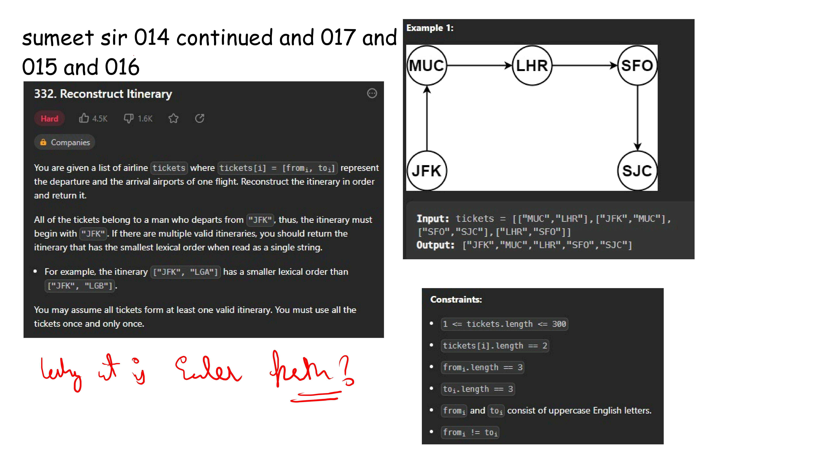

# Notes




.jpg) .jpg) .jpg) .jpg) .jpg)


.jpg) .jpg) .jpg) .jpg) .jpg) .jpg) .jpg) .jpg) .jpg) .jpg) .jpg) .jpg) .jpg) .jpg) .jpg) .jpg) .jpg) .jpg) .jpg) .jpg) .jpg) .jpg) .jpg) .jpg) .jpg) .jpg) .jpg) .jpg) .jpg) .jpg) 

```java
class Solution {
    public int CheapestFlight(int n, int[][] flights, int src, int dst, int k) {
              int [] dist=new int[n];
        Arrays.fill(dist,Integer.MAX_VALUE);
        dist[src]=0;
        int[] dist1=null;
        for(int i=0;i<=k;i++){
            dist1=dist.clone();
            for(var flight:flights){
                int u=flight[0];
                int v=flight[1];
                int wt=flight[2];
                if(dist[u]!=Integer.MAX_VALUE){
                    dist1[v]=Math.min(dist[u]+wt,dist1[v]);
                }
            }
            dist=dist1;
        }
        return dist[dst]==Integer.MAX_VALUE?-1:dist[dst];
    }
}


```

## Cpp code by striver 

```cpp
#include <bits/stdc++.h>
using namespace std;

/* Define P as a shorthand for
the pair<int, pair<int,int>> type */
#define P pair <int, pair<int,int>>

class Solution {
public:
    
    /* Function to find cheapest price from 
    src to dst with at most k stops */
    int CheapestFlight(int n, vector<vector<int>>& flights, 
                       int src, int dst, int k) {
        
        // To store the graph
        vector<pair<int,int>> adj[n];
        
        // Adding edges to the graph
        for(auto it : flights) {
            adj[it[0]].push_back({it[1], it[2]});
        }
        
        // To store minimum distance
        vector<int> minDist(n, 1e9);
        minDist[src] = 0;
        /* Queue storing the elements of 
        the form {stops, {node, dist}} */
        queue <P> q;
        
        // Add the source to the queue
        q.push({0, {src, 0}});
        
        // Until the queue is empty
        while(!q.empty()) {
            
            // Get the element from queue
            auto p = q.front(); q.pop();
            
            int stops = p.first; //stops
            int node = p.second.first; // node
            int dist = p.second.second; // distance
            
            /* If the number of stops taken exceed k,
            skip and move to the next element */
            if(stops > k) continue;
            
            // Traverse all the neighbors
            for(auto it : adj[node]) {
                
                int adjNode = it.first; // Adjacent node
                int edgeWt = it.second; // Edge weight
                
                /* If the tentative distance to 
                reach adjacent node is smaller 
                than the known distance and number 
                of stops doesn't exceed k */
                if(dist + edgeWt < minDist[adjNode] && 
                   stops <= k) {
                       
                    // Update the known distance
                    minDist[adjNode] = dist + edgeWt;
                    
                    // Add the new element to queue
                    q.push({stops+1, {adjNode, dist + edgeWt}});
                }
            }
        }
        
        /* If the destination is 
        unreachable, return -1 */
        if(minDist[dst] == 1e9) 
            return -1;
        
        // Otherwise return the result
        return minDist[dst];
    }
};

int main() {
    int n = 4;
    vector<vector<int>> flights = {
        {0,1,100},
        {1,2,100},
        {2,0,100},
        {1,3,600},
        {2,3,200}
    };
    
    int src = 0, dst = 3, k = 1;
    
    /* Creating an instance of 
    Solution class */
    Solution sol; 
    
    /* Function call to determine cheapest flight 
    from source to destination within K stops */
    int ans = 
        sol.CheapestFLight(n, flights, src, dst, k);
    
    // Output
    cout << "The cheapest flight from source to destination within K stops is: " << ans;
    
    return 0;
}
```

# Shortest Path Arena: Cheapest Flights Within K Stops

Welcome to the Shortest Path arena. You have just brought two completely different algorithmic heavyweights to the same fight: **LeetCode 787: Cheapest Flights Within K Stops**.

* **The Java Code:** Bounded Bellman-Ford Algorithm.
* **The C++ Code:** Level-Order BFS (Breadth-First Search).

This is a notorious problem because standard shortest-path algorithms (like Dijkstra) often fail here. You have two conflicting constraints: you want the lowest cost, but you are artificially limited by the number of stops ($K$).

Here is the "Senior Engineer" breakdown of how these two solutions tackle the problem.

---

### 1. The Java Code: Bounded Bellman-Ford

The Bellman-Ford algorithm is famous for finding shortest paths by relaxing all edges up to $V-1$ times. But here, you artificially stop it after $K + 1$ iterations.

#### The Genius Move: The `clone()` array
Look at this exact line: `dist1 = dist.clone();`. Why didn't you just use one `dist` array?

**The Chaining Trap:** Imagine flights $A \to B$ (cost 10) and $B \to C$ (cost 10). If you are on iteration 1 (only allowed 0 stops/1 edge), a naive loop might process $A \to B$, update $B$ to 10, and then *immediately* process $B \to C$, updating $C$ to 20. 
* **The Error:** You just traveled from $A \to C$ (2 edges) in a single iteration!
* **The Fix:** By cloning the array, `dist1` writes the new answers while reading the *old* answers from `dist`. It perfectly isolates the state of the graph layer by layer.

**The Math:**
* **Time Complexity:** $O(K \cdot E)$ (where $E$ is the number of flights). It scans every edge $K$ times.
* **Space Complexity:** $O(N)$ for the two arrays. Incredibly memory efficient.

---

### 2. The C++ Code: Level-Order BFS

This is a highly optimized graph traversal that treats the "stops" as the depth of the tree.

#### The Genius Move: Dodging the "Dijkstra Trap"
90% of candidates see "cheapest flight" and immediately write Dijkstra's Algorithm using a `priority_queue`. That is a fatal mistake here. A Min-Heap prioritizes **cost**. It might greedily explore a very cheap path that has 100 stops, exhausting your $K$ limit and failing to find a valid 2-stop path that costs slightly more.

Your C++ code uses a **standard queue**. This forces the algorithm to prioritize **stops** (level-order traversal). It checks all 1-edge flights, then all 2-edge flights, etc. It is the perfect architectural choice for a $K$-bounded problem.

**The Math:**
* **Time Complexity:** $O(E)$ on average. It only explores reachable paths.
* **Space Complexity:** $O(N + E)$ because you must build the Adjacency List to traverse it.

---

### The Verdict: Which is better?

| Feature | Java (Bellman-Ford) | C++ (Level-Order BFS) |
| :--- | :--- | :--- |
| **Code Length** | Tiny (No adjacency list needed) | Long (Requires building a graph) |
| **Memory** | **Winner:** $O(N)$ | $O(N + E)$ |
| **Speed (Sparse Graph)** | Slower (Checks every edge blindly) | **Winner:** Faster (Only explores active paths) |

---

### The Senior Engineer Recommendation

* **In an Interview:** If you are short on time, the **Java Bellman-Ford** is the ultimate weapon. It is roughly 10 lines of code, requires no graph building, and is mathematically bulletproof because of the array cloning.
* **In Production:** If you are building a real-world flight routing engine where the flight map is massive (millions of edges), the **C++ BFS** wins. Bellman-Ford would blindly scan flights in Australia $K$ times while looking for a route from New York to Boston; BFS only explores flights actually departing from your source.

Are you starting to see how Data Structures (Arrays vs. Queues) completely dictate the physical behavior of the algorithm?


