# Q1 Word ladder I


## Problem Statement

Given are the two distinct words `startWord` and `targetWord`, and a list of size `N`, denoting `wordList` of unique words of equal size `M`. Find the length of the shortest transformation sequence from `startWord` to `targetWord`.

Keep the following conditions in mind:
* A word can only consist of lowercase characters.
* Only one letter can be changed in each transformation.
* Each transformed word must exist in the `wordList` including the `targetWord`.
* `startWord` may or may not be part of the `wordList`.

**Note:** If there’s no possible way to transform the sequence from `startWord` to `targetWord` return `0`.

---

## Examples

**Example 1**
> **Input:** `wordList = ["des","der","dfr","dgt","dfs"]`, `startWord = "der"`, `targetWord = "dfs"`
> **Output:** `3`
> **Explanation:** > The length of the smallest transformation sequence from "der" to "dfs" is 3
> i.e. "der" -> (replace ‘e’ by ‘f’) -> "dfr" -> (replace ‘r’ by ‘s’) -> "dfs".
> So, it takes 3 different strings for us to reach the `targetWord`. Each of these strings are present in the `wordList`.

**Example 2**
> **Input:** `wordList = ["geek", "gefk"]`, `startWord = "gedk"`, `targetWord = "geek"`
> **Output:** `2`
> **Explanation:** > The length of the smallest transformation sequence from "gedk" to "geek" is 2
> i.e. "gedk" -> (replace ‘d’ by ‘e’) -> "geek" .
> So, it takes 2 different strings for us to reach the `targetWord`. Each of these strings are present in the `wordList`.

---

## Quiz: Now your turn!

**Input:** `wordList = ["hot", "dot", "dog", "lot", "log"]`, `startWord = "hit"`, `targetWord = "cog"`

**Output:**
Pick your answer:
* [ ] 3
* [ ] 0
* [ ] 2
* [ ] 1

*(Senior Engineer Hint: Before you try to mentally build the BFS tree, look at the 3rd condition in the problem statement and look at the `targetWord` vs the `wordList`. Always check the base edge-cases first!)*

---

## Constraints

* `1 ≤ wordList.length ≤ 100`
* `1 ≤ wordList[i].length ≤ 10`
* `startWord.length == targetWord.length == wordList[i].length`
* `startWord`, `targetWord`, and `wordList[i]` consist of lowercase English letters.
* `startWord != targetWord`


## Word Ladder I — Complete Guide

### Read the Hint First

The senior engineer hint is gold:

> "Look at the 3rd condition vs the targetWord vs the wordList"

**Condition 3:** Each transformed word must exist in the `wordList` **including the targetWord**.

```
wordList = ["hot", "dot", "dog", "lot", "log"]
targetWord = "cog"

Is "cog" in wordList? ❌ NO

→ Answer is 0 immediately, no BFS needed
```

**Quiz Answer: 0**

---

### The Mental Checklist Before Writing Any Code

This is what separates senior from junior thinking:

```
Step 1: Is targetWord in wordList?      → if NO, return 0 immediately
Step 2: Is wordList empty?              → return 0
Step 3: Is startWord == targetWord?     → return 1 (already there)
Step 4: Only then → run BFS
```

Always check **base cases before algorithm**. Saves time in interviews.

---

### Why BFS? Not DFS, Not DP?

```
Problem asks for SHORTEST transformation sequence
          ↓
SHORTEST PATH in an unweighted graph
          ↓
BFS — always finds shortest path first
      DFS finds A path, not necessarily shortest
      DP doesn't apply — no overlapping subproblems
```

Think of it as a **graph problem**:
```
Each word = node
Edge between two words = differ by exactly 1 letter
Find shortest path from startWord to targetWord
```

---

### The Approach — BFS Level by Level

```
Level 1:  startWord              → distance 1
Level 2:  all words 1 change away → distance 2
Level 3:  all words 2 changes away → distance 3
...
When targetWord is dequeued → return its level
```

The trick to generate neighbours efficiently:

```cpp
// For each position, try all 26 letters
word = "der"
pos 0: 'a'er, 'b'er ... 'z'er  → check each in wordSet
pos 1: d'a'r, d'b'r ... d'z'r  → check each in wordSet
pos 2: de'a', de'b' ... de'z'  → check each in wordSet
```

This is O(M × 26) per word instead of O(N) comparisons — much faster for large wordLists.

---

### The Code

```cpp
#include <bits/stdc++.h>
using namespace std;

int wordLadderLength(string startWord, string targetWord,
                     vector<string>& wordList) {

    // Base case: targetWord must be in wordList
    unordered_set<string> wordSet(wordList.begin(), wordList.end());
    if (!wordSet.count(targetWord)) return 0;

    // BFS
    queue<pair<string, int>> q;   // {word, level}
    q.push({startWord, 1});
    wordSet.erase(startWord);     // mark visited by removing from set

    while (!q.empty()) {
        auto [word, level] = q.front();
        q.pop();

        // try changing each position
        for (int i = 0; i < word.size(); i++) {
            char original = word[i];

            for (char c = 'a'; c <= 'z'; c++) {
                if (c == original) continue;
                word[i] = c;

                if (word == targetWord) return level + 1;

                if (wordSet.count(word)) {
                    wordSet.erase(word);      // mark visited
                    q.push({word, level + 1});
                }
            }
            word[i] = original;   // restore
        }
    }
    return 0;   // no path found
}
```

---

### Dry Run — Example 1

```
startWord = "der"   targetWord = "dfs"
wordList  = ["des","der","dfr","dgt","dfs"]
```

**Base case check:** "dfs" in wordList ✅ continue.

```
Initial: wordSet = {des, der, dfr, dgt, dfs}
         erase "der" → wordSet = {des, dfr, dgt, dfs}

Queue: [("der", 1)]
```

```
Pop ("der", 1):
  pos 0 'd': try aer,ber... no matches
  pos 1 'e': try dar,dbr... "dfr" ✅ → push ("dfr", 2)
                             "des"? no, wrong pos
  pos 2 'r': try dea,deb... "des" ✅ → push ("des", 2)

wordSet = {dgt, dfs}
Queue: [("dfr",2), ("des",2)]
```

```
Pop ("dfr", 2):
  pos 0 'd': no matches
  pos 1 'f': try dar... no matches
  pos 2 'r': try dfa,dfb... "dfs" == targetWord! ✅

return 2 + 1 = 3 ✅
```

---

### Dry Run — Example 2

```
startWord = "gedk"   targetWord = "geek"
wordList  = ["geek", "gefk"]
```

**Base case:** "geek" in wordList ✅

```
Queue: [("gedk", 1)]
wordSet = {gefk}   (geek stays for target check)

Pop ("gedk", 1):
  pos 2 'd': try geak, gebk... "geek" == targetWord! ✅

return 1 + 1 = 2 ✅
```

---

### Why `wordSet.erase(word)` instead of a visited set?

```cpp
// Instead of:
unordered_set<string> visited;
visited.insert(word);

// We do:
wordSet.erase(word);
```

Same effect — once a word is visited, removing it from wordSet prevents revisiting. One less data structure, same correctness.

---

### Complexity

```
N = wordList size
M = word length

Time:  O(N × M × 26)
       ↑            ↑
   BFS visits    each word tries
   each word     M×26 neighbours
   at most once

Space: O(N) for wordSet + O(N) for queue = O(N)
```

---

### Summary

```
Key decisions made:

1. Base case check first       → return 0 if target not in list
2. BFS not DFS                 → guarantees shortest path
3. Try all 26 letters per pos  → O(M×26) neighbour generation
4. Erase from wordSet          → O(1) visited tracking
5. Return level+1 at target    → count includes startWord
```

| Check | Question to ask |
|---|---|
| Before BFS | Is targetWord in wordList? |
| Neighbour gen | Change each position to a-z |
| Visited | Erase from wordSet |
| Found target | Return current level + 1 |
| Queue empty | Return 0 — no path |


## Word Ladder BFS Tree — Visual Dry Run

### Example 1

```
startWord = "der"   targetWord = "dfs"
wordList  = ["des","der","dfr","dgt","dfs"]
```


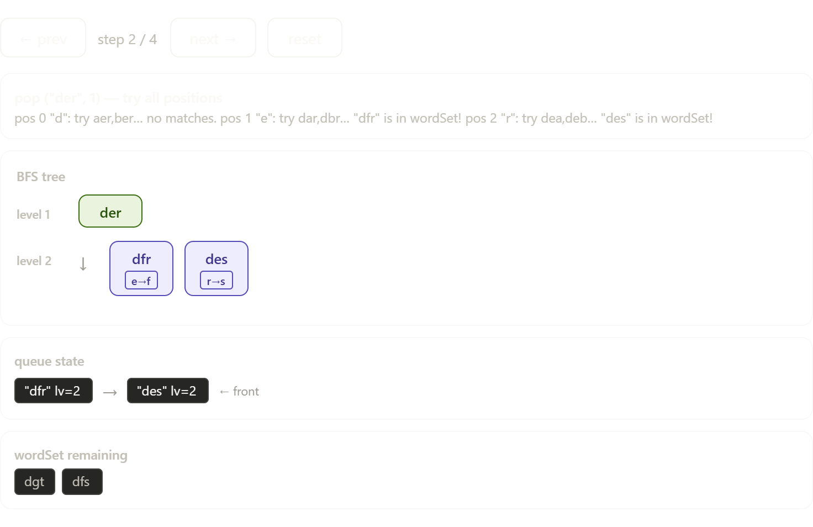

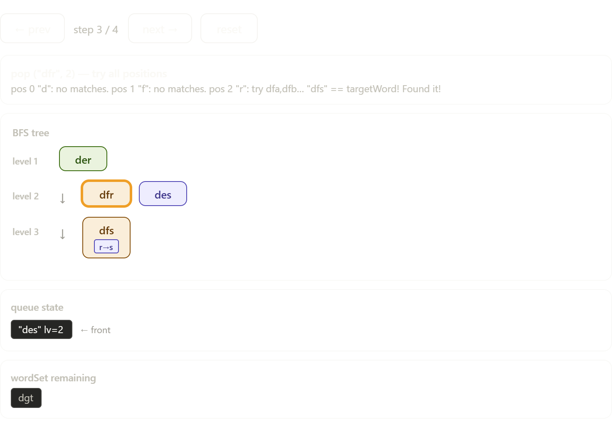


---

### What the Tree is Showing You

Each level in the BFS tree = one transformation step:

```
Level 1:  der          → distance 1  (start)
Level 2:  dfr, des     → distance 2  (1 change from der)
Level 3:  dfs          → distance 3  (1 change from dfr) ← TARGET
```

The key thing to notice — `des` at level 2 is **never explored**. BFS found the target through `dfr` first, so it returns immediately with `level + 1 = 3`. This is exactly why BFS guarantees the shortest path — it explores level by level, so the **first time you reach the target is always the shortest way**.

---

### Why `des` is a Dead End (Even if We Explored It)

```
des → one change away: des→dfs? (e→f, s→s) — no, two changes
    → des→dfr? no
    → des→dgt? no
des has no path to dfs in one step → would return nothing
```

BFS naturally skips this because target was already found from `dfr`. This is the **BFS guarantee** — shortest path always found before longer paths are explored.


`set.count()` is simple — it returns either **0 or 1**.

---

### Why Only 0 or 1?

Because a `set` (and `unordered_set`) **cannot have duplicates**. So any key either:

```cpp
exists in set  →  count returns 1
doesn't exist  →  count returns 0
```

That's it. It's essentially a **yes/no lookup**.

---

### In Code

```cpp
unordered_set<string> wordSet = {"des", "dfr", "dgt", "dfs"};

wordSet.count("dfr")   // → 1  (exists)
wordSet.count("xyz")   // → 0  (doesn't exist)
wordSet.count("dfs")   // → 1  (exists)
```

---

### How It's Used in Word Ladder

```cpp
if (wordSet.count(word)) {   // count returns 1 = truthy
    wordSet.erase(word);
    q.push({word, level + 1});
}
```

This is exactly the same as writing:

```cpp
if (wordSet.find(word) != wordSet.end())  // longer way
if (wordSet.count(word) == 1)             // explicit way
if (wordSet.count(word))                  // shorthand — most common
```

All three mean the same thing. `count()` is preferred because it's the shortest and most readable.

---

### count() vs find() — When to Use Which

```cpp
// Use count() when you only need YES/NO
if (wordSet.count(word))          // ✅ clean, simple

// Use find() when you need the ITERATOR too
auto it = wordSet.find(word);
if (it != wordSet.end()) {
    // use *it directly
}
```

---

### Why Not Just Use count() on a map?

`map` and `unordered_map` also have `.count()` — same behaviour, returns 0 or 1:

```cpp
unordered_map<char, int> freq;
freq['a'] = 3;

freq.count('a')   // → 1
freq.count('z')   // → 0
```

The only container where `.count()` can return more than 1 is `multiset` or `multimap` — because those allow duplicates:

```cpp
multiset<int> ms = {1, 1, 2, 3, 3, 3};
ms.count(3)   // → 3  (three copies of 3)
ms.count(1)   // → 2
ms.count(9)   // → 0
```

---

### One-Line Summary

```
set.count(x)  =  "does x exist in the set?"
                  1 = yes,  0 = no
```


This is called **Structured Bindings** — introduced in C++17.

---

### What It Does

```cpp
auto [word, level] = q.front();
```

It **unpacks** a `pair` (or tuple/struct) into individual named variables in one line.

Without it you'd write:

```cpp
// old way — C++14 and before
pair<string, int> p = q.front();
string word  = p.first;
int    level = p.second;

// new way — C++17 structured binding
auto [word, level] = q.front();
```

Exact same result, one line instead of three.

---

### How It Maps

```cpp
queue<pair<string, int>> q;
//         ↑       ↑
//       first   second

auto [word, level] = q.front();
//    ↑       ↑
//  first   second

// word  → maps to pair.first  (the string)
// level → maps to pair.second (the int)
```

The variables are assigned **left to right** matching the order of the pair/struct members.

---

### Works on Pairs, Tuples, Structs

```cpp
// pair
pair<int, string> p = {1, "hello"};
auto [num, str] = p;
// num = 1, str = "hello"

// tuple
tuple<int, string, bool> t = {42, "world", true};
auto [a, b, c] = t;
// a=42, b="world", c=true

// struct
struct Point { int x, y; };
Point pt = {3, 7};
auto [x, y] = pt;
// x=3, y=7
```

---

### Also Works in Range-based For Loops

Very common with maps:

```cpp
unordered_map<char, int> freq = {{'a',3}, {'b',2}};

// old way
for (auto& p : freq) {
    cout << p.first << " → " << p.second;
}

// C++17 structured binding — much cleaner
for (auto& [ch, count] : freq) {
    cout << ch << " → " << count;
}
```

---

### The `&` Matters

```cpp
auto  [word, level] = q.front();   // COPY  — modifying word/level doesn't affect queue
auto& [word, level] = q.front();   // REFERENCE — modifying affects original
```

In Word Ladder we use copy because we modify `word` in place (changing each character) and don't want to corrupt the queue:

```cpp
auto [word, level] = q.front();   // copy ✅
q.pop();

for (int i = 0; i < word.size(); i++) {
    char orig = word[i];
    word[i] = 'a';                // safely modifying the COPY
    ...
    word[i] = orig;
}
```

---

### Summary

| | Old way | C++17 structured binding |
|---|---|---|
| Syntax | `p.first`, `p.second` | `auto [a, b]` |
| Readability | low — `.first/.second` meaningless | high — custom names |
| Works on | pair only with `.first/.second` | pair, tuple, struct, array |
| Requires | C++11 | C++17 |

```cpp
// One-line mental model:
auto [word, level] = q.front();
//    ↑      ↑          ↑
//  name1  name2    pair/tuple to unpack
```


# Q2 Word ladder II


## Problem Statement

Given two distinct words `startWord` and `targetWord`, and a list denoting `wordList` of unique words of equal lengths. Find all shortest transformation sequence(s) from `startWord` to `targetWord`. You can return them in any order possible.

In this problem statement, we need to keep the following conditions in mind:
* A word can only consist of lowercase characters.
* Only one letter can be changed in each transformation.
* Each transformed word must exist in the `wordList` including the `targetWord`.
* `startWord` may or may not be part of the `wordList`.
* Return an empty list if there is no such transformation sequence.

---

## Examples

**Example 1**
> **Input:** `startWord = "der"`, `targetWord = "dfs"`, `wordList = ["des", "der", "dfr", "dgt", "dfs"]`
> **Output:** `[ ["der", "dfr", "dfs"], ["der", "des", "dfs"] ]`
> **Explanation:** The length of the smallest transformation sequence here is 3.
> Following are the only two shortest ways to get to the `targetWord` from the `startWord`:
> * `"der"` -> (replace ‘r’ by ‘s’) -> `"des"` -> (replace ‘e’ by ‘f’) -> `"dfs"`.
> * `"der"` -> (replace ‘e’ by ‘f’) -> `"dfr"` -> (replace ‘r’ by ‘s’) -> `"dfs"`.

**Example 2**
> **Input:** `startWord = "gedk"`, `targetWord= "geek"`, `wordList = ["geek", "gefk"]`
> **Output:** `[ ["gedk", "geek"] ]`
> **Explanation:** The length of the smallest transformation sequence here is 2.
> Following is the only shortest way to get to the `targetWord` from the `startWord`:
> * `"gedk"` -> (replace ‘d’ by ‘e’) -> `"geek"`.

---

## Quiz: Now your turn!

**Input:** `startWord = "abc"`, `targetWord = "xyz"`, `wordList = ["abc", "ayc", "ayz", "xyz"]`

**Output:**
Pick your answer:
* [ ] `[["abc", "ayz", "ayc", "xyz"]]`
* [ ] `[["abc", "ayc", "abc", "xyz"]]`
* [ ] `[]`
* [ ] `[["abc", "ayc", "ayz", "xyz"]]`

*(Senior Engineer Hint: Remember that BFS guarantees the shortest path. Trace the valid single-character mutations sequentially without revisiting previous states to prevent cycles like 'abc' -> 'ayc' -> 'abc'.)*

---

## Constraints

* `N` = Number of Words
* `M` = Length of Word
* `1 <= N <= 100`
* `1 <= M <= 10`


## Word Ladder II — Complete Guide

### Quiz Answer First

```
startWord = "abc"   targetWord = "xyz"
wordList  = ["abc", "ayc", "ayz", "xyz"]
```

Trace every possible path:

```
abc → ayc  (b→y)  ✅ in wordList
ayc → ayz  (c→z)  ✅ in wordList
ayz → xyz  (a→x)  ✅ in wordList

Length = 4 words = shortest possible
```

✅ Answer: **`[["abc", "ayc", "ayz", "xyz"]]`**

Why not the others:
```
Option 1: "abc→ayz→ayc→xyz" — ayz→ayc goes BACKWARD, longer path ❌
Option 2: visits "abc" twice — invalid, already visited ❌
Option 3: [] — path exists so empty is wrong ❌
```

---

### Word Ladder I vs II — The Key Difference

```
Word Ladder I                    Word Ladder II
─────────────────────            ──────────────────────────────
Find LENGTH of shortest path     Find ALL shortest paths
Return one number                Return list of lists
BFS alone is enough              BFS + path tracking needed
Stop at first hit                Must explore entire level
Simple queue                     Queue stores full path so far
```

---

### Why This Is Harder

In Word Ladder I, the moment you reach `targetWord` you return. In Word Ladder II:

```
You must NOT stop at first hit
You must finish exploring the ENTIRE level where target is found
Because another path at the same level might also reach target
```

This means you need to:

```
1. BFS level by level
2. Track the full PATH not just the word
3. Never revisit a word WITHIN the same path
4. Collect ALL paths that reach target at minimum level
5. Stop after the level where first hit occurs
```

---

### The Approach — BFS with Path Tracking

```cpp
#include <bits/stdc++.h>
using namespace std;

vector<vector<string>> findLadders(string startWord, string targetWord,
                                    vector<string>& wordList) {
    unordered_set<string> wordSet(wordList.begin(), wordList.end());

    // base case
    if (!wordSet.count(targetWord)) return {};

    // queue stores FULL PATH so far (not just current word)
    queue<vector<string>> q;
    q.push({startWord});

    // words used in CURRENT level — erase from wordSet after full level
    unordered_set<string> usedThisLevel;
    usedThisLevel.insert(startWord);

    vector<vector<string>> result;
    bool found = false;

    while (!q.empty() && !found) {
        int levelSize = q.size();     // process one full level at a time

        // collect words used in this level
        // erase them AFTER level, not during (other paths in same level need them)
        unordered_set<string> usedInLevel;

        for (int i = 0; i < levelSize; i++) {
            vector<string> path = q.front();
            q.pop();
            string word = path.back();   // current word = last in path

            // try all positions and all 26 letters
            for (int j = 0; j < word.size(); j++) {
                char orig = word[j];
                for (char c = 'a'; c <= 'z'; c++) {
                    if (c == orig) continue;
                    word[j] = c;

                    if (word == targetWord) {
                        path.push_back(word);
                        result.push_back(path);
                        path.pop_back();
                        found = true;     // don't stop — finish this level
                    }
                    else if (wordSet.count(word) && !usedThisLevel.count(word)) {
                        usedInLevel.insert(word);
                        path.push_back(word);
                        q.push(path);
                        path.pop_back();
                    }
                }
                word[j] = orig;
            }
        }

        // erase all words used in this level from wordSet
        // prevents future levels from revisiting them
        for (auto& w : usedInLevel)
            wordSet.erase(w);

        usedThisLevel = usedInLevel;
    }

    return result;
}
```

---

### The Trickiest Part — When to Erase from wordSet

This is what makes Word Ladder II hard:

```
WRONG — erase immediately (like Word Ladder I):
  Path A uses "dfr" → erased → Path B can't use "dfr"
  You miss valid paths at the SAME level ❌

CORRECT — erase after entire level is done:
  Path A uses "dfr" → kept for now
  Path B also uses "dfr" → both paths recorded ✅
  After level completes → erase "dfr"
  Next level can't revisit it ✅
```

---

Now walk through the full dry run interactively:---

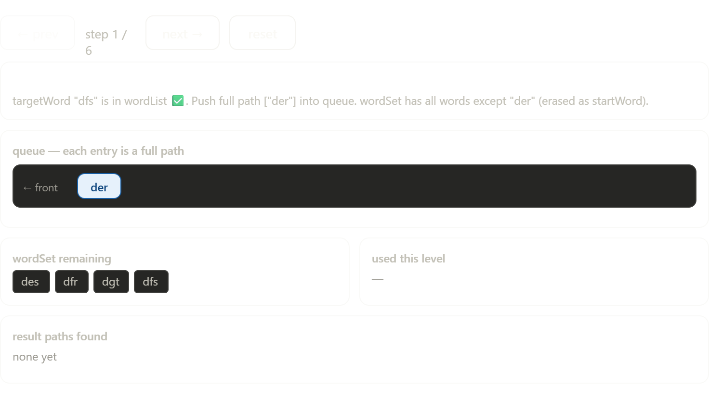


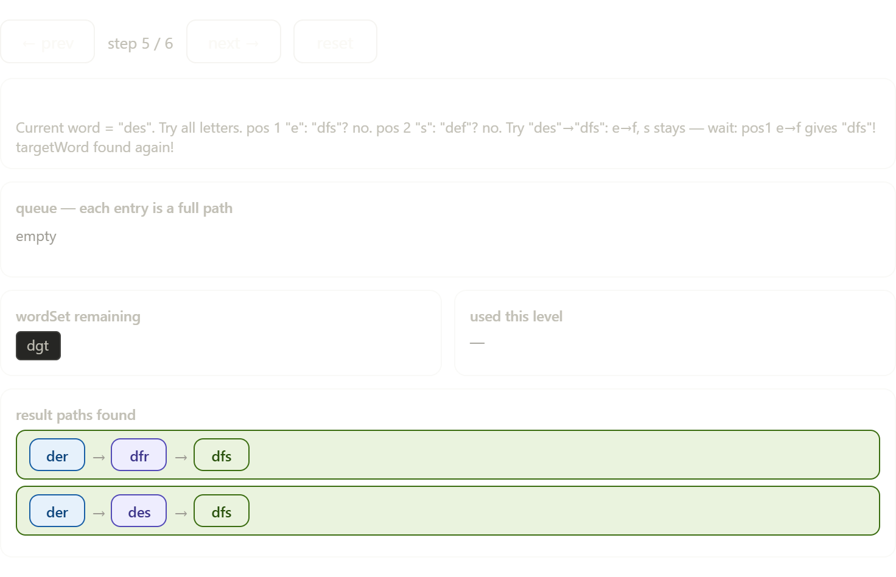


### The 3 Critical Differences from Word Ladder I

```
Word Ladder I                     Word Ladder II
─────────────────                 ─────────────────────────────
queue<pair<string,int>>           queue<vector<string>>
stores word + level               stores FULL PATH

erase word immediately            erase word AFTER full level
→ other paths at same level       → other paths can still use it
  can't use it

return level+1 at first hit       set found=true, finish level
→ stops immediately               → collects ALL paths at that level
```

---

### Complexity

```
N = wordList size,  M = word length

Time:  O(N × M × 26 × N)
            ↑              ↑
       BFS per word    path copying (each path up to N words long)

Space: O(N × N × M)   — queue can hold N paths each of length N
```

Word Ladder II is significantly more expensive than I because storing full paths uses much more memory. For large inputs this is why the constraints are kept small (N ≤ 100).


# Q3 Minimum Multiplications to Reach End


## Problem Statement

Given `start`, `end` and an array `arr` of `n` numbers. At each step, `start` is multiplied with any number in `arr` and then modulo `100000` is taken to get the new `start`. 

Find the minimum steps in which `end` can be achieved starting from `start`. If it is not possible to reach `end`, then return `-1`.

---

## Examples

**Example 1**
> **Input:** `arr = [2, 5, 7]`, `start = 3`, `end = 30`
> **Output:** `2`
> **Explanation:** > Step 1: `3 * 2 = 6 % 100000 = 6`
> Step 2: `6 * 5 = 30 % 100000 = 30`
> Minimum steps taken to reach 30 from 3 is 2.

**Example 2**
> **Input:** `arr = [3, 4, 65]`, `start = 7`, `end = 66175`
> **Output:** `4`
> **Explanation:** > Step 1: `7 * 3 = 21 % 100000 = 21` 
> Step 2: `21 * 65 = 1365 % 100000 = 1365` 
> Step 3: `1365 * 65 = 88725 % 100000 = 88725` 
> Step 4: `88725 * 3 = 266175 % 100000 = 66175`
> Minimum steps taken to reach 66175 from 7 is 4.

---

## Constraints

* `1 <= arr.length <= 10^4`
* `1 <= arr[i] <= 10^4`
* `0 <= start, end < 100000`

---
*Senior Engineer Hint: This is not a math problem; it is a shortest-path Graph problem. Because the modulo is $10^5$, there are exactly 100,000 possible nodes (0 to 99,999). Use Dijkstra's Algorithm (or a simple BFS queue since edge weights are all exactly 1 step) to find the shortest path from the `start` node to the `end` node.*

Intuition--> bfs problem and same like previous need to travel whole array ech time.we put start on queue and multily by each element in array and at each level we check do we get the end

## Ai reply

Yes! You've understood it **exactly right.**

---

### Your Mental Model is Correct

```
start = node
multiply by each arr[i] = edges to neighbours
% 100000 = keeps values within 0..99999 (finite graph)
find end = shortest path question
             ↓
            BFS
```

---

### Why BFS Works Here

```
Level 0:  start                    → 0 multiplications
Level 1:  start × arr[0,1,2...]    → 1 multiplication
Level 2:  each of those × arr[...] → 2 multiplications
...
First time we see end = minimum multiplications ✅
```

Each multiplication = one step = one edge of equal weight. Unweighted graph → BFS guarantees shortest path.

---

### The Graph You're Imagining is Correct

```
arr = [2, 5, 7],  start = 3

Level 0:        3
              / | \
Level 1:     6  15  21        (×2, ×5, ×7)
           /|\  ...  ...
Level 2: 12 30 42 ...         (×2, ×5, ×7 again)
              ↑
             end=30 found! → return 2
```

---

### The One Key Detail — Why % 100000

Without the mod, values grow infinitely → infinite nodes → BFS never terminates.

```
With % 100000:
max possible value = 99999
so there are only 100000 possible nodes (0 to 99999)
BFS is guaranteed to terminate ✅
```

This is what makes it a **finite graph** problem.

---

### Quiz Answer

```
arr=[3,4,65], start=7, end=21

Level 0: 7
Level 1: 7×3=21 ← end found immediately!

Answer = 1 ✅
```

---

### One-line Summary

```
nodes  = numbers 0..99999
edges  = multiply by any arr[i] then %100000
goal   = shortest path from start to end
method = BFS  ✅
```

Your intuition was completely right — trust it.

Q--> if we do not get the answer then graph will always be ongoing as we are multiplying??

Great observation — but it **won't go on forever**. Here's why:

---

### The Visited Array Saves You

```cpp
vector<int> dist(100000, -1);  // only 100000 possible values (0 to 99999)
```

After `% 100000` every value is in range `[0, 99999]`.

So there are only **100000 possible nodes** in the entire graph.

```
Once all 100000 nodes are visited
→ nothing new can ever be added to queue
→ queue becomes empty
→ BFS terminates
→ return -1
```

---

### Concrete Picture

```
Without visited check:
3 → 6 → 12 → 24 → 48 ...  infinite ❌

With % 100000 + visited array:
values stay in [0, 99999]
once a value is visited, never added to queue again
max 100000 nodes ever processed
BFS always terminates ✅
```

---

### The Termination Proof

```
Total possible nodes   = 100000  (0 to 99999)
Each node visited      = at most once
Each node removed from queue = at most once

So queue can have at most 100000 items EVER
→ BFS always ends in finite steps
→ if end never found → queue empties → return -1
```

---

### One Line Summary

```
% 100000  →  caps the graph at 100000 nodes
visited   →  each node processed at most once
together  →  BFS always terminates, never infinite
```

The modulo is not just a math trick — it's what **converts an infinite multiplication chain into a finite graph**.

## My code

```cpp
class Solution{
public:
    int minimumMultiplications(vector<int> &arr,
                               int start, int end) {
        queue<pair<int,int>> q;
        q.push({start,0});
        vector<int> dist(100000, -1);
        dist[start]=1;

        while(q.size()>0){
            pair<int,int> p=q.front();
            q.pop();
            int val=p.first;
            int lvl=p.second;
            if(val==end) return lvl;
            for(int v:arr){

                int mul=(v*val)%100000;
                if(dist[mul]==1) continue;
                dist[mul]=1;
                q.push({mul,lvl+1});
            }
        }   

        return -1;         
   
    }
};

```

## Ai reply 

## Full Code Review

### Logic is Correct ✅

Your core approach is right:
- BFS from start
- multiply by each arr element
- mod 100000
- return level when end found

---

### Bug 1 — Wrong Initial dist value ❌

```cpp
dist[start] = 1;   // ❌ using 1 as "visited" marker

if(dist[mul] == 1) continue;   // ❌ checking for 1
```

This works **by accident** here — but it's semantically wrong and fragile.

```
dist is initialised to -1 (unvisited)
you mark visited as 1
but what if the ACTUAL distance to a node is 1?
they collide — same value means two different things
```

**Fix — use a boolean visited array instead:**

```cpp
vector<bool> visited(100000, false);
visited[start] = true;

if(visited[mul]) continue;
visited[mul] = true;
```

Clean separation — visited means visited, nothing else.

---

### Bug 2 — Check end BEFORE pushing, not after popping ⚠️

```cpp
// your way — check after popping
auto [val, lvl] = q.front();
q.pop();
if(val == end) return lvl;   // works but slightly wasteful
```

```cpp
// better way — check before pushing
int mul = (v * val) % 100000;
if(mul == end) return lvl + 1;  // return immediately, don't even push
```

This also handles the edge case where `start == end`:

```cpp
// add before BFS loop
if(start == end) return 0;
```

---

### Bug 3 — `start` itself is never distance-checked early ⚠️

```cpp
q.push({start, 0});
dist[start] = 1;
// what if start == end?
// BFS pops it, checks val==end, returns 0 ✅ -- ok actually
// but only by luck of the loop structure
```

Safer to handle explicitly:

```cpp
if(start == end) return 0;
```
Good question. Let me explain both parts.

---

### Part 1 — Why check before pushing is better

**Your way — check after popping:**
```
push end into queue
...some time passes...
pop end from queue
THEN check → return
```

You do **unnecessary work**:
- end sits in the queue
- other neighbours might get pushed after it
- wastes memory and time

**Better way — check before pushing:**
```
calculate mul
mul == end? → return immediately
don't even touch the queue
```

```
Example: arr=[2,5,7], start=3, end=6

Your way:
  pop 3 → not end
  mul = 3×2 = 6 → push {6,1} into queue   ← unnecessary
  mul = 3×5 = 15 → push {15,1}
  mul = 3×7 = 21 → push {21,1}
  pop 6 → IS end → return 1

Better way:
  pop 3 → not end
  mul = 3×2 = 6 == end → return 1 immediately ✅
  never pushed anything
```

---

### Part 2 — Why `start == end` needs special handling

When you check **before pushing**, you only check `mul` — the result after multiplication. You **never check start itself**.

```
start = 5, end = 5

Your loop:
  pop {5, 0}
  mul = 5×arr[0] → not end
  mul = 5×arr[1] → not end
  ...
  never returns 0 ❌
  eventually returns -1 ❌
```

With check-after-pop this isn't a problem because:

```
pop {5, 0} → val==end → return 0 ✅
```

So the two approaches have a tradeoff:

```
Check after pop:
  ✅ handles start==end naturally
  ❌ slightly wasteful — end enters queue before being caught

Check before push:
  ✅ more efficient — return the moment end is found
  ❌ misses start==end → need explicit guard
```

That's exactly why the explicit guard is needed:

```cpp
if (start == end) return 0;   // guard for check-before-push approach
```

---

### Summary

```
Check after pop  →  simpler, handles start==end, slightly wasteful
Check before push →  faster, needs start==end guard explicitly

Both are correct — just different tradeoffs
Your original code (check after pop) is fine as-is
```
---

### Minor — Prefer `!q.empty()` over `q.size() > 0`

```cpp
while(q.size() > 0)    // works but non-idiomatic
while(!q.empty())      // ✅ standard C++ idiom, clearer intent
```

---

### Minor — Use structured bindings (C++17)

```cpp
pair<int,int> p = q.front();
int val = p.first;
int lvl = p.second;

// cleaner:
auto [val, lvl] = q.front();
```

---

### Clean Version

```cpp
class Solution {
public:
    int minimumMultiplications(vector<int>& arr, int start, int end) {
        if (start == end) return 0;

        vector<bool> visited(100000, false);
        visited[start] = true;

        queue<pair<int,int>> q;
        q.push({start, 0});

        while (!q.empty()) {
            auto [val, lvl] = q.front();
            q.pop();

            for (int v : arr) {
                int mul = ((long long)v * val) % 100000;

                if (mul == end) return lvl + 1;   // check before pushing

                if (!visited[mul]) {
                    visited[mul] = true;
                    q.push({mul, lvl + 1});
                }
            }
        }

        return -1;
    }
};
```

---

### One Extra — Integer Overflow Guard

```cpp
int mul = (v * val) % 100000;
```

```
v   can be up to 10^4
val can be up to 99999 ≈ 10^5

v * val = 10^4 × 10^5 = 10^9  → fits in int (max ~2.1×10^9) ✅
          but only barely — safer to cast:

int mul = ((long long)v * val) % 100000;
```

---

### Summary

| Issue | Severity | Fix |
|---|---|---|
| `dist=1` as visited marker | ⚠️ semantic bug | use `vector<bool> visited` |
| Check end after pop not before | ⚠️ minor inefficiency | check before pushing |
| `start==end` not handled | ⚠️ edge case | add early return |
| `q.size() > 0` | style | use `!q.empty()` |
| `p.first/p.second` | style | use structured bindings |
| potential overflow | ⚠️ | cast to `long long` |


Q--> dist was only for checking if node is vsisted ,why it is bug??

You're right, I misread your intent.

---

### Your Code's Actual Logic

```cpp
vector<int> dist(100000, -1);  // -1 = not visited
dist[start] = 1;               // 1 = visited

if(dist[mul] == 1) continue;   // skip if already visited
dist[mul] = 1;                 // mark as visited
```

You're using `dist` as a **visited tracker** with two states only:

```
-1  →  not visited
 1  →  visited
```

This is **completely correct** and has **no bug**. There is no collision because you never store actual distances — just visited/unvisited.

---

### My Mistake

I assumed `dist` was storing distances (like in Dijkstra) because of the name. But you're storing levels inside the queue pair itself:

```cpp
queue<pair<int,int>> q;   // {value, level}
//                  ↑
//            level tracked here, not in dist
```

So `dist` is purely a visited array — my collision concern was wrong.

---

### The Only Real Suggestion Then

Just rename it for clarity:

```cpp
vector<int> dist(100000, -1);   // misleading name
// rename to:
vector<bool> visited(100000, false);   // intent is crystal clear
```

Same logic, clearer name. Everything else in your code is correct.


# Q4 Path With Minimum Effort

## Problem Statement

You are a hiker preparing for an upcoming hike. You are given a 2D array `heights`, where `heights[row][col]` represents the height of cell `(row, col)`. You are situated in the top-left cell, `(0, 0)`, and you hope to travel to the bottom-right cell, `(rows-1, columns-1)` (i.e., **0-indexed**). You can move up, down, left, or right, and you wish to find a route that requires the minimum **effort**.

A route's **effort** is the **maximum absolute difference** in heights between two consecutive cells of the route.

Return the minimum **effort** required to travel from the top-left cell to the bottom-right cell.

---

## Examples

**Example 1**
> **Input:** `heights = [[1,2,2],[3,8,2],[5,3,5]]`
> **Output:** `2`
> **Explanation:** > The route of [1,3,5,3,5] has a maximum absolute difference of 2 in consecutive cells.
> This is better than the route of [1,2,2,2,5], where the maximum absolute difference is 3.

**Example 2**
> **Input:** `heights = [[1,2,3],[3,8,4],[5,3,5]]`
> **Output:** `1`
> **Explanation:** > The route of [1,2,3,4,5] has a maximum absolute difference of 1 in consecutive cells, which is better than route [1,3,5,3,5].

**Example 3**
> **Input:** `heights = [[1,2,1,1,1],[1,2,1,2,1],[1,2,1,2,1],[1,2,1,2,1],[1,1,1,2,1]]`
> **Output:** `0`
> **Explanation:** This route does not require any effort.

---

## Constraints

* `rows == heights.length`
* `columns == heights[i].length`
* `1 <= rows, columns <= 100`
* `1 <= heights[i][j] <= 10^6`

---
*Senior Engineer Hint: There are two elite ways to solve this. 1) **Modified Dijkstra:** Instead of summing edge weights, track the `max` difference seen on the path using a Min-Heap. 2) **Binary Search + BFS:** If Priority Queues are banned on your exam, binary search the answer range `[0, 10^6]`. For a chosen `mid` effort, run a simple BFS. If you can reach the end using only steps where the height difference is `<= mid`, then `mid` is a valid answer. Try smaller!*


## My sol

```cpp
class Solution {
    int gans=INT_MAX;
    vector<vector<int>> dir = {{1, 0}, {-1, 0}, {0, 1}, {0, -1}};
    bool isVisisted(int i, int j, int n, int m, vector<vector<int>> &mat) {
        if (i < 0 || i >= n || j < 0 || j >= m || mat[i][j] < 0) return true;
        return false;
    }
    void minEffort(int i, int j, int n, int m, vector<vector<int>> &mat,int temp) {
        if(i==n-1 && j==m-1)  gans=min(temp,gans);
        mat[i][j]=-mat[i][j];
        
        for(int k=0;k<4;k++){
            int newi=i+dir[k][0];
            int newj=j+dir[k][1];
            if(isVisisted(newi,newj,n,m,mat)==false){
                int tres= abs(-mat[i][j]-mat[newi][newj]);
                int tvar=max(tres,temp);
                minEffort(newi,newj,n,m,mat,tvar);
            }
        }

        mat[i][j]=-mat[i][j];
    }

   public:
    int MinimumEffort(vector<vector<int>> &mat) {
        int n = mat.size();
        int m = mat[0].size();
        minEffort(0, 0, n, m, mat,0);
        return gans;
    }
};

```
## Code Review + Better Solution

### Your Approach — Recursive DFS with Backtracking

Your logic is correct conceptually:
- Mark visited by negating the value
- Track max absolute difference along path
- Backtrack by restoring the value
- Update global answer at destination

---

### Problems with Your Solution

**Problem 1 — Exponential Time Complexity ❌**

```
DFS explores ALL possible paths
No pruning based on current best effort
On a 100×100 grid → paths are astronomical

Time: O(4^(N×M))  ← way too slow
```

**Problem 2 — No Pruning ❌**

```cpp
// you always explore even if current effort
// already exceeds the best answer found

int tvar = max(tres, temp);
minEffort(newi, newj, n, m, mat, tvar);
// what if tvar > gans already? still recurse ❌
```

Simple fix would be:

```cpp
if(tvar < gans)   // prune — only recurse if worth it
    minEffort(newi, newj, n, m, mat, tvar);
```

**Problem 3 — Global variable `gans` ❌**

```cpp
int gans = INT_MAX;   // class member
```

If `Solution` object is reused across test cases, `gans` retains old value. Should be reset at start of `MinimumEffort`.

---

### Quiz Answer

```
heights = [[1,2,1,1,1],
           [1,2,1,2,1],
           [1,2,1,2,1],
           [1,2,1,2,1],
           [1,1,1,2,1]]

Path: go down column 0, then across bottom, then up column 4
1→1→1→1→1→1→1→1→1→1→1→1→1

All differences = 0 or 1
Max difference along this path = 1

Answer = 1 ✅
```

---

### The Right Approach — Dijkstra

This is a **shortest path** problem where:

```
node   = cell (i,j)
edge   = move to adjacent cell
weight = abs difference in heights
goal   = minimise MAXIMUM weight along path
```

Dijkstra with a min-heap on **effort so far** finds the optimal path efficiently.

```cpp
#include <bits/stdc++.h>
using namespace std;

class Solution {
    vector<vector<int>> dir = {{1,0},{-1,0},{0,1},{0,-1}};

public:
    int MinimumEffort(vector<vector<int>>& mat) {
        int n = mat.size(), m = mat[0].size();

        // dist[i][j] = min effort to reach (i,j)
        vector<vector<int>> dist(n, vector<int>(m, INT_MAX));
        dist[0][0] = 0;

        // min heap: {effort, row, col}
        priority_queue<tuple<int,int,int>,
                       vector<tuple<int,int,int>>,
                       greater<>> pq;
        pq.push({0, 0, 0});

        while (!pq.empty()) {
            auto [effort, i, j] = pq.top();
            pq.pop();

            // reached destination
            if (i == n-1 && j == m-1) return effort;

            // stale entry
            if (effort > dist[i][j]) continue;

            for (auto& d : dir) {
                int ni = i + d[0];
                int nj = j + d[1];

                if (ni < 0 || ni >= n || nj < 0 || nj >= m) continue;

                // effort = max of current effort and this step's diff
                int newEffort = max(effort,
                                   abs(mat[i][j] - mat[ni][nj]));

                if (newEffort < dist[ni][nj]) {
                    dist[ni][nj] = newEffort;
                    pq.push({newEffort, ni, nj});
                }
            }
        }

        return dist[n-1][m-1];
    }
};
```

---

### Dry Run — Example 1

```
heights = [[1,2,2],
           [3,8,2],
           [5,3,5]]

dist = [[0,  INF, INF],
        [INF,INF, INF],
        [INF,INF, INF]]

pq = [{0, 0,0}]
```

```
pop {0, 0,0}:
  →(0,1): effort=max(0,|1-2|)=1 < INF → dist[0][1]=1, push {1,0,1}
  →(1,0): effort=max(0,|1-3|)=2 < INF → dist[1][0]=2, push {2,1,0}

pop {1, 0,1}:
  →(0,2): effort=max(1,|2-2|)=1 < INF → dist[0][2]=1, push {1,0,2}
  →(1,1): effort=max(1,|2-8|)=6 < INF → dist[1][1]=6, push {6,1,1}
  →(0,0): effort=max(1,|2-1|)=1 > dist[0][0]=0 → skip

pop {1, 0,2}:
  →(1,2): effort=max(1,|2-2|)=1 < INF → dist[1][2]=1, push {1,1,2}

pop {1, 1,2}:
  →(2,2): effort=max(1,|2-5|)=3 < INF → dist[2][2]=3, push {3,2,2}
  →(1,1): effort=max(1,|2-8|)=6 < dist? no

pop {2, 1,0}:
  →(2,0): effort=max(2,|3-5|)=2 < INF → dist[2][0]=2, push {2,2,0}

pop {2, 2,0}:
  →(2,1): effort=max(2,|5-3|)=2 < INF → dist[2][1]=2, push {2,2,1}

pop {2, 2,1}:
  →(2,2): effort=max(2,|3-5|)=2 < dist[2][2]=3 → dist[2][2]=2, push {2,2,2}

pop {2, 2,2}: ← destination!
  return 2 ✅
```

---

### Complexity Comparison

| | Your DFS | Dijkstra |
|---|---|---|
| Time | O(4^(N×M)) | O(N×M × log(N×M)) |
| Space | O(N×M) recursion stack | O(N×M) dist array + heap |
| Correct? | ✅ but TLE | ✅ optimal |
| N=100,M=100 | impossible | 10000 × log(10000) ≈ fast |

---

### Key Insight

```
Standard Dijkstra:   minimise SUM of edge weights
This problem:        minimise MAX of edge weights

Only change needed:
dist[v] = dist[u] + weight        ← standard
dist[v] = max(dist[u], weight)    ← this problem

Same algorithm, one line different ✅
```
## Q-->how u get to know it is dijkstra ?? it is not shortest path??

Great question — this is about **pattern recognition**, not just knowing the algorithm name.

---

### Your Objection is Valid

```
Traditional Dijkstra  →  minimise SUM of weights
This problem          →  minimise MAXIMUM weight

So yes — it's NOT the standard shortest path problem
```

But Dijkstra is more general than that. Here's how to see it.

---

### The 3 Signals That Point to Dijkstra

**Signal 1 — Grid or Graph with weighted edges**
```
heights[i][j] are different values
moving between cells has a "cost" (abs difference)
→ weighted graph problem
```

**Signal 2 — Find OPTIMAL path from source to destination**
```
not asking for ALL paths
not asking for count of paths
asking for ONE optimal value along best path
→ greedy single-source search
```

**Signal 3 — Optimal substructure exists**
```
if the optimal path goes through cell X
then the sub-path from (0,0) to X
must also be optimal

this property = Dijkstra works
```

---

### The Real Question to Ask

Not "is this shortest path?" but:

```
"Can I make a greedy decision at each step
 that guarantees the globally optimal answer?"
         ↓
        YES → Dijkstra
```

In this problem:

```
At each step, always expand the cell
with the MINIMUM effort so far

Why greedy works:
  effort can only stay same or increase
  so the first time you reach destination
  = guaranteed minimum effort path
  (same logic as why Dijkstra works for shortest path)
```

---

### The Abstraction — Dijkstra is Really About This

```
Standard Dijkstra:
  dist[v] = best "accumulated value" to reach v
  "accumulated" = SUM

Generalised Dijkstra:
  dist[v] = best "accumulated value" to reach v
  "accumulated" = ANY monotonic function

Monotonic means:
  going further never makes it better
  (adding more edges never decreases the cost)
```

Both SUM and MAX are monotonic:

```
SUM:  adding positive weights always increases total  ✅
MAX:  adding more edges never decreases the maximum  ✅
```

So Dijkstra works for both.

---

### The Pattern Map

Whenever you see these problem types — think Dijkstra:

```
"minimum cost path"          → dist = sum        standard Dijkstra
"minimum effort path"        → dist = max        this problem
"minimum bottleneck path"    → dist = max        same pattern
"minimum time with delays"   → dist = sum+delay  modified Dijkstra
"minimum multiplications"    → dist = level      BFS (all equal weight)
"safest path"                → dist = max prob   Dijkstra with max
```

---

### How to Recognise in an Interview — 3 Questions

```
Q1: Is there a graph or grid with varying costs between nodes?
    YES → not plain BFS (BFS = equal weights only)

Q2: Am I optimising one path from source to destination?
    YES → not DP on all paths, not DFS brute force

Q3: Does "expanding the cheapest option first" make sense?
    YES → Dijkstra

All three YES → Dijkstra (possibly with modified accumulation)
```
Great — let me explain each point deeply with intuition.

---

### Q1 — Why Varying Costs Mean BFS Fails

**BFS assumes all edges cost the same.**

```
BFS explores level by level:
Level 1 = all nodes 1 step away
Level 2 = all nodes 2 steps away
...
First time you reach destination = shortest path ✅
```

This works ONLY when every step costs the same:

```
BFS on unweighted graph:
A →(1)→ B →(1)→ D
A →(1)→ C →(1)→(1)→ D

BFS correctly finds A→B→D = 2 steps ✅
```

Now add varying weights:

```
BFS on weighted graph:
A →(1)→ B →(1)→ D    total = 2
A →(10)→ C →(1)→ D   total = 11

BFS sees both paths as "2 levels deep"
treats them as equal cost ❌
returns wrong answer
```

```
Applied to this problem:
moving from height 1 to height 2 = cost 1
moving from height 1 to height 8 = cost 7

BFS treats BOTH as "one step"
has no way to prefer the cheaper move
→ wrong answer guaranteed ❌
```

**The rule:**
```
All edges equal weight  →  BFS
Edges have different weights  →  Dijkstra
```

---

### Q2 — Why "One Optimal Path" Rules Out DP and DFS

**DFS brute force** explores every possible path:

```
Grid 3×3 → could have thousands of paths
Grid 100×100 → astronomical number of paths
DFS visits all of them → exponential time ❌

Your original solution was DFS
Works for tiny inputs, TLEs on large ones
```

**DP on all paths** works when:

```
You need answers for ALL sources or ALL destinations
Example: "find shortest path from every node to every other"
→ Floyd Warshall (DP)

But here: fixed source (0,0), fixed destination (n-1,m-1)
Computing answers for ALL cells is wasteful
→ DP overkill ❌
```

**Dijkstra** works because:

```
Single source (0,0) → single destination (n-1,m-1)
Only need ONE optimal path
Don't care about suboptimal paths at all
→ Dijkstra explores only promising paths
→ stops the moment destination is reached
→ never wastes time on bad paths
```

```
DFS:       explores ALL paths         O(4^(N×M))
DP:        computes ALL subproblems   O(N²×M²)
Dijkstra:  explores OPTIMAL paths     O(N×M×log(N×M))
```

---

### Q3 — Why "Expand Cheapest First" Guarantees Optimal Answer

This is the heart of Dijkstra. Let me build the intuition slowly.

**Imagine you're the hiker.**

You're standing at (0,0). You can see all your immediate neighbours. Which one do you step to first?

```
Neighbour A: effort = 1
Neighbour B: effort = 7
```

You step to A first — effort 1.

Now from A you can reach more neighbours. You always pick the globally cheapest unvisited cell next.

**Why does this work?**

```
Key property: effort never decreases as you walk further

If current effort to reach cell X = 3
Any path continuing from X has effort >= 3
(because effort = MAX, adding more steps never reduces MAX)

So if cell X has the minimum effort among all
cells in the priority queue right now...

No future path can improve on it
Because future steps can only keep effort same or increase it

→ the first time you pop a cell from the heap
  = you have found the optimal effort to that cell
  = never need to visit it again ✅
```

**Concrete example:**

```
heap = [{effort=1, cell=A}, {effort=3, cell=B}, {effort=7, cell=C}]

Pop A (effort=1):
  Can any other path reach A with effort < 1?
  NO — because B costs 3 and C costs 7 to reach
  Any path through B or C to A costs at least 3
  So effort=1 to A is FINAL ✅

Pop B (effort=3):
  Similarly — effort=3 to B is FINAL ✅
```

**What if we expanded B before A?** (wrong order)

```
We'd say "effort to reach further cells via B = 3"
But later we find A with effort=1
Cells reachable via A might have effort=2
Which is LESS than 3
So our earlier answer via B was WRONG ❌

→ expanding cheapest first prevents this mistake
```

---

### The Three Questions as a Flowchart

```
See a path problem
        │
        ▼
Varying edge weights?
   │              │
  NO             YES
   │              │
  BFS             ▼
           Single source to
           single destination?
              │         │
             YES        NO
              │         │
              ▼      Floyd Warshall
        Greedy expansion    or Bellman Ford
        makes sense?
           │       │
          YES      NO
           │       │
        Dijkstra   DP / other
```

---

### One-Line Summary for Each

```
Q1 — varying weights?
     BFS is blind to cost differences → need cost-aware search

Q2 — single optimal path?
     DFS wastes time on bad paths
     DP wastes time on irrelevant subproblems
     Dijkstra targets exactly what you need

Q3 — expand cheapest first?
     Effort/cost is monotonic — never decreases going forward
     So cheapest current option = already optimal for that cell
     Greedy choice is globally safe → Dijkstra correct
```
---

### Applied to This Problem

```
Q1: Grid with abs(height difference) as edge cost?   YES ✅
Q2: Find optimal single path 0,0 to n-1,m-1?        YES ✅
Q3: Always expand minimum effort cell first?
    → if I expand minimum effort first,
      can any other path give less effort later?
    → NO — because effort is MAX, it never decreases
    → so minimum effort cell = already optimal      YES ✅

→ Dijkstra ✅
```

---

### The One-Line Intuition

```
Dijkstra works whenever:
"the best partial path to a node
 will always be part of the best full path"

This is true for SUM (positive weights)
This is true for MAX (any weights)
This is why both use Dijkstra
```

The moment you see **optimal path** + **weighted edges** + **greedy expansion makes sense** — reach for Dijkstra, then just figure out what "distance" means in that specific problem.


## Dijkstra


## Dijkstra's Algorithm — Complete Guide

### What Problem Does It Solve?

```
Given a weighted graph
Find shortest path from ONE source to ALL other nodes
Edge weights must be NON-NEGATIVE
```

### The Core Idea — Always Expand Cheapest First

Think of it like **water flowing** from the source:

```
Water always takes the path of least resistance
It reaches nearby nodes first
Then gradually spreads to farther nodes
The first time water reaches a node = shortest path ✅
```

---

### The Data Structures

```
dist[]   → shortest distance found so far to each node
           initially INF for all, 0 for source

visited[] → whether node's shortest distance is FINALISED
            once popped from heap = finalised forever

min-heap  → always gives the node with minimum distance next
            {distance, node}
```


---

### The Algorithm Steps

```
1. dist[source] = 0, push {0, source} to heap
2. pop minimum {d, u} from heap
3. if u already visited → skip (stale entry)
4. mark u visited
5. for each neighbour v of u:
      if dist[u] + weight(u,v) < dist[v]:
          dist[v] = dist[u] + weight(u,v)
          push {dist[v], v} to heap
6. repeat until heap empty
```
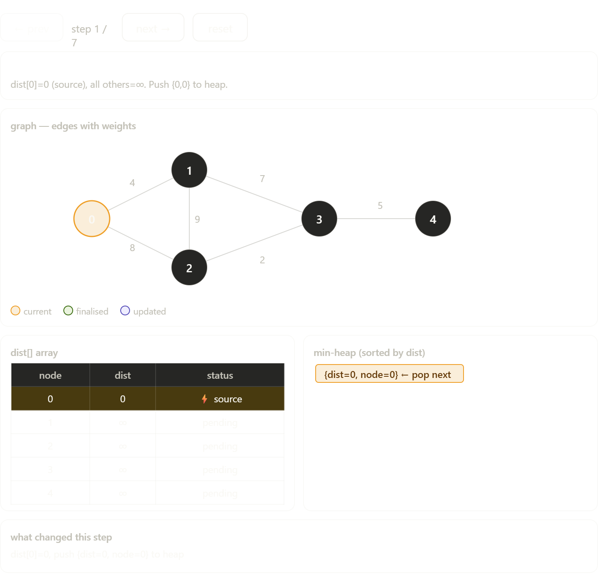

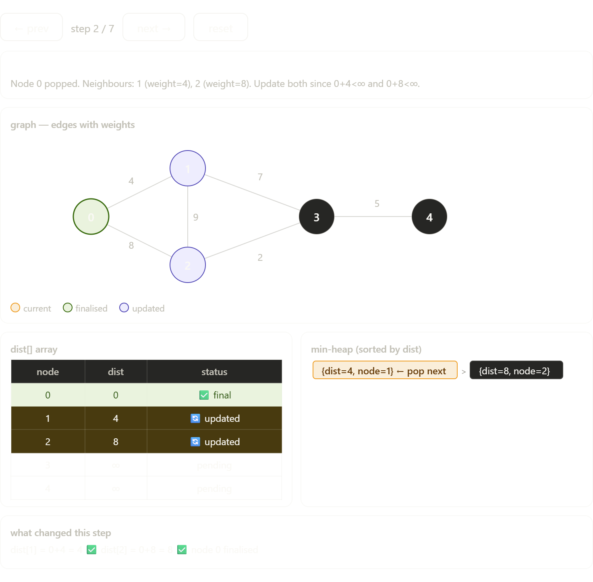

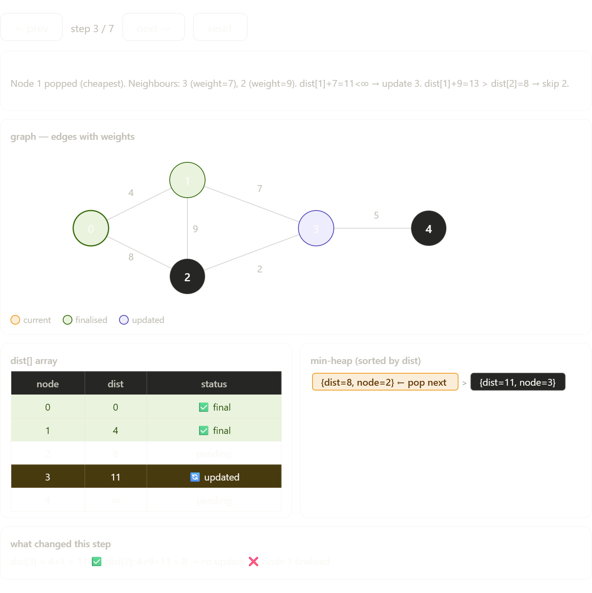


## Q--> in dry runn in step 3 how u can say  dist[1]=4 is final?? it an be changed later?

Excellent question — this is the **core proof** of why Dijkstra works.

---

### Your Doubt

```
Step 3: we pop {4, node=1}
You ask: how do we KNOW dist[1]=4 is final?
         what if some other path gives dist[1] < 4 later?
```

---

### The Proof — Why It Cannot Be Improved

When we pop node 1 with dist=4, look at what's left in the heap:

```
heap = [{4, node=1}, {8, node=2}]

Everything remaining in heap has distance >= 4
```

Now ask: **can any future path reach node 1 with distance < 4?**

```
Any path to node 1 must go THROUGH some node in the heap
The cheapest node in heap right now = dist 4

To reach node 1 via any other route:
  must pass through heap node first  (dist >= 4)
  then travel more edges             (weight >= 0)

total = dist of heap node + edge weights
      >= 4 + 0
      >= 4
```

So no future path can give dist[1] < 4. **4 is already optimal.**

---

### The Key Assumption Hidden Here

```
edge weights >= 0
```

This is EVERYTHING. If weights are non-negative:

```
going through more edges NEVER decreases distance
so the minimum in heap RIGHT NOW = globally optimal
```

If weights could be negative:

```
dist of heap node = 4
edge weight = -10
total = 4 + (-10) = -6 < 4  ← could improve!

→ Dijkstra breaks with negative weights
→ use Bellman Ford instead
```

---

### Visualising Why Finality Works

```
Source = 0,  dist[1] = 4 just popped

All undiscovered paths to node 1 look like:

0 ──?──► X ──?──► ... ──?──► 1
          ↑
     must pass through
     some node in heap
     cheapest = dist 4

path cost = dist[X] + remaining edges
          ≥ 4       + 0
          ≥ 4

Cannot be less than 4  ✅
So 4 is FINAL the moment it's popped
```

---

### One Line Summary

```
Popped node = final  because:

  all other paths to it cost >= current heap minimum
  + non-negative edges on top of that
  = can never be cheaper than what we already found
```

This is the **entire correctness proof of Dijkstra** in one paragraph. The non-negative weight constraint is not optional — it is what makes the greedy choice safe at every step.

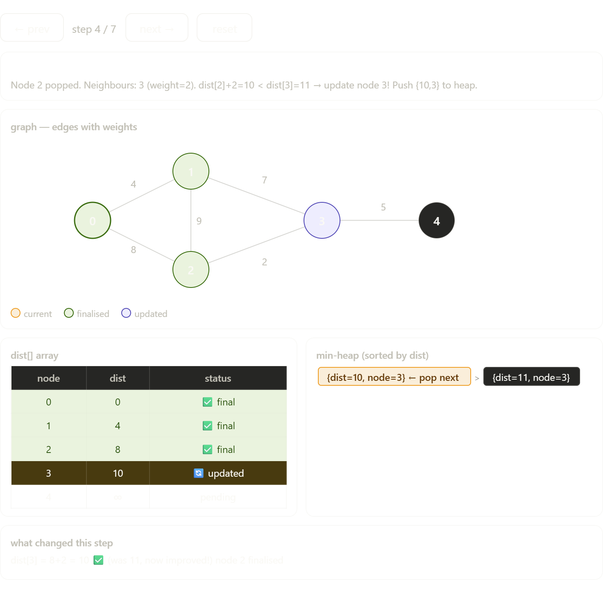

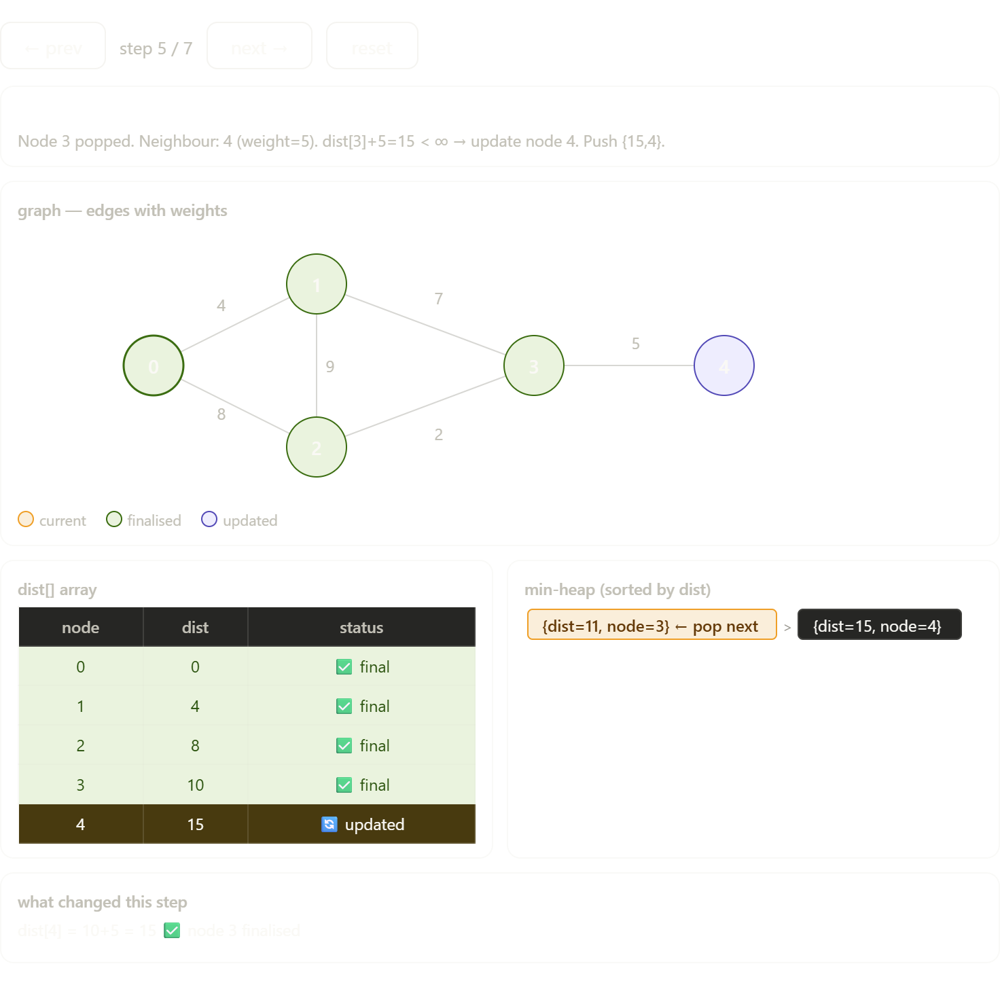

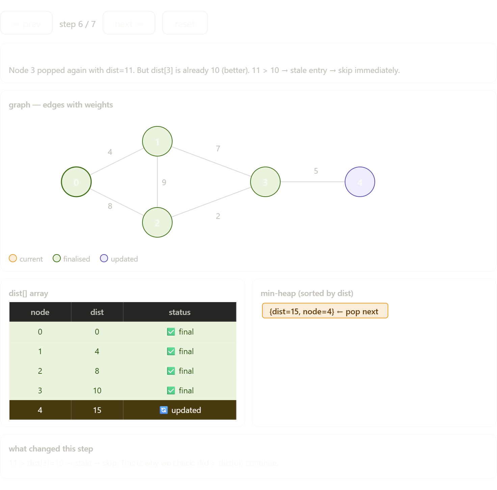

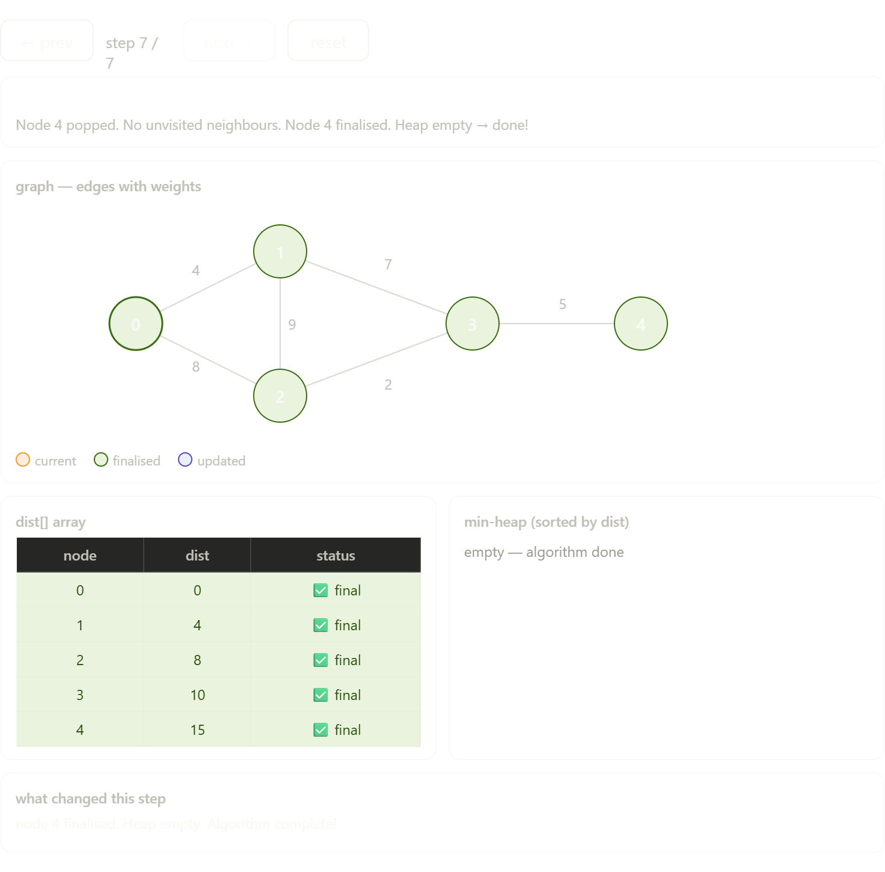
---

### The Code

```cpp
#include <bits/stdc++.h>
using namespace std;

vector<int> dijkstra(int src, int n, vector<vector<pair<int,int>>>& adj) {

    vector<int> dist(n, INT_MAX);
    dist[src] = 0;

    // min heap {distance, node}
    priority_queue<pair<int,int>,
                   vector<pair<int,int>>,
                   greater<>> pq;
    pq.push({0, src});

    while (!pq.empty()) {
        auto [d, u] = pq.top();
        pq.pop();

        // stale entry — already found better path
        if (d > dist[u]) continue;

        for (auto [v, w] : adj[u]) {
            if (dist[u] + w < dist[v]) {
                dist[v] = dist[u] + w;
                pq.push({dist[v], v});
            }
        }
    }
    return dist;
}
```

---

### Full Dry Run Table

| Step | Pop | Neighbour | Old dist | New dist | Action |
|---|---|---|---|---|---|
| 1 | init | — | all ∞ | dist[0]=0 | push {0,0} |
| 2 | {0,0} | 1 (w=4) | ∞ | 4 | update ✅ |
| 2 | {0,0} | 2 (w=8) | ∞ | 8 | update ✅ |
| 3 | {4,1} | 3 (w=7) | ∞ | 11 | update ✅ |
| 3 | {4,1} | 2 (w=9) | 8 | 13 | skip ❌ |
| 4 | {8,2} | 3 (w=2) | 11 | 10 | update ✅ improved! |
| 5 | {10,3} | 4 (w=5) | ∞ | 15 | update ✅ |
| 6 | {11,3} | — | 10 | — | stale, skip |
| 7 | {15,4} | — | — | — | done ✅ |

**Final distances from node 0:**

```
node 0 → 0
node 1 → 4
node 2 → 8
node 3 → 10   (via 0→2→3, not 0→1→3)
node 4 → 15
```

---

### The Stale Entry — Most Asked Interview Question

```cpp
if (d > dist[u]) continue;   // why is this needed?
```

When we updated `dist[3]` from 11 to 10, the old entry `{11, 3}` is **still sitting in the heap**. We cannot remove it. So when it gets popped:

```
d=11, dist[3]=10
11 > 10 → this is stale → skip ✅

Without this check:
we'd reprocess node 3 unnecessarily
push its neighbours again with wrong distances ❌
```

---

### Why Negative Weights Break Dijkstra

```
Graph: 0 →(4)→ 1 →(-10)→ 2
                0 →(2)→ 2

Dijkstra pops 2 with dist=2, marks it FINAL
Later finds path 0→1→2 = 4+(-10) = -6 which is BETTER
But node 2 is already finalised — too late ❌

Negative weights = use Bellman Ford instead
```

---

### Complexity

```
V = vertices, E = edges

Time:  O((V + E) log V)
         ↑           ↑
    each node    each edge push
    popped once  to heap = log V

Space: O(V + E)
         ↑    ↑
       dist  heap + adjacency list
```


```cpp
class Solution {
public:
    vector<int> dijkstra(int V, vector<vector<vector<int>>> &adj, int S) {
        priority_queue<pair<int, int>, vector<pair<int, int>>, greater<pair<int, int>>> pq;
        pq.push({0, S});
        
        vector<int> res(V, 1e9);
        vector<bool> vis(V, false);
        
        while(!pq.empty()) {
            int wt = pq.top().first;
            int v = pq.top().second;
            pq.pop();
            
            if(vis[v]) continue;
            vis[v] = true;
            res[v] = wt;
            
            for(auto &it : adj[v]) {
                int nbr = it[0];
                int w = it[1];
                if(!vis[nbr]) {
                    pq.push({wt + w, nbr});
                }
            }
        }
        return res;
    }
};
```
This is also dijsktsra we have seen in level 1 ,which to use??


Yes! This is also Dijkstra — but with a **slightly different implementation style**. Let me compare both.

---

### Two Valid Approaches

| | Your code | My code |
|---|---|---|
| Visited tracking | `vis[]` boolean array | `if(d > dist[u]) continue` |
| dist update | `res[v] = wt` when popped | `dist[v] = newDist` when pushing |
| Push condition | `if(!vis[nbr])` | `if(newDist < dist[v])` |
| Style | visited-based | distance-based |

Both are correct. Both are O((V+E) log V).

---

### Your Code Flow

```cpp
// 1. pop minimum
int wt = pq.top().first;
int v  = pq.top().second;

// 2. if already visited → skip
if(vis[v]) continue;

// 3. NOW finalise — mark visited and set distance
vis[v] = true;
res[v] = wt;        // ← distance set at POP time, not push time

// 4. push unvisited neighbours
if(!vis[nbr])
    pq.push({wt + w, nbr});
```

---

### Key Difference — When Distance is Set

**My approach — distance set at PUSH time:**
```cpp
// when pushing:
dist[v] = newDist;          // set immediately
pq.push({newDist, v});

// stale check at pop:
if(d > dist[u]) continue;   // skip old entries
```

**Your approach — distance set at POP time:**
```cpp
// when pushing:
pq.push({wt + w, nbr});     // just push, don't update dist

// finalise at pop:
vis[v] = true;
res[v] = wt;                // set distance only when popped
```

---

### Why Your Code is Still Correct

```
Min heap always pops smallest distance first
First time a node is popped = smallest possible distance
  because all other paths in heap cost >= current
  + non-negative edges on top
  = can never be smaller

So first pop = optimal distance ✅
vis[] prevents processing same node twice ✅
```

---

### One Subtle Difference — Push Condition

**Your code:**
```cpp
if(!vis[nbr])
    pq.push({wt + w, nbr});
```

**My code:**
```cpp
if(newDist < dist[v])
    pq.push({dist[v], v});
```

Your code pushes neighbour if **not yet finalised** — even if a better entry already exists in heap. This means heap can have more duplicate entries.

```
Example:
Node 3 reachable via two paths: cost 11 and cost 10
Your code pushes BOTH {11,3} and {10,3} to heap
Mine pushes {11,3} first, then when 10 found,
  dist[3] updates to 10 and pushes {10,3}
  but also has {11,3} as stale

Both end up with same stale entries in heap
Both skip them correctly (vis[] vs d>dist[])
```
Let me trace both codes **side by side** on the same example.

---

### The Graph

```
0 →(4)→ 1
0 →(2)→ 2
2 →(1)→ 1       ← shorter path to node 1 exists!
1 →(5)→ 3
```

So node 1 reachable two ways:
```
0→1 = 4
0→2→1 = 2+1 = 3   ← shorter
```

---

### My Code — dist[] updated at PUSH time

```cpp
dist[v] = newDist;       // update immediately
pq.push({newDist, v});   // then push
```

**Trace:**

```
dist = [0, INF, INF, INF]
pq   = [{0,0}]

─── pop {0, node=0} ───
  neighbour 1: newDist=4 < INF → dist[1]=4, push {4,1}
  neighbour 2: newDist=2 < INF → dist[2]=2, push {2,2}

dist = [0, 4, 2, INF]
pq   = [{2,2}, {4,1}]

─── pop {2, node=2} ───
  neighbour 1: newDist=3 < dist[1]=4
               → dist[1]=3         ← updated immediately
               → push {3,1}        ← new entry

dist = [0, 3, 2, INF]
pq   = [{3,1}, {4,1}]
           ↑     ↑
         fresh  stale (dist was 4, now 3)

─── pop {3, node=1} ───
  3 == dist[1]=3 → NOT stale → process ✅
  neighbour 3: newDist=8, push {8,3}

─── pop {4, node=1} ───
  4 > dist[1]=3 → STALE → skip ✅

Final dist = [0, 3, 2, 8]
```

---

### Your Code — dist set at POP time, vis[] tracks finalised

```cpp
if(!vis[nbr])
    pq.push({wt+w, nbr});   // push without updating dist[]
vis[v]=true;
res[v]=wt;                  // set dist only when popped
```

**Trace:**

```
res = [INF, INF, INF, INF]
vis = [F, F, F, F]
pq  = [{0,0}]

─── pop {0, node=0} ───
  vis[0]=false → process
  vis[0]=true, res[0]=0

  neighbour 1: vis[1]=false → push {4,1}
  neighbour 2: vis[2]=false → push {2,2}

pq  = [{2,2}, {4,1}]
vis = [T, F, F, F]

─── pop {2, node=2} ───
  vis[2]=false → process
  vis[2]=true, res[2]=2

  neighbour 1: vis[1]=false → push {3,1}  ← pushed again!

pq  = [{3,1}, {4,1}]
           ↑     ↑
         fresh  stale (same node, different cost)
vis = [T, F, T, F]

─── pop {3, node=1} ───
  vis[1]=false → process  ✅ first time seeing node 1
  vis[1]=true, res[1]=3   ← correct! smallest cost wins

  neighbour 3: vis[3]=false → push {8,3}

─── pop {4, node=1} ───
  vis[1]=TRUE → skip ✅   ← stale entry caught here

Final res = [0, 3, 2, 8] ✅ same answer
```

---

### Side by Side — What's in the Heap

```
After processing node 2:

My code heap:                Your code heap:
[{3,1}, {4,1}]              [{3,1}, {4,1}]
    ↑      ↑                    ↑      ↑
  fresh   stale              fresh   stale

IDENTICAL heap contents! ✅
```

---

### How Each Detects the Stale Entry

```
Stale entry = {4, node=1}

My code:
  pop {4,1}
  check: 4 > dist[1]=3?  YES → skip
  "distance in heap > best known distance"

Your code:
  pop {4,1}
  check: vis[1]=true?    YES → skip
  "node already finalised"

Different check, same result ✅
```

---

### The Core Difference Visualised

```
MY CODE:
                     dist[1] updated HERE
                           ↓
  push {4,1} ─────────────► dist[1]=4
                             ...
  push {3,1} ─────────────► dist[1]=3  ← overwrites
                             ...
  pop  {3,1} → 3==dist[1]=3 → valid ✅
  pop  {4,1} → 4> dist[1]=3 → stale ❌ skip


YOUR CODE:
                     res[1] updated HERE
                                    ↓
  push {4,1} → nothing updated yet
  push {3,1} → nothing updated yet
  ...
  pop  {3,1} → vis[1]=false → valid ✅ → res[1]=3
  pop  {4,1} → vis[1]=true  → stale ❌ skip
```

---

### Summary in One Table

| Moment | My code | Your code |
|---|---|---|
| When dist set | at PUSH | at POP |
| Stale detection | `d > dist[u]` | `vis[u] == true` |
| Heap contents | identical | identical |
| Final answer | same | same |
| Conceptual model | "update eagerly, check at pop" | "push freely, finalise at pop" |

Both are correct because the **min-heap guarantees the smallest cost entry is always popped first** — so whether you detect stale entries via `dist[]` or `vis[]`, you always process each node at its optimal cost exactly once.
---

### Which is Preferred in Interview?

```
Your approach (vis[] based):
✅ cleaner code — no stale check logic
✅ easier to explain — "first pop = final"
✅ more intuitive — visited = done
⚠️ slightly more entries in heap

My approach (dist[] based):
✅ more entries pruned before pushing
✅ dist[] available at any time during algorithm
⚠️ stale check needed — slightly more logic
```

**For interviews — your approach is actually cleaner to write and explain.**

---

### One Real Issue in Your Code ⚠️

```cpp
vector<int> res(V, 1e9);
//               ^^^
//        1e9 is a double → implicit conversion to int
//        = 999999999 or 1000000000 depending on precision
```

Safer to write:

```cpp
vector<int> res(V, INT_MAX);   // explicit integer max
// or
vector<int> res(V, 1e9);       // works but imprecise
```

Also if you do `wt + w` where `wt` is near `INT_MAX`:

```cpp
// overflow risk:
int wt = INT_MAX;
int w  = 5;
wt + w = overflow ❌

// but since you use 1e9 not INT_MAX, this is fine here ✅
// 1e9 + 1e4 < INT_MAX (2.1e9)
```

---

### Summary

```
Both implementations are correct Dijkstra ✅

Your code  →  vis[] array  →  finalise at pop
My code    →  dist[] check →  update at push

Yours is arguably cleaner for interviews
The only real difference is heap size
(yours may have slightly more entries)
```


In L1 we have seen


### Comparison of Implementations

| Implementation | Time Complexity | Best Use Case |
| :--- | :--- | :--- |
| **Binary Heap (Priority Queue)** | $O(E \log V)$ | **Sparse Graphs** (Most Interview Problems) |
| **Array (Naive)** | $O(V^2)$ | **Dense Graphs** (where $E \approx V^2$) |
| **Fibonacci Heap** | $O(E + V \log V)$ | Theoretical best (Often too complex for interviews) |

## Claude explained


Exactly right! But let me add one important nuance — the difference is **smaller than it looks**.

---

### The Nuance — Both Have Same Worst Case

```
Blind Push (your code):
  pushes neighbour if !vis[nbr]
  a node can be pushed MULTIPLE times
  once per incoming edge

Edge Relaxation (my code):
  pushes only if newDist < dist[v]
  still can push multiple times
  (old entry becomes stale when dist improves)
```

**Both have same worst case heap size:**

```
Worst case = every edge causes a push
           = O(E) total entries in heap
           = O(E log E) time

This is the SAME for both approaches ❌ not truly different
```

---

### Where They Actually Differ

```
Dense graph with many equal-cost paths:

Blind Push:
  pushes neighbour even if same cost already in heap
  → more duplicate entries

Edge Relaxation:
  only pushes if STRICTLY better
  → fewer entries when costs are equal
```

```
Example:
Node 3 reachable via 5 paths all costing 10

Blind Push    → pushes {10,3} five times
Edge Relaxation → pushes {10,3} once (rest are not < dist[3])
```

---

### The Complete Honest Table

| Feature | Blind Push | Edge Relaxation |
|---|---|---|
| Heap size worst case | O(E) | O(E) |
| Heap size avg case | larger | smaller |
| Equal cost paths | pushes duplicates | pushes only first |
| Strictly better path | pushes | pushes |
| Stale detection | `vis[]` check | `d > dist[]` check |
| Code simplicity | ✅ simpler | slightly more complex |
| dist[] available mid-run | ❌ not maintained | ✅ always current |
| Interview preference | ✅ clean to explain | ✅ standard textbook |
| Production preference | ✅ fine for sparse | ✅ better for dense |

---

### When the Difference Actually Matters

```
Sparse graph (E ≈ V):
  both are nearly identical
  use whichever is cleaner to write

Dense graph (E ≈ V²):
  edge relaxation wins
  significantly fewer heap operations

Competitive programming:
  dense graphs with tight time limits
  → edge relaxation preferred

Interviews:
  either is fine
  explain your choice → shows depth
```

---

### The One Real Advantage of Edge Relaxation

```cpp
// dist[] is always up to date during the run
// useful when you need current best distance
// for conditional logic MID algorithm

// Example: "minimum effort" problem
if (newEffort < dist[ni][nj]) {
    dist[ni][nj] = newEffort;   // dist[] reflects truth always
    pq.push({newEffort, ni, nj});
}
```

```
Blind push has no dist[] maintained
Can't query "what's current best to node X?"
during the algorithm without extra tracking
```

---

### TL;DR

```
Worst case time:  SAME      O(E log E) both
Average case:     Edge relaxation slightly better for dense graphs
Code clarity:     Blind push simpler
Interview:        Both acceptable — explain the tradeoff
Production:       Edge relaxation for dense graphs

The gap is smaller than most people think
The real difference is equal-cost duplicate entries
not fundamentally different complexity class
```

# Q5  Number of Ways to Arrive at Destination

 corresponds to LeetCode 1976

### **Problem Statement**

You are in a city that consists of `n` intersections numbered from `0` to `n - 1` with bi-directional roads between some intersections. The inputs are generated such that you can reach any intersection from any other intersection and that there is at most one road between any two intersections.

You are given an integer `n` and a 2D integer array `roads` where `roads[i] = [ui, vi, timei]` means that there is a bi-directional road between intersections `ui` and `vi` that takes `timei` minutes to travel.

You want to know in how many ways you can travel from intersection `0` to intersection `n - 1` in the **shortest amount of time**.

Return the number of ways you can arrive at your destination in the shortest amount of time. Since the answer may be large, return it **modulo** `10^9 + 7`.

---

### **Examples**

**Example 1:**

* **Input:** `n = 7`, `roads = [[0,6,7],[0,1,2],[1,2,3],[1,3,3],[6,3,3],[3,5,1],[6,5,1],[2,5,1],[0,4,5],[4,6,2]]`
* **Output:** `4`
* **Explanation:** The shortest amount of time it takes to go from intersection `0` to intersection `6` is `7` minutes.
The four ways to get there in 7 minutes are:
* 0 ➝ 6
* 0 ➝ 4 ➝ 6
* 0 ➝ 1 ➝ 2 ➝ 5 ➝ 6
* 0 ➝ 1 ➝ 3 ➝ 5 ➝ 6


**Example 2:**

* **Input:** `n = 2`, `roads = [[1,0,10]]`
* **Output:** `1`
* **Explanation:** There is only one way to go from intersection `0` to intersection `1`, and it takes `10` minutes.

---

### **Constraints:**

* `1 <= n <= 200`
* `n - 1 <= roads.length <= n * (n - 1) / 2`
* `roads[i].length == 3`
* `0 <= ui, vi <= n - 1`
* `1 <= timei <= 10^9`
* `ui != vi`
* There is at most one road connecting any two intersections.
* You can reach any intersection from any other intersection.


```cpp
class Solution {
    int dijkstra(int src, int n, vector<vector<pair<int, int>>>& adj) {
        int mod = 1e9 + 7;
        vector<int> dist(n, INT_MAX);
        vector<int> ways(n, 0);
        dist[src] = 0;
        ways[src] = 1;

        // min heap {distance, node}
        priority_queue<pair<int, int>, vector<pair<int, int>>, greater<>> pq;
        pq.push({0, src});

        while (!pq.empty()) {
            auto [d, u] = pq.top();
            pq.pop();

            // stale entry — already found better path
            if (d > dist[u]) continue;

            for (auto [v, w] : adj[u]) {
                if (dist[u] + w <= dist[v]) {
                    if (dist[u] + w < dist[v]) {
                        dist[v] = dist[u] + w;
                        ways[v] = ways[u];
                        pq.push({dist[v], v});
                    } else
                        ways[v] = (ways[v] + ways[u]) % mod;
                }
            }
        }
        return ways[n - 1];
    }

   public:
    int countPaths(int n, vector<vector<int>>& roads) {
        vector<vector<pair<int, int>>> adj(n);
        for (auto road : roads) {
            int u = road[0];
            int v = road[1];
            int wt = road[2];
            adj[u].push_back({v, wt});
            adj[v].push_back({u, wt});
        }
        return dijkstra(0, n, adj);
    }
};
```

it is having `ways[src]=1` as from src to src there is only one way!!


