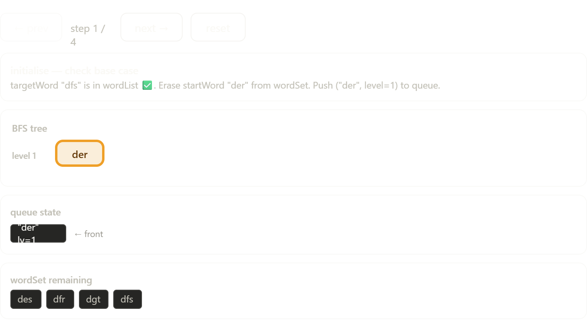
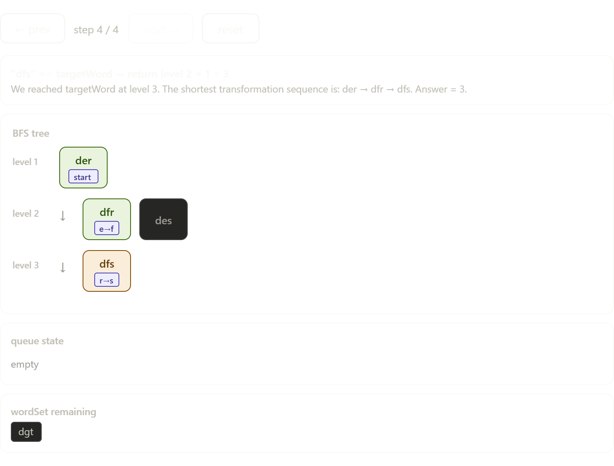
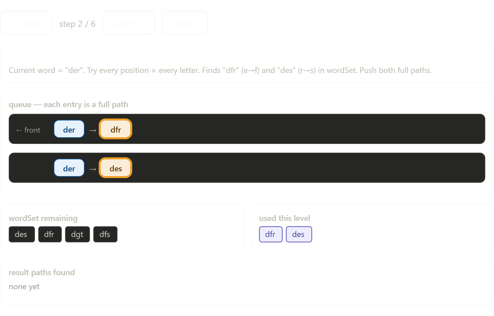
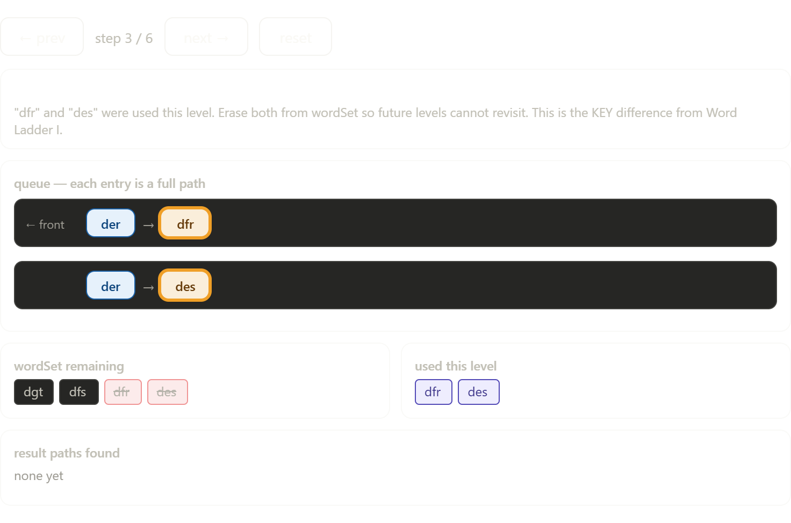
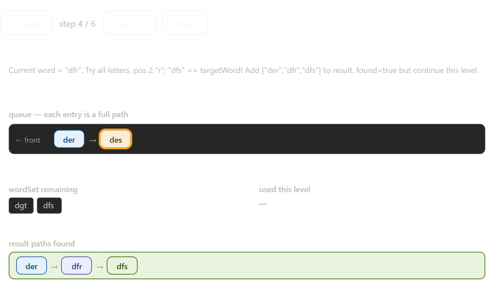
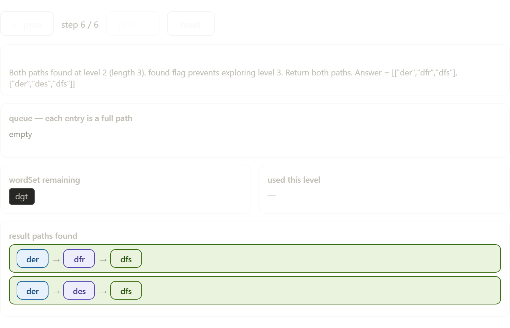

# Q1 Word ladder I


## Problem Statement

Given are the two distinct words `startWord` and `targetWord`, and a list of size `N`, denoting `wordList` of unique words of equal size `M`. Find the length of the shortest transformation sequence from `startWord` to `targetWord`.

Keep the following conditions in mind:
* A word can only consist of lowercase characters.
* Only one letter can be changed in each transformation.
* Each transformed word must exist in the `wordList` including the `targetWord`.
* `startWord` may or may not be part of the `wordList`.

**Note:** If there’s no possible way to transform the sequence from `startWord` to `targetWord` return `0`.

---

## Examples

**Example 1**
> **Input:** `wordList = ["des","der","dfr","dgt","dfs"]`, `startWord = "der"`, `targetWord = "dfs"`
> **Output:** `3`
> **Explanation:** > The length of the smallest transformation sequence from "der" to "dfs" is 3
> i.e. "der" -> (replace ‘e’ by ‘f’) -> "dfr" -> (replace ‘r’ by ‘s’) -> "dfs".
> So, it takes 3 different strings for us to reach the `targetWord`. Each of these strings are present in the `wordList`.

**Example 2**
> **Input:** `wordList = ["geek", "gefk"]`, `startWord = "gedk"`, `targetWord = "geek"`
> **Output:** `2`
> **Explanation:** > The length of the smallest transformation sequence from "gedk" to "geek" is 2
> i.e. "gedk" -> (replace ‘d’ by ‘e’) -> "geek" .
> So, it takes 2 different strings for us to reach the `targetWord`. Each of these strings are present in the `wordList`.

---

## Quiz: Now your turn!

**Input:** `wordList = ["hot", "dot", "dog", "lot", "log"]`, `startWord = "hit"`, `targetWord = "cog"`

**Output:**
Pick your answer:
* [ ] 3
* [ ] 0
* [ ] 2
* [ ] 1

*(Senior Engineer Hint: Before you try to mentally build the BFS tree, look at the 3rd condition in the problem statement and look at the `targetWord` vs the `wordList`. Always check the base edge-cases first!)*

---

## Constraints

* `1 ≤ wordList.length ≤ 100`
* `1 ≤ wordList[i].length ≤ 10`
* `startWord.length == targetWord.length == wordList[i].length`
* `startWord`, `targetWord`, and `wordList[i]` consist of lowercase English letters.
* `startWord != targetWord`


## Word Ladder I — Complete Guide

### Read the Hint First

The senior engineer hint is gold:

> "Look at the 3rd condition vs the targetWord vs the wordList"

**Condition 3:** Each transformed word must exist in the `wordList` **including the targetWord**.

```
wordList = ["hot", "dot", "dog", "lot", "log"]
targetWord = "cog"

Is "cog" in wordList? ❌ NO

→ Answer is 0 immediately, no BFS needed
```

**Quiz Answer: 0**

---

### The Mental Checklist Before Writing Any Code

This is what separates senior from junior thinking:

```
Step 1: Is targetWord in wordList?      → if NO, return 0 immediately
Step 2: Is wordList empty?              → return 0
Step 3: Is startWord == targetWord?     → return 1 (already there)
Step 4: Only then → run BFS
```

Always check **base cases before algorithm**. Saves time in interviews.

---

### Why BFS? Not DFS, Not DP?

```
Problem asks for SHORTEST transformation sequence
          ↓
SHORTEST PATH in an unweighted graph
          ↓
BFS — always finds shortest path first
      DFS finds A path, not necessarily shortest
      DP doesn't apply — no overlapping subproblems
```

Think of it as a **graph problem**:
```
Each word = node
Edge between two words = differ by exactly 1 letter
Find shortest path from startWord to targetWord
```

---

### The Approach — BFS Level by Level

```
Level 1:  startWord              → distance 1
Level 2:  all words 1 change away → distance 2
Level 3:  all words 2 changes away → distance 3
...
When targetWord is dequeued → return its level
```

The trick to generate neighbours efficiently:

```cpp
// For each position, try all 26 letters
word = "der"
pos 0: 'a'er, 'b'er ... 'z'er  → check each in wordSet
pos 1: d'a'r, d'b'r ... d'z'r  → check each in wordSet
pos 2: de'a', de'b' ... de'z'  → check each in wordSet
```

This is O(M × 26) per word instead of O(N) comparisons — much faster for large wordLists.

---

### The Code

```cpp
#include <bits/stdc++.h>
using namespace std;

int wordLadderLength(string startWord, string targetWord,
                     vector<string>& wordList) {

    // Base case: targetWord must be in wordList
    unordered_set<string> wordSet(wordList.begin(), wordList.end());
    if (!wordSet.count(targetWord)) return 0;

    // BFS
    queue<pair<string, int>> q;   // {word, level}
    q.push({startWord, 1});
    wordSet.erase(startWord);     // mark visited by removing from set

    while (!q.empty()) {
        auto [word, level] = q.front();
        q.pop();

        // try changing each position
        for (int i = 0; i < word.size(); i++) {
            char original = word[i];

            for (char c = 'a'; c <= 'z'; c++) {
                if (c == original) continue;
                word[i] = c;

                if (word == targetWord) return level + 1;

                if (wordSet.count(word)) {
                    wordSet.erase(word);      // mark visited
                    q.push({word, level + 1});
                }
            }
            word[i] = original;   // restore
        }
    }
    return 0;   // no path found
}
```

---

### Dry Run — Example 1

```
startWord = "der"   targetWord = "dfs"
wordList  = ["des","der","dfr","dgt","dfs"]
```

**Base case check:** "dfs" in wordList ✅ continue.

```
Initial: wordSet = {des, der, dfr, dgt, dfs}
         erase "der" → wordSet = {des, dfr, dgt, dfs}

Queue: [("der", 1)]
```

```
Pop ("der", 1):
  pos 0 'd': try aer,ber... no matches
  pos 1 'e': try dar,dbr... "dfr" ✅ → push ("dfr", 2)
                             "des"? no, wrong pos
  pos 2 'r': try dea,deb... "des" ✅ → push ("des", 2)

wordSet = {dgt, dfs}
Queue: [("dfr",2), ("des",2)]
```

```
Pop ("dfr", 2):
  pos 0 'd': no matches
  pos 1 'f': try dar... no matches
  pos 2 'r': try dfa,dfb... "dfs" == targetWord! ✅

return 2 + 1 = 3 ✅
```

---

### Dry Run — Example 2

```
startWord = "gedk"   targetWord = "geek"
wordList  = ["geek", "gefk"]
```

**Base case:** "geek" in wordList ✅

```
Queue: [("gedk", 1)]
wordSet = {gefk}   (geek stays for target check)

Pop ("gedk", 1):
  pos 2 'd': try geak, gebk... "geek" == targetWord! ✅

return 1 + 1 = 2 ✅
```

---

### Why `wordSet.erase(word)` instead of a visited set?

```cpp
// Instead of:
unordered_set<string> visited;
visited.insert(word);

// We do:
wordSet.erase(word);
```

Same effect — once a word is visited, removing it from wordSet prevents revisiting. One less data structure, same correctness.

---

### Complexity

```
N = wordList size
M = word length

Time:  O(N × M × 26)
       ↑            ↑
   BFS visits    each word tries
   each word     M×26 neighbours
   at most once

Space: O(N) for wordSet + O(N) for queue = O(N)
```

---

### Summary

```
Key decisions made:

1. Base case check first       → return 0 if target not in list
2. BFS not DFS                 → guarantees shortest path
3. Try all 26 letters per pos  → O(M×26) neighbour generation
4. Erase from wordSet          → O(1) visited tracking
5. Return level+1 at target    → count includes startWord
```

| Check | Question to ask |
|---|---|
| Before BFS | Is targetWord in wordList? |
| Neighbour gen | Change each position to a-z |
| Visited | Erase from wordSet |
| Found target | Return current level + 1 |
| Queue empty | Return 0 — no path |


## Word Ladder BFS Tree — Visual Dry Run

### Example 1

```
startWord = "der"   targetWord = "dfs"
wordList  = ["des","der","dfr","dgt","dfs"]
```




---

### What the Tree is Showing You

Each level in the BFS tree = one transformation step:

```
Level 1:  der          → distance 1  (start)
Level 2:  dfr, des     → distance 2  (1 change from der)
Level 3:  dfs          → distance 3  (1 change from dfr) ← TARGET
```

The key thing to notice — `des` at level 2 is **never explored**. BFS found the target through `dfr` first, so it returns immediately with `level + 1 = 3`. This is exactly why BFS guarantees the shortest path — it explores level by level, so the **first time you reach the target is always the shortest way**.

---

### Why `des` is a Dead End (Even if We Explored It)

```
des → one change away: des→dfs? (e→f, s→s) — no, two changes
    → des→dfr? no
    → des→dgt? no
des has no path to dfs in one step → would return nothing
```

BFS naturally skips this because target was already found from `dfr`. This is the **BFS guarantee** — shortest path always found before longer paths are explored.


`set.count()` is simple — it returns either **0 or 1**.

---

### Why Only 0 or 1?

Because a `set` (and `unordered_set`) **cannot have duplicates**. So any key either:

```cpp
exists in set  →  count returns 1
doesn't exist  →  count returns 0
```

That's it. It's essentially a **yes/no lookup**.

---

### In Code

```cpp
unordered_set<string> wordSet = {"des", "dfr", "dgt", "dfs"};

wordSet.count("dfr")   // → 1  (exists)
wordSet.count("xyz")   // → 0  (doesn't exist)
wordSet.count("dfs")   // → 1  (exists)
```

---

### How It's Used in Word Ladder

```cpp
if (wordSet.count(word)) {   // count returns 1 = truthy
    wordSet.erase(word);
    q.push({word, level + 1});
}
```

This is exactly the same as writing:

```cpp
if (wordSet.find(word) != wordSet.end())  // longer way
if (wordSet.count(word) == 1)             // explicit way
if (wordSet.count(word))                  // shorthand — most common
```

All three mean the same thing. `count()` is preferred because it's the shortest and most readable.

---

### count() vs find() — When to Use Which

```cpp
// Use count() when you only need YES/NO
if (wordSet.count(word))          // ✅ clean, simple

// Use find() when you need the ITERATOR too
auto it = wordSet.find(word);
if (it != wordSet.end()) {
    // use *it directly
}
```

---

### Why Not Just Use count() on a map?

`map` and `unordered_map` also have `.count()` — same behaviour, returns 0 or 1:

```cpp
unordered_map<char, int> freq;
freq['a'] = 3;

freq.count('a')   // → 1
freq.count('z')   // → 0
```

The only container where `.count()` can return more than 1 is `multiset` or `multimap` — because those allow duplicates:

```cpp
multiset<int> ms = {1, 1, 2, 3, 3, 3};
ms.count(3)   // → 3  (three copies of 3)
ms.count(1)   // → 2
ms.count(9)   // → 0
```

---

### One-Line Summary

```
set.count(x)  =  "does x exist in the set?"
                  1 = yes,  0 = no
```


This is called **Structured Bindings** — introduced in C++17.

---

### What It Does

```cpp
auto [word, level] = q.front();
```

It **unpacks** a `pair` (or tuple/struct) into individual named variables in one line.

Without it you'd write:

```cpp
// old way — C++14 and before
pair<string, int> p = q.front();
string word  = p.first;
int    level = p.second;

// new way — C++17 structured binding
auto [word, level] = q.front();
```

Exact same result, one line instead of three.

---

### How It Maps

```cpp
queue<pair<string, int>> q;
//         ↑       ↑
//       first   second

auto [word, level] = q.front();
//    ↑       ↑
//  first   second

// word  → maps to pair.first  (the string)
// level → maps to pair.second (the int)
```

The variables are assigned **left to right** matching the order of the pair/struct members.

---

### Works on Pairs, Tuples, Structs

```cpp
// pair
pair<int, string> p = {1, "hello"};
auto [num, str] = p;
// num = 1, str = "hello"

// tuple
tuple<int, string, bool> t = {42, "world", true};
auto [a, b, c] = t;
// a=42, b="world", c=true

// struct
struct Point { int x, y; };
Point pt = {3, 7};
auto [x, y] = pt;
// x=3, y=7
```

---

### Also Works in Range-based For Loops

Very common with maps:

```cpp
unordered_map<char, int> freq = {{'a',3}, {'b',2}};

// old way
for (auto& p : freq) {
    cout << p.first << " → " << p.second;
}

// C++17 structured binding — much cleaner
for (auto& [ch, count] : freq) {
    cout << ch << " → " << count;
}
```

---

### The `&` Matters

```cpp
auto  [word, level] = q.front();   // COPY  — modifying word/level doesn't affect queue
auto& [word, level] = q.front();   // REFERENCE — modifying affects original
```

In Word Ladder we use copy because we modify `word` in place (changing each character) and don't want to corrupt the queue:

```cpp
auto [word, level] = q.front();   // copy ✅
q.pop();

for (int i = 0; i < word.size(); i++) {
    char orig = word[i];
    word[i] = 'a';                // safely modifying the COPY
    ...
    word[i] = orig;
}
```

---

### Summary

| | Old way | C++17 structured binding |
|---|---|---|
| Syntax | `p.first`, `p.second` | `auto [a, b]` |
| Readability | low — `.first/.second` meaningless | high — custom names |
| Works on | pair only with `.first/.second` | pair, tuple, struct, array |
| Requires | C++11 | C++17 |

```cpp
// One-line mental model:
auto [word, level] = q.front();
//    ↑      ↑          ↑
//  name1  name2    pair/tuple to unpack
```


# Q2 Word ladder II


## Problem Statement

Given two distinct words `startWord` and `targetWord`, and a list denoting `wordList` of unique words of equal lengths. Find all shortest transformation sequence(s) from `startWord` to `targetWord`. You can return them in any order possible.

In this problem statement, we need to keep the following conditions in mind:
* A word can only consist of lowercase characters.
* Only one letter can be changed in each transformation.
* Each transformed word must exist in the `wordList` including the `targetWord`.
* `startWord` may or may not be part of the `wordList`.
* Return an empty list if there is no such transformation sequence.

---

## Examples

**Example 1**
> **Input:** `startWord = "der"`, `targetWord = "dfs"`, `wordList = ["des", "der", "dfr", "dgt", "dfs"]`
> **Output:** `[ ["der", "dfr", "dfs"], ["der", "des", "dfs"] ]`
> **Explanation:** The length of the smallest transformation sequence here is 3.
> Following are the only two shortest ways to get to the `targetWord` from the `startWord`:
> * `"der"` -> (replace ‘r’ by ‘s’) -> `"des"` -> (replace ‘e’ by ‘f’) -> `"dfs"`.
> * `"der"` -> (replace ‘e’ by ‘f’) -> `"dfr"` -> (replace ‘r’ by ‘s’) -> `"dfs"`.

**Example 2**
> **Input:** `startWord = "gedk"`, `targetWord= "geek"`, `wordList = ["geek", "gefk"]`
> **Output:** `[ ["gedk", "geek"] ]`
> **Explanation:** The length of the smallest transformation sequence here is 2.
> Following is the only shortest way to get to the `targetWord` from the `startWord`:
> * `"gedk"` -> (replace ‘d’ by ‘e’) -> `"geek"`.

---

## Quiz: Now your turn!

**Input:** `startWord = "abc"`, `targetWord = "xyz"`, `wordList = ["abc", "ayc", "ayz", "xyz"]`

**Output:**
Pick your answer:
* [ ] `[["abc", "ayz", "ayc", "xyz"]]`
* [ ] `[["abc", "ayc", "abc", "xyz"]]`
* [ ] `[]`
* [ ] `[["abc", "ayc", "ayz", "xyz"]]`

*(Senior Engineer Hint: Remember that BFS guarantees the shortest path. Trace the valid single-character mutations sequentially without revisiting previous states to prevent cycles like 'abc' -> 'ayc' -> 'abc'.)*

---

## Constraints

* `N` = Number of Words
* `M` = Length of Word
* `1 <= N <= 100`
* `1 <= M <= 10`


## Word Ladder II — Complete Guide

### Quiz Answer First

```
startWord = "abc"   targetWord = "xyz"
wordList  = ["abc", "ayc", "ayz", "xyz"]
```

Trace every possible path:

```
abc → ayc  (b→y)  ✅ in wordList
ayc → ayz  (c→z)  ✅ in wordList
ayz → xyz  (a→x)  ✅ in wordList

Length = 4 words = shortest possible
```

✅ Answer: **`[["abc", "ayc", "ayz", "xyz"]]`**

Why not the others:
```
Option 1: "abc→ayz→ayc→xyz" — ayz→ayc goes BACKWARD, longer path ❌
Option 2: visits "abc" twice — invalid, already visited ❌
Option 3: [] — path exists so empty is wrong ❌
```

---

### Word Ladder I vs II — The Key Difference

```
Word Ladder I                    Word Ladder II
─────────────────────            ──────────────────────────────
Find LENGTH of shortest path     Find ALL shortest paths
Return one number                Return list of lists
BFS alone is enough              BFS + path tracking needed
Stop at first hit                Must explore entire level
Simple queue                     Queue stores full path so far
```

---

### Why This Is Harder

In Word Ladder I, the moment you reach `targetWord` you return. In Word Ladder II:

```
You must NOT stop at first hit
You must finish exploring the ENTIRE level where target is found
Because another path at the same level might also reach target
```

This means you need to:

```
1. BFS level by level
2. Track the full PATH not just the word
3. Never revisit a word WITHIN the same path
4. Collect ALL paths that reach target at minimum level
5. Stop after the level where first hit occurs
```

---

### The Approach — BFS with Path Tracking

```cpp
#include <bits/stdc++.h>
using namespace std;

vector<vector<string>> findLadders(string startWord, string targetWord,
                                    vector<string>& wordList) {
    unordered_set<string> wordSet(wordList.begin(), wordList.end());

    // base case
    if (!wordSet.count(targetWord)) return {};

    // queue stores FULL PATH so far (not just current word)
    queue<vector<string>> q;
    q.push({startWord});

    // words used in CURRENT level — erase from wordSet after full level
    unordered_set<string> usedThisLevel;
    usedThisLevel.insert(startWord);

    vector<vector<string>> result;
    bool found = false;

    while (!q.empty() && !found) {
        int levelSize = q.size();     // process one full level at a time

        // collect words used in this level
        // erase them AFTER level, not during (other paths in same level need them)
        unordered_set<string> usedInLevel;

        for (int i = 0; i < levelSize; i++) {
            vector<string> path = q.front();
            q.pop();
            string word = path.back();   // current word = last in path

            // try all positions and all 26 letters
            for (int j = 0; j < word.size(); j++) {
                char orig = word[j];
                for (char c = 'a'; c <= 'z'; c++) {
                    if (c == orig) continue;
                    word[j] = c;

                    if (word == targetWord) {
                        path.push_back(word);
                        result.push_back(path);
                        path.pop_back();
                        found = true;     // don't stop — finish this level
                    }
                    else if (wordSet.count(word) && !usedThisLevel.count(word)) {
                        usedInLevel.insert(word);
                        path.push_back(word);
                        q.push(path);
                        path.pop_back();
                    }
                }
                word[j] = orig;
            }
        }

        // erase all words used in this level from wordSet
        // prevents future levels from revisiting them
        for (auto& w : usedInLevel)
            wordSet.erase(w);

        usedThisLevel = usedInLevel;
    }

    return result;
}
```

---

### The Trickiest Part — When to Erase from wordSet

This is what makes Word Ladder II hard:

```
WRONG — erase immediately (like Word Ladder I):
  Path A uses "dfr" → erased → Path B can't use "dfr"
  You miss valid paths at the SAME level ❌

CORRECT — erase after entire level is done:
  Path A uses "dfr" → kept for now
  Path B also uses "dfr" → both paths recorded ✅
  After level completes → erase "dfr"
  Next level can't revisit it ✅
```

---

Now walk through the full dry run interactively:---














### The 3 Critical Differences from Word Ladder I

```
Word Ladder I                     Word Ladder II
─────────────────                 ─────────────────────────────
queue<pair<string,int>>           queue<vector<string>>
stores word + level               stores FULL PATH

erase word immediately            erase word AFTER full level
→ other paths at same level       → other paths can still use it
  can't use it

return level+1 at first hit       set found=true, finish level
→ stops immediately               → collects ALL paths at that level
```

---

### Complexity

```
N = wordList size,  M = word length

Time:  O(N × M × 26 × N)
            ↑              ↑
       BFS per word    path copying (each path up to N words long)

Space: O(N × N × M)   — queue can hold N paths each of length N
```

Word Ladder II is significantly more expensive than I because storing full paths uses much more memory. For large inputs this is why the constraints are kept small (N ≤ 100).


# Q3 Minimum Multiplications to Reach End


## Problem Statement

Given `start`, `end` and an array `arr` of `n` numbers. At each step, `start` is multiplied with any number in `arr` and then modulo `100000` is taken to get the new `start`. 

Find the minimum steps in which `end` can be achieved starting from `start`. If it is not possible to reach `end`, then return `-1`.

---

## Examples

**Example 1**
> **Input:** `arr = [2, 5, 7]`, `start = 3`, `end = 30`
> **Output:** `2`
> **Explanation:** > Step 1: `3 * 2 = 6 % 100000 = 6`
> Step 2: `6 * 5 = 30 % 100000 = 30`
> Minimum steps taken to reach 30 from 3 is 2.

**Example 2**
> **Input:** `arr = [3, 4, 65]`, `start = 7`, `end = 66175`
> **Output:** `4`
> **Explanation:** > Step 1: `7 * 3 = 21 % 100000 = 21` 
> Step 2: `21 * 65 = 1365 % 100000 = 1365` 
> Step 3: `1365 * 65 = 88725 % 100000 = 88725` 
> Step 4: `88725 * 3 = 266175 % 100000 = 66175`
> Minimum steps taken to reach 66175 from 7 is 4.

---

## Constraints

* `1 <= arr.length <= 10^4`
* `1 <= arr[i] <= 10^4`
* `0 <= start, end < 100000`

---
*Senior Engineer Hint: This is not a math problem; it is a shortest-path Graph problem. Because the modulo is $10^5$, there are exactly 100,000 possible nodes (0 to 99,999). Use Dijkstra's Algorithm (or a simple BFS queue since edge weights are all exactly 1 step) to find the shortest path from the `start` node to the `end` node.*

Intuition--> bfs problem and same like previous need to travel whole array ech time.we put start on queue and multily by each element in array and at each level we check do we get the end

## Ai reply

Yes! You've understood it **exactly right.**

---

### Your Mental Model is Correct

```
start = node
multiply by each arr[i] = edges to neighbours
% 100000 = keeps values within 0..99999 (finite graph)
find end = shortest path question
             ↓
            BFS
```

---

### Why BFS Works Here

```
Level 0:  start                    → 0 multiplications
Level 1:  start × arr[0,1,2...]    → 1 multiplication
Level 2:  each of those × arr[...] → 2 multiplications
...
First time we see end = minimum multiplications ✅
```

Each multiplication = one step = one edge of equal weight. Unweighted graph → BFS guarantees shortest path.

---

### The Graph You're Imagining is Correct

```
arr = [2, 5, 7],  start = 3

Level 0:        3
              / | \
Level 1:     6  15  21        (×2, ×5, ×7)
           /|\  ...  ...
Level 2: 12 30 42 ...         (×2, ×5, ×7 again)
              ↑
             end=30 found! → return 2
```

---

### The One Key Detail — Why % 100000

Without the mod, values grow infinitely → infinite nodes → BFS never terminates.

```
With % 100000:
max possible value = 99999
so there are only 100000 possible nodes (0 to 99999)
BFS is guaranteed to terminate ✅
```

This is what makes it a **finite graph** problem.

---

### Quiz Answer

```
arr=[3,4,65], start=7, end=21

Level 0: 7
Level 1: 7×3=21 ← end found immediately!

Answer = 1 ✅
```

---

### One-line Summary

```
nodes  = numbers 0..99999
edges  = multiply by any arr[i] then %100000
goal   = shortest path from start to end
method = BFS  ✅
```

Your intuition was completely right — trust it.

Q--> if we do not get the answer then graph will always be ongoing as we are multiplying??

Great observation — but it **won't go on forever**. Here's why:

---

### The Visited Array Saves You

```cpp
vector<int> dist(100000, -1);  // only 100000 possible values (0 to 99999)
```

After `% 100000` every value is in range `[0, 99999]`.

So there are only **100000 possible nodes** in the entire graph.

```
Once all 100000 nodes are visited
→ nothing new can ever be added to queue
→ queue becomes empty
→ BFS terminates
→ return -1
```

---

### Concrete Picture

```
Without visited check:
3 → 6 → 12 → 24 → 48 ...  infinite ❌

With % 100000 + visited array:
values stay in [0, 99999]
once a value is visited, never added to queue again
max 100000 nodes ever processed
BFS always terminates ✅
```

---

### The Termination Proof

```
Total possible nodes   = 100000  (0 to 99999)
Each node visited      = at most once
Each node removed from queue = at most once

So queue can have at most 100000 items EVER
→ BFS always ends in finite steps
→ if end never found → queue empties → return -1
```

---

### One Line Summary

```
% 100000  →  caps the graph at 100000 nodes
visited   →  each node processed at most once
together  →  BFS always terminates, never infinite
```

The modulo is not just a math trick — it's what **converts an infinite multiplication chain into a finite graph**.

## My code

```cpp
class Solution{
public:
    int minimumMultiplications(vector<int> &arr,
                               int start, int end) {
        queue<pair<int,int>> q;
        q.push({start,0});
        vector<int> dist(100000, -1);
        dist[start]=1;

        while(q.size()>0){
            pair<int,int> p=q.front();
            q.pop();
            int val=p.first;
            int lvl=p.second;
            if(val==end) return lvl;
            for(int v:arr){

                int mul=(v*val)%100000;
                if(dist[mul]==1) continue;
                dist[mul]=1;
                q.push({mul,lvl+1});
            }
        }   

        return -1;         
   
    }
};

```

## Ai reply 

## Full Code Review

### Logic is Correct ✅

Your core approach is right:
- BFS from start
- multiply by each arr element
- mod 100000
- return level when end found

---

### Bug 1 — Wrong Initial dist value ❌

```cpp
dist[start] = 1;   // ❌ using 1 as "visited" marker

if(dist[mul] == 1) continue;   // ❌ checking for 1
```

This works **by accident** here — but it's semantically wrong and fragile.

```
dist is initialised to -1 (unvisited)
you mark visited as 1
but what if the ACTUAL distance to a node is 1?
they collide — same value means two different things
```

**Fix — use a boolean visited array instead:**

```cpp
vector<bool> visited(100000, false);
visited[start] = true;

if(visited[mul]) continue;
visited[mul] = true;
```

Clean separation — visited means visited, nothing else.

---

### Bug 2 — Check end BEFORE pushing, not after popping ⚠️

```cpp
// your way — check after popping
auto [val, lvl] = q.front();
q.pop();
if(val == end) return lvl;   // works but slightly wasteful
```

```cpp
// better way — check before pushing
int mul = (v * val) % 100000;
if(mul == end) return lvl + 1;  // return immediately, don't even push
```

This also handles the edge case where `start == end`:

```cpp
// add before BFS loop
if(start == end) return 0;
```

---

### Bug 3 — `start` itself is never distance-checked early ⚠️

```cpp
q.push({start, 0});
dist[start] = 1;
// what if start == end?
// BFS pops it, checks val==end, returns 0 ✅ -- ok actually
// but only by luck of the loop structure
```

Safer to handle explicitly:

```cpp
if(start == end) return 0;
```
Good question. Let me explain both parts.

---

### Part 1 — Why check before pushing is better

**Your way — check after popping:**
```
push end into queue
...some time passes...
pop end from queue
THEN check → return
```

You do **unnecessary work**:
- end sits in the queue
- other neighbours might get pushed after it
- wastes memory and time

**Better way — check before pushing:**
```
calculate mul
mul == end? → return immediately
don't even touch the queue
```

```
Example: arr=[2,5,7], start=3, end=6

Your way:
  pop 3 → not end
  mul = 3×2 = 6 → push {6,1} into queue   ← unnecessary
  mul = 3×5 = 15 → push {15,1}
  mul = 3×7 = 21 → push {21,1}
  pop 6 → IS end → return 1

Better way:
  pop 3 → not end
  mul = 3×2 = 6 == end → return 1 immediately ✅
  never pushed anything
```

---

### Part 2 — Why `start == end` needs special handling

When you check **before pushing**, you only check `mul` — the result after multiplication. You **never check start itself**.

```
start = 5, end = 5

Your loop:
  pop {5, 0}
  mul = 5×arr[0] → not end
  mul = 5×arr[1] → not end
  ...
  never returns 0 ❌
  eventually returns -1 ❌
```

With check-after-pop this isn't a problem because:

```
pop {5, 0} → val==end → return 0 ✅
```

So the two approaches have a tradeoff:

```
Check after pop:
  ✅ handles start==end naturally
  ❌ slightly wasteful — end enters queue before being caught

Check before push:
  ✅ more efficient — return the moment end is found
  ❌ misses start==end → need explicit guard
```

That's exactly why the explicit guard is needed:

```cpp
if (start == end) return 0;   // guard for check-before-push approach
```

---

### Summary

```
Check after pop  →  simpler, handles start==end, slightly wasteful
Check before push →  faster, needs start==end guard explicitly

Both are correct — just different tradeoffs
Your original code (check after pop) is fine as-is
```
---

### Minor — Prefer `!q.empty()` over `q.size() > 0`

```cpp
while(q.size() > 0)    // works but non-idiomatic
while(!q.empty())      // ✅ standard C++ idiom, clearer intent
```

---

### Minor — Use structured bindings (C++17)

```cpp
pair<int,int> p = q.front();
int val = p.first;
int lvl = p.second;

// cleaner:
auto [val, lvl] = q.front();
```

---

### Clean Version

```cpp
class Solution {
public:
    int minimumMultiplications(vector<int>& arr, int start, int end) {
        if (start == end) return 0;

        vector<bool> visited(100000, false);
        visited[start] = true;

        queue<pair<int,int>> q;
        q.push({start, 0});

        while (!q.empty()) {
            auto [val, lvl] = q.front();
            q.pop();

            for (int v : arr) {
                int mul = ((long long)v * val) % 100000;

                if (mul == end) return lvl + 1;   // check before pushing

                if (!visited[mul]) {
                    visited[mul] = true;
                    q.push({mul, lvl + 1});
                }
            }
        }

        return -1;
    }
};
```

---

### One Extra — Integer Overflow Guard

```cpp
int mul = (v * val) % 100000;
```

```
v   can be up to 10^4
val can be up to 99999 ≈ 10^5

v * val = 10^4 × 10^5 = 10^9  → fits in int (max ~2.1×10^9) ✅
          but only barely — safer to cast:

int mul = ((long long)v * val) % 100000;
```

---

### Summary

| Issue | Severity | Fix |
|---|---|---|
| `dist=1` as visited marker | ⚠️ semantic bug | use `vector<bool> visited` |
| Check end after pop not before | ⚠️ minor inefficiency | check before pushing |
| `start==end` not handled | ⚠️ edge case | add early return |
| `q.size() > 0` | style | use `!q.empty()` |
| `p.first/p.second` | style | use structured bindings |
| potential overflow | ⚠️ | cast to `long long` |


Q--> dist was only for checking if node is vsisted ,why it is bug??

You're right, I misread your intent.

---

### Your Code's Actual Logic

```cpp
vector<int> dist(100000, -1);  // -1 = not visited
dist[start] = 1;               // 1 = visited

if(dist[mul] == 1) continue;   // skip if already visited
dist[mul] = 1;                 // mark as visited
```

You're using `dist` as a **visited tracker** with two states only:

```
-1  →  not visited
 1  →  visited
```

This is **completely correct** and has **no bug**. There is no collision because you never store actual distances — just visited/unvisited.

---

### My Mistake

I assumed `dist` was storing distances (like in Dijkstra) because of the name. But you're storing levels inside the queue pair itself:

```cpp
queue<pair<int,int>> q;   // {value, level}
//                  ↑
//            level tracked here, not in dist
```

So `dist` is purely a visited array — my collision concern was wrong.

---

### The Only Real Suggestion Then

Just rename it for clarity:

```cpp
vector<int> dist(100000, -1);   // misleading name
// rename to:
vector<bool> visited(100000, false);   // intent is crystal clear
```

Same logic, clearer name. Everything else in your code is correct.


