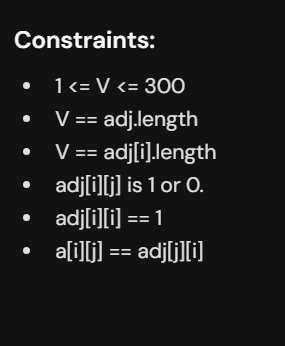
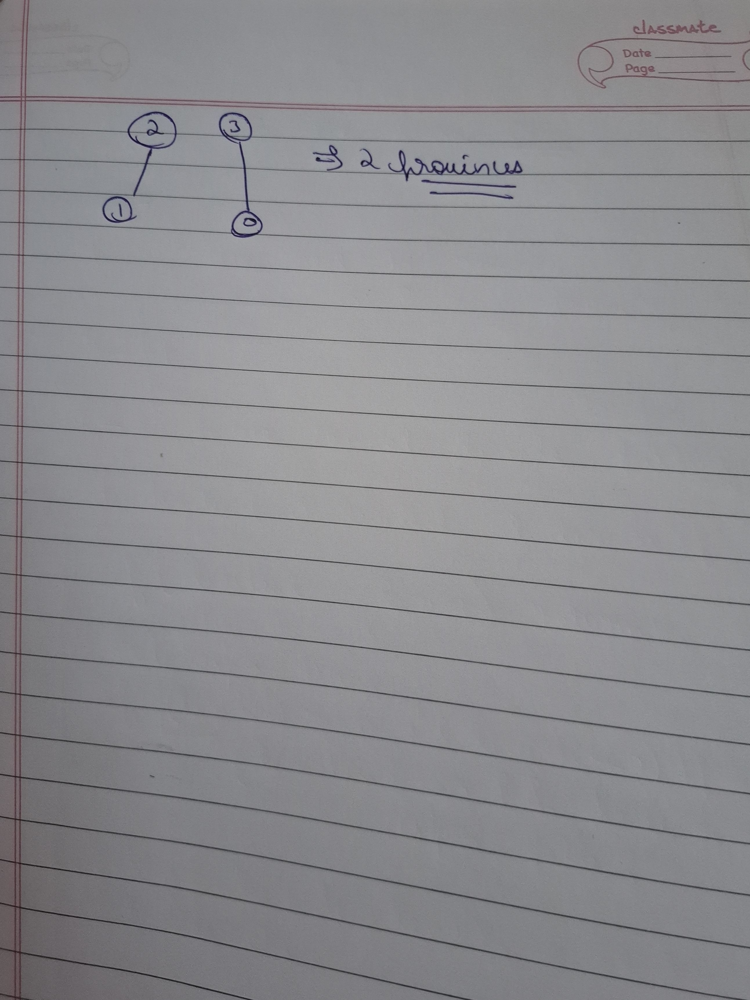

# Notes

##  Number of Provinces (too easy)






### Code

```cpp

class Solution{
    void dfs(vector<bool>& vis,int v,vector<int> * graph,int n){
        vis[v]=true;
        for(int  nbr:graph[v]){
            if(vis[nbr]==false){
                dfs(vis,nbr,graph,n);
            }
        }
    }
public:
    int numProvinces(vector<vector<int>> adj) {
       int n=adj.size();
       vector<int> graph[n];
       for(int i=0;i<n;i++){
        for(int j=0;j<i;j++){
            if(adj[i][j]==1){
                graph[i].push_back(j);
                graph[j].push_back(i);
            }
        }
       }

        vector<bool> vis(n,false);
        int cnt=0;
        for(int i=0;i<n;i++){
            if(vis[i]==false){
                dfs(vis,i,graph,n);
                cnt++;
            } 
            
        }
        return cnt;

    }
};

```


---

## 2.connected components

### java


```java
import java.util.*;

class Solution {
    // Function for BFS traversal
    private void bfs(int node, List<Integer>[] adjLs, 
                     boolean[] vis) {
        // Mark the node as visited
        vis[node] = true;

        // Queue required for BFS traversal
        Queue<Integer> q = new LinkedList<>();

        // To start traversal from node
        q.add(node);

        /* Keep on traversing till 
        the queue is not empty */
        while (!q.isEmpty()) {
            // Get the node
            int i = q.poll();

            // Traverse its unvisited neighbours
            for (int adjNodes : adjLs[i]) {
                if (!vis[adjNodes]) {
                    // Mark the node as visited
                    vis[adjNodes] = true;

                    // Add the node to queue
                    q.add(adjNodes);
                }
            }
        }
    }

    // Function for DFS traversal
    private void dfs(int node, List<Integer>[] adjLs, 
                     boolean[] vis) {
        // Mark the node as visited
        vis[node] = true;

        // Traverse its unvisited neighbours
        for (int it : adjLs[node]) {
            if (!vis[it]) {
                // Recursively perform DFS
                dfs(it, adjLs, vis);
            }
        }
    }

    /* Function call to find the number of 
    connected components in the given graph */
    public int findNumberOfComponent(int V, 
                                     List<List<Integer>> edges) {
        int E = edges.size();
        
        // To store adjacency list
        List<Integer>[] adjLs = new ArrayList[V];
        for (int i = 0; i < V; i++) {
            adjLs[i] = new ArrayList<>();
        }

        // Add edges to adjacency list
        for (int i = 0; i < E; i++) {
            adjLs[edges.get(i).get(0)].add(edges.get(i).get(1));
            adjLs[edges.get(i).get(1)].add(edges.get(i).get(0));
        }

        // Visited array
        boolean[] vis = new boolean[V];

        // Variable to store number of components
        int cnt = 0;

        // Start Traversal
        for (int i = 0; i < V; i++) {
            // If the node is not visited
            if (!vis[i]) {
                // Increment counter
                cnt++;

                /* Start traversal from current 
                node using any traversal */
                bfs(i, adjLs, vis);
                // dfs(i, adjLs, vis);
            }
        }

        // Return the count
        return cnt;
    }
}

class Main {
    public static void main(String[] args) {
        int V = 4;
        List<List<Integer>> edges = Arrays.asList(
            Arrays.asList(0, 1),
            Arrays.asList(1, 2)
        );

        /* Creating an instance of 
        Solution class */
        Solution sol = new Solution();

        /* Function call to find the number of 
        connected components in the given graph */
        int ans = sol.findNumberOfComponent(V, edges);

        System.out.println("The number of components in the given graph is: " + ans);
    }
}

```
### Cpp
```cpp

#include <bits/stdc++.h>
using namespace std;

class Solution {
private: 
    // Function for BFS traversal
    void bfs(int node, vector<int> adjLs[], int vis[]) {
        queue <int> q;
        q.push(node); 
        while(!q.empty()) {
            // Get the node
            int i = q.front();
            vis[i] = 1;
            q.pop();
            
            // Traverse its unvisited neighbours
            for(auto adjNodes: adjLs[i]) {
                
                if(vis[adjNodes] != 1) {
                    q.push(adjNodes);
                }
            }
        }
        
    }

    // Function for DFS traversal  
    void dfs(int node, vector<int> adjLs[], int vis[]) {
        
        vis[node] = 1; 
        for(auto it: adjLs[node]) {
            
            if(!vis[it]) {
                // Recursively perform DFS
                dfs(it, adjLs, vis); 
            }
        }
    }
    
public:

    /* find the number of 
    connected components in the given graph */
    int findNumberOfComponent(int E, int V, vector<vector<int>> &edges) {
        vector<int> adjLs[V];
        for(int i=0; i < E; i++) {
            adjLs[edges[i][0]].push_back(edges[i][1]);
            adjLs[edges[i][1]].push_back(edges[i][0]);
        }
        int vis[V] = {0}; 
        int cnt = 0; 
        
        for(int i=0; i < V; i++) {
            if(!vis[i]) {
                cnt++;
                bfs(i, adjLs, vis); 
                //dfs(i, adjLs, vis);
            }
        }
        return cnt; 
    }
};

int main() {
    int V = 4, E = 2;
    vector<vector<int>> edges = {
        {0, 1},
        {1, 2}
    };
    
    /* Creating an instance of 
    Solution class */
    Solution sol; 
    
    /* Function call to find the number of 
    connected components in the given graph */
    int ans = sol.findNumberOfComponent(E, V, edges);
    
    cout << "The number of components in the given graph is: " << ans;
    
    return 0;
}
```


## Flood fill 
An image is represented by a 2-D array of integers, each integer representing 
the pixel value of the image. Given a coordinate (sr, sc) representing the starting pixel (row and column)
 of the flood fill, and a pixel value newColor, "flood fill" the image.


To perform a flood fill, consider the starting pixel, plus any pixels connected 4-directionally 
to the starting pixel of the same colour as the starting pixel, plus any pixels connected 4-directionally
 to those pixels (also with the same colour as the starting pixel), and so on. Replace the colour of all of the aforementioned pixels with the newColor.

 Input: image = [ [1, 1, 1], [1, 1, 0], [1, 0, 1] ], sr = 1, sc = 1, newColor = 2

Output: [ [2, 2, 2], [2, 2, 0], [2, 0, 1] ]

Explanation: From the center of the image with position (sr, sc) = (1, 1) (i.e., the red pixel), all pixels connected by a path of the same color as the starting pixel (i.e., the blue pixels) are colored with the new color.

Note the bottom corner is not colored 2, because it is not 4-directionally connected to the starting pixel.

Input: image = [ [0, 1, 0], [1, 1, 0], [0, 0, 1] ], sr = 2, sc = 2, newColor = 3

Output: [ [0, 1, 0], [1, 1, 0], [0, 0, 3] ]

Explanation: Starting from the pixel at position (2, 2) (i.e., the blue pixel), we flood fill all adjacent pixels that have the same color as the starting pixel. In this case, only the pixel at position (2, 2) itself is of the same color. So, only that pixel gets colored with the new color, resulting in the updated image.

```cpp
#include <bits/stdc++.h>
using namespace std;

class Solution{
    bool canVisit( vector<vector<int>> &grid,vector<vector<bool>> &vis,int i ,int j,int oc){
        int n=grid.size();
        int m=grid[0].size();
        if(i>=0 && i<n && j>=0 && j<m && vis[i][j]==false && grid[i][j]==oc) return true;
        return false;
    }
    void solve (vector<vector<int>> &dir, vector<vector<int>> &grid,vector<vector<bool>> &vis,int i ,int j,int oc,int nc){
        vis[i][j]=true;
        grid[i][j]=nc;
        for(int k=0;k<dir.size();k++){
            int newi=i+dir[k][0];
            int newj=j+dir[k][1];
            if(canVisit(grid,vis,newi,newj,oc)==true){
               solve(dir,grid,vis,newi,newj,oc,nc);
            }
        }
    }
    public:
    vector<vector<int>> floodFill(vector<vector<int>> &img,
                                  int sr, int sc, int newColor) {
        vector<vector<int>>dir={{-1,0},{1,0},{0,1},{0,-1}};
        vector<vector<bool>> vis(img.size(),vector<bool>(img[0].size(),false));
        int oc=img[sr][sc];
        solve(dir,img,vis,sr,sc,oc,newColor);
        return img;
    }
};

int main() {
    vector<vector<int>> image = {
	    {1,1,1},
	    {1,1,0},
	    {1,0,1}
	};
    int sr = 1, sc = 1;
    int newColor = 2;
    
    int n = image.size();
    int m = image[0].size();
    
    /* Creating an instance of 
    Solution class */
    Solution sol; 
    
    /* Function call to find the 
    number of islands in given grid*/
    vector<vector<int>> ans = sol.floodFill(image, sr, sc, newColor);
    
    cout << "Image after performing flood fill algorithm: \n\n";
    
    for(int i=0; i < n; i++) {
        for(int j=0; j < m; j++) {
            cout << ans[i][j] << " "; 
        }
        cout << endl;
    }
    
    return 0;
}
```


.jpg>) .jpg>) .jpg>) .jpg>) .jpg>) .jpg>) .jpg>) .jpg>) 

```java
class Solution {
    int helper(int i,int j,int [][] grid,int[][] dir){
        if(grid[i][j]==0) return 0;
        if(i==0||j==0||i==grid.length-1||j==grid[0].length-1) return -1;
         grid[i][j]=0;
        int res=1;
        for(int d=0;d<4;d++){
            int newi=i+dir[d][0];
            int newj=j+dir[d][1];
            int tres=helper(newi,newj,grid,dir);
            if(tres==-1) res=-1;// do not chnage to return as need to visit all other connected to this
            else if(res!=-1 )res+=tres; // do not remove if as then res will be added when res=-1 which we do not want
        }
         
        return  res;
    }
    public int numberOfEnclaves(int[][] grid) {
        int enclaves=0;
        int [][]dir={{0,-1},{0,1},{1,0},{-1,0}};
        for(int i=0;i<grid.length;i++)
        {
            for(int j=0;j<grid[0].length;j++){
                    if(grid[i][j]==1){
                    int tres=helper(i,j,grid,dir);
                    enclaves+=(tres==-1)?0:tres;
                }
            }
        }
        return enclaves;
    }
}
```
### BFS solution

```java

import java.util.*;

class Solution {
    private int[] delRow = {-1, 0, 1, 0};
    private int[] delCol = {0, 1, 0, -1};
    
    /* Helper Function to check if a 
    cell is within boundaries */
    private boolean isValid(int i, int j, 
                            int n, int m) {
        
        // Return false if cell is invalid
        if(i < 0 || i >= n) return false;
        if(j < 0 || j >= m) return false;
        
        // Return true if cell is valid
        return true;
    }
    
    // Function to perform BFS traversal 
    private void bfs(int[][] grid,
                     Queue<int[]> q,
                     boolean[][] vis) {
        
        // Getting the dimensions of image
        int n = grid.length;
        int m = grid[0].length; 
        
        // Until the queue is empty
        while(!q.isEmpty()) {
            // Get the cell from queue
            int[] cell = q.poll();
            
            // Get its coordinates
            int row = cell[0];
            int col = cell[1];
            
            // Traverse its 4 neighbors
            for(int i=0; i < 4; i++) {
                
                // Coordinates of new cell
                int nRow = row + delRow[i]; 
                int nCol = col + delCol[i]; 
                
                /* check for valid, unvisited 
                and land cells */
                if(isValid(nRow, nCol, n, m) && 
                   grid[nRow][nCol] == 1 
                   && vis[nRow][nCol] == false) {
                    
                    /* Mark the new cell as visited
                    and add it to the queue */
                    vis[nRow][nCol] = true;
                    q.add(new int[]{nRow, nCol});
                }
            }
        }
    }
    
    // Function to find number of enclaves 
    public int numberOfEnclaves(int[][] grid) {
        
        // Get the dimensions of grid
        int n = grid.length;
        int m = grid[0].length;
        
        // Queue for BFS traversal
        Queue<int[]> q = new LinkedList<>();
        
        // Visited array
        boolean[][] vis = new boolean[n][m];
        
        /* Traverse the grid and add 
        the border land cells to queue */
        for(int i=0; i < n; i++) {
            for(int j=0; j < m; j++) {
                
                /* If the land cell is at
                border, add it to queue */
                if((i == 0 || i == n-1 ||
                    j == 0 || j == m-1) &&
                    grid[i][j] == 1) {
                    
                    vis[i][j] = true;
                    q.add(new int[]{i, j});
                }
            }
        }
       
        /* Perform the bfs traversal 
        from border land cells */
        bfs(grid, q, vis);
        
        // Count to store number of enclaves
        int count = 0;
        
        // Traverse the grid
        for(int i=0; i < n; i++) {
            for(int j=0; j < m; j++){
                
                /* If cell is a land cell and
                 unvisited, update the count */
                if(grid[i][j] == 1 && !vis[i][j])
                    count++;
            }
        }
        
        // Return count as answer
        return count;
    }
    
    public static void main(String[] args) {
        int[][] grid = {
            {0, 0, 0, 1}, 
            {1, 0, 1, 0}, 
            {0, 0, 1, 0}, 
            {0, 0, 0, 0}
        };
        
        /* Creating an instance of 
        Solution class */
        Solution sol = new Solution(); 
        
        // Function call to get number of enclaves
        int ans = sol.numberOfEnclaves(grid);
        
        System.out.println("The number of enclaves in given grid are: " + ans);
    }
}


```

.jpg>) .jpg>) .jpg>) .jpg>) .jpg>) .jpg>) .jpg>)

.jpg>) .jpg>) .jpg>) .jpg>) .jpg>) .jpg>) .jpg>) .jpg>) 

```cpp
class Solution{
  bool  isPossibleToadd(int i,int j,vector<vector<int>> &grid,vector<vector<bool>>& vis,int n,int m){
    if(i<0 || i>=n || j<0 ||j>=m || grid[i][j]==0 ||vis[i][j]==true ) return false;
    return true;
  }
public:
    int orangesRotting(vector<vector<int>> &grid) {
       int n=grid.size();
       int m=grid[0].size();
       vector<vector<bool>> vis(n,vector<bool>(m,false));
       queue<pair<int,pair<int,int>>>q;
       int fresh=0;
       for(int i=0;i<n;i++){
        for(int j=0;j<m;j++){
            if(grid[i][j]==2) q.push({0,{i,j}});
            else if (grid[i][j]==1) fresh++;
        }
       }
       vector<vector<int>> dir={{1,0},{-1,0},{0,1},{0,-1}};
       int t=0;
       while(q.size()>0){
            pair<int,pair<int,int>> rem=q.front();
            q.pop();
            int tm=rem.first;
            int i=rem.second.first;
            int j=rem.second.second;
            if(vis[i][j]==true) continue;
            vis[i][j]=true;
            t=max(t,tm);
            if(grid[i][j]==1) fresh--;
            for(int k=0;k<4;k++){
                int newi=i+dir[k][0];
                int newj=j+dir[k][1];
                if(isPossibleToadd(newi,newj,grid,vis,n,m)){
                    q.push({tm+1,{newi,newj}});
                }
            }
       }
       return fresh==0?t:-1;

    }
};
```
However, it still contains the "Mark on Pop" logic flaw, which causes the queue to fill with duplicate entries, leading to **Time Limit Exceeded (TLE)** on large test cases.

Here is the explanation of the issue and the optimized solution.

### The Problem: Delayed "Visited" Marking
In your code, you mark `vis[i][j] = true` **after** popping from the queue.

**Scenario:** Imagine Node A and Node B both neighbor Node C.
1. **Step 1:** You process A. It sees C is not visited. It pushes C.
2. **Step 2:** You process B. C is still in the queue (waiting), so it is technically "not visited" yet. B pushes C again.

**Result:** Node C is added to the queue multiple times. In a large grid, this causes the queue size to explode exponentially.

### The Fix: Mark on Push
You must mark a node as visited and decrement `fresh` the **moment** you push it into the queue.

```cpp
class Solution {
    // Helper: Checks if valid AND checks if it is a FRESH orange (1)
    bool isPossibleToadd(int i, int j, vector<vector<int>> &grid, vector<vector<bool>> &vis, int n, int m) {
        // Bounds check
        if (i < 0 || i >= n || j < 0 || j >= m) return false;
        // Logic check: Must be Fresh (1) and Not Visited
        if (grid[i][j] != 1 || vis[i][j] == true) return false;
        
        return true;
    }

public:
    int orangesRotting(vector<vector<int>> &grid) {
        int n = grid.size();
        int m = grid[0].size();
        
        vector<vector<bool>> vis(n, vector<bool>(m, false));
        queue<pair<int, pair<int, int>>> q; // Corrected syntax
        
        int fresh = 0;

        // Step 1: Initialize Queue
        for (int i = 0; i < n; i++) {
            for (int j = 0; j < m; j++) {
                if (grid[i][j] == 2) {
                    q.push({0, {i, j}});
                    vis[i][j] = true; // IMPORTANT: Mark start nodes as visited immediately
                } else if (grid[i][j] == 1) {
                    fresh++;
                }
            }
        }

        vector<vector<int>> dir = {{1, 0}, {-1, 0}, {0, 1}, {0, -1}};
        int t = 0;

        // Step 2: BFS
        while (!q.empty()) {
            auto rem = q.front();
            q.pop();
            
            int tm = rem.first;
            int i = rem.second.first;
            int j = rem.second.second;
            
            t = max(t, tm);

            // Note: We don't check "if(vis[i][j]) continue" here anymore
            // because we guarantee unique pushes below.

            for (int k = 0; k < 4; k++) {
                int newi = i + dir[k][0];
                int newj = j + dir[k][1];

                if (isPossibleToadd(newi, newj, grid, vis, n, m)) {
                    // CRITICAL FIX: Update state ON PUSH
                    vis[newi][newj] = true; 
                    fresh--; 
                    q.push({tm + 1, {newi, newj}});
                }
            }
        }

        return fresh == 0 ? t : -1;
    }
};
```
### Key Changes Made:

* **Mark Start Nodes:** Added `vis[i][j] = true` inside the initialization loop for rotten oranges.
* **Helper Function:** Updated to check `grid[i][j] != 1`. We only care about moving to fresh oranges.
* **Inside BFS Loop:** Moved `vis[newi][newj] = true` and `fresh--` inside the neighbor loop (the push block). This ensures every fresh orange enters the queue exactly once.


Here is the Complexity Analysis for the Rotting Oranges (BFS) solution. Let $N$ be the number of rows and $M$ be the number of columns.

### 1. Time Complexity: $O(N \times M)$

* **Initialization:** We iterate through the entire grid once to find all initially rotten oranges and count fresh ones. This takes $O(N \times M)$.
* **BFS Process:**
    * In the worst case, every fresh orange gets rotten.
    * Each cell is added to the queue at most once (because we mark them as visited immediately).
    * For every cell popped, we look at its 4 neighbors (constant time).
    * Total operations $\approx 4 \times (N \times M)$.
* **Total:** $O(N \times M) + O(N \times M) \approx O(N \times M)$.

### 2. Space Complexity: $O(N \times M)$

* **Queue:** In the worst case (e.g., a massive wave of rotten oranges), the queue can store up to $O(N \times M)$ elements.
* **Visited Array:** We store a 2D `vis` array of size $N \times M$.
* **Total:** $O(N \times M)$.

> **Optimization Note:** You can achieve $O(1)$ auxiliary space (excluding the queue) if you modify the input grid directly (e.g., changing 1 to 2 to mark it as visited) instead of using a separate `vis` array. The Queue space remains $O(N \times M)$.


.jpg>) .jpg>) .jpg>) .jpg>) .jpg>) .jpg>) .jpg>) .jpg>) .jpg>) .jpg>) .jpg>) .jpg>) .jpg>) .jpg>) .jpg>) .jpg>) .jpg>) .jpg>) .jpg>) .jpg>) .jpg>) .jpg>) .jpg>) .jpg>) .jpg>) .jpg>) .jpg>) .jpg>) .jpg>) .jpg>) .jpg>) .jpg>) .jpg>) .jpg>) .jpg>) 

## My code

```cpp
class Solution
{
    vector<vector<int>> dir={{0,-1,},{0,1},{1,0},{-1,0}};
    vector<char>dirc={'L','R','D','U'};
    unordered_set<string>set;
    string dfs(int i,int j ,vector<vector<int>> & grid, string &path){
        if(i<0 || i>=grid.size() || j<0 || j>= grid[0].size() || grid[i][j]==0) return path;
        grid[i][j]=0;
        string stringPath="";
        for(int k=0;k<4;k++){
            int newi=i+dir[k][0];
            int newj=j+dir[k][1];
            string newpath=path+dirc[k];
            stringPath += dfs(newi,newj,grid,newpath);
        }
        return stringPath;
    }
public:
    int countDistinctIslands(vector<vector<int>> &grid){
        int n=grid.size();
        int m=grid[0].size();
        string path="";
        for(int i=0;i<n;i++){
            for(int j=0;j<m;j++){
                if(grid[i][j]==1){
                    set.insert(dfs(i,j,grid,path));
                }
            }
        }
        
        return set.size();
    }
    
};

```
## Ai code
```cpp
class Solution {
    // Directions: Left, Right, Down, Up
    vector<vector<int>> dir = {{0, -1}, {0, 1}, {1, 0}, {-1, 0}};
    vector<char> dirc = {'L', 'R', 'D', 'U'};

    // 1. Return type is VOID (We build the string in place)
    // 2. Pass 's' by REFERENCE (No copying)
    void dfs(int i, int j, vector<vector<int>> &grid, string &s) {
        grid[i][j] = 0; // Mark as visited (sink the land)
        
        for (int k = 0; k < 4; k++) {
            int newi = i + dir[k][0];
            int newj = j + dir[k][1];
            
            // Check if Valid Move (Within bounds AND is Land)
            if (newi >= 0 && newi < grid.size() && newj >= 0 && newj < grid[0].size() && grid[newi][newj] == 1) {
                
                // 1. Add direction to signature (e.g., "R")
                s += dirc[k];
                
                // 2. Go deeper
                dfs(newi, newj, grid, s);
                
                // 3. Add Backtracking marker (Crucial for distinct shapes)
                s += 'b'; 
            }
        }
    }

public:
    int countDistinctIslands(vector<vector<int>> &grid) {
        int n = grid.size();
        int m = grid[0].size();
        unordered_set<string> distinctIslands;
        
        for (int i = 0; i < n; i++) {
            for (int j = 0; j < m; j++) {
                if (grid[i][j] == 1) {
                    string signature = "";
                    dfs(i, j, grid, signature);
                    distinctIslands.insert(signature);
                }
            }
        }
        
        return distinctIslands.size();
    }
};
```
### A Better Counter-Example (Why 'b' is mandatory)

Compare **Island A** (Line) and **Island B** (Split).

* **Island A (Line):** $Start \to Right \to Down$.
    * *Forward only:* "R" (move), "D" (move). 
    * **Result:** "RD"
* **Island B (Corner/Split):** $Start \to Right$ (stop), then $Start \to Down$ (stop).
    * *Forward only:* "R" (move), return to start (silent), "D" (move). 
    * **Result:** "RD"

Without 'b', both Island A and Island B produce "RD". The algorithm thinks they are identical.

---

### 2. The Solution (With 'b')

The character 'b' acts as a closing bracket `}`, signaling **"We are done with this branch."**

#### Trace Island A (Line): $Start \to Right \to Down$
1. Move Right $\to$ record "R"
2. Move Down $\to$ record "D"
3. Hit dead end, go back $\to$ record "b"
4. Go back again $\to$ record "b"
* **Signature:** `"RDbb"`

#### Trace Island B (Corner): $Start \to Right$, then $Start \to Down$
1. Move Right $\to$ record "R"
2. Hit dead end, go back $\to$ record "b" (This tells us: "The 'R' branch is **OVER**.")
3. Back at Start. Now move Down $\to$ record "D"
4. Hit dead end, go back $\to$ record "b"
* **Signature:** `"RbDb"`

---

### Conclusion

* **Line:** `"RDbb"` (The 'D' is inside the 'R' branch).
* **Corner:** `"RbDb"` (The 'D' is a sibling of the 'R' branch).

The 'b' allows you to distinguish between a **child** (an extension of the current path) and a **sibling** (a new branch from the same parent).

## Striver code

```cpp

#include <bits/stdc++.h>
using namespace std;

class Solution {
private:
    // Direction vectors: up, left, down, right
    vector<int> delRow = {-1, 0, 1, 0};
    vector<int> delCol = {0, -1, 0, 1};

    // Check if cell is within bounds
    bool isValid(int i, int j, int n, int m) {
        return i >= 0 && j >= 0 && i < n && j < m;
    }

    // DFS to explore island and encode shape
    void dfs(int row, int col, vector<vector<int>> &grid, int baseRow, int baseCol, string &shape) {
        int n = grid.size(), m = grid[0].size();

        // Mark cell as visited
        grid[row][col] = 0;

        // Encode relative position
        shape += to_string(row - baseRow) + "," + to_string(col - baseCol) + " ";

        // Explore four directions
        for (int d = 0; d < 4; d++) {
            int nRow = row + delRow[d];
            int nCol = col + delCol[d];
            if (isValid(nRow, nCol, n, m) && grid[nRow][nCol] == 1) {
                dfs(nRow, nCol, grid, baseRow, baseCol, shape);
            }
        }
    }

public:
    // Count distinct islands
    int countDistinctIslands(vector<vector<int>> &grid) {
        int n = grid.size();
        int m = grid[0].size();
        unordered_set<string> shapes;

        // Traverse the grid
        for (int i = 0; i < n; i++) {
            for (int j = 0; j < m; j++) {
                if (grid[i][j] == 1) {
                    string shape = "";
                    dfs(i, j, grid, i, j, shape);
                    shapes.insert(shape);
                }
            }
        }
        return shapes.size();
    }
};

int main() {
    // Input grid
    vector<vector<int>> grid = {
        {1,1,0,0},
        {1,0,0,0},
        {0,0,1,1},
        {0,0,1,1}
    };

    // Create solution object
    Solution sol;

    // Call function
    int ans = sol.countDistinctIslands(grid);

    // Print result
    cout << "The number of distinct islands: " << ans << endl;
    return 0;
}

```
This approach relies on **Translation Invariance**.

When you find an island, you treat the first cell found (top-left) as the **Base** (`baseRow`, `baseCol`). For every other cell in that island, you store its position as `(row - baseRow, col - baseCol)`.

### Example:
Imagine two identical "L" shaped islands at different locations.

* **Island A at (0,0):**
    * Cells: `(0,0), (0,1), (1,0)`
    * Relative: `(0-0, 0-0), (0-0, 1-0), (1-0, 0-0)`
    * String: `"0,0 0,1 1,0 "`
* **Island B at (5,5):**
    * Cells: `(5,5), (5,6), (6,5)`
    * Relative: `(5-5, 5-5), (5-5, 6-5), (6-5, 5-5)`
    * String: `"0,0 0,1 1,0 "`

Since the strings are identical, the `unordered_set` correctly identifies them as the same island.

---

### 2. Why "Backtracking" ('b' or '0') is NOT needed here
This is the most common point of confusion.

* **Previous Approach (Path Signature):** Recorded **Movements**. Without a 'back' marker, "Right, Down" (Corner) looks the same as "Right, then Down from neighbor" (Line) if flattened.
* **Current Approach (Relative Coordinates):** Records **Absolute Positions**. 
    * **Corner Shape:** Includes point `(1, 0)`.
    * **Line Shape:** Includes point `(0, 2)`.

Because `(1,0)` and `(0,2)` are literally different numbers, the strings will never match. You don't need a backtrack marker because the coordinates themselves define the structure uniquely.


## Another way AI(highly optimized)

```cpp
#include <vector>
#include <set>
#include <utility> // for pair

using namespace std;

class Solution {
private:
    // Directions: Up, Right, Down, Left
    // Using a simple array is slightly faster than vector<vector>
    const int dRow[4] = {-1, 0, 1, 0};
    const int dCol[4] = {0, 1, 0, -1};

    void dfs(int row, int col, vector<vector<int>>& grid, vector<vector<bool>>& vis, 
             vector<pair<int, int>>& currentIsland, int baseRow, int baseCol) {
        
        int n = grid.size();
        int m = grid[0].size();
        
        vis[row][col] = true;
        
        // Optimization: Store relative coordinates directly
        // {row - baseRow, col - baseCol} normalizes the shape to (0,0)
        currentIsland.push_back({row - baseRow, col - baseCol});

        for (int i = 0; i < 4; i++) {
            int nRow = row + dRow[i];
            int nCol = col + dCol[i];

            // Boundary checks and visited checks
            if (nRow >= 0 && nRow < n && nCol >= 0 && nCol < m && 
                grid[nRow][nCol] == 1 && !vis[nRow][nCol]) {
                
                dfs(nRow, nCol, grid, vis, currentIsland, baseRow, baseCol);
            }
        }
    }

public:
    int countDistinctIslands(vector<vector<int>>& grid) {
        int n = grid.size();
        int m = grid[0].size();
        vector<vector<bool>> vis(n, vector<bool>(m, false));
        
        // Set stores vectors of pairs. 
        // C++ STL sets handle vector comparison automatically (lexicographical check).
        set<vector<pair<int, int>>> distinctIslands;

        for (int i = 0; i < n; i++) {
            for (int j = 0; j < m; j++) {
                if (grid[i][j] == 1 && !vis[i][j]) {
                    vector<pair<int, int>> island;
                    
                    // Start DFS treating (i, j) as the (0,0) base
                    dfs(i, j, grid, vis, island, i, j);
                    
                    // Insert vector into set. 
                    // If this exact sequence of pairs exists, it's discarded (duplicate).
                    distinctIslands.insert(island);
                }
            }
        }
        
        return distinctIslands.size();
    }
};

```


### Why is this "Highly Optimized"?

* **No String Manipulation:** String construction, concatenation, and hashing are relatively expensive (heap allocations). Pairs of integers are stored contiguously in memory (stack/cache friendly).
* **Efficient Comparison:** `std::set` automatically compares vectors lexicographically. Since our DFS order is deterministic (always Up, Right, Down, Left), identical shapes will produce identical coordinate sequences without needing to be sorted.
* **Space Efficiency:** Stores raw integer coordinates rather than converting numbers to ASCII characters (e.g., storing integer 12 takes 4 bytes, while string "12" takes 2 bytes + overhead + length storage).


# 130. Surrounded Regions

**Medium**

You are given an `m x n` matrix `board` containing letters `'X'` and `'O'`, capture regions that are surrounded:

* **Connect:** A cell is connected to adjacent cells horizontally or vertically.
* **Region:** To form a region connect every `'O'` cell.
* **Surround:** The region is surrounded with `'X'` cells if you can connect the region with `'X'` cells and none of the region cells are on the edge of the board.

To **capture** a surrounded region, replace all `'O'`s with `'X'`s in-place within the original board. You do not need to return anything.

### Example 1:

**Input:** 
```text
board = [
  ["X","X","X","X"],
  ["X","O","O","X"],
  ["X","X","O","X"],
  ["X","O","X","X"]
]

```

Output: 

```text [ ["X","X","X","X"], ["X","X","X","X"], ["X","X","X","X"], ["X","O","X","X"] ]```


**Explanation:**
In the above diagram, the bottom region is not captured because it is on the edge of the board and cannot be surrounded.

### Example 2:

**Input:** `board = [["X"]]`
**Output:** `[["X"]]`

---

### Constraints:

* `m == board.length`
* `n == board[i].length`
* `1 <= m, n <= 200`
* `board[i][j]` is `'X'` or `'O'`.


## My wrong code 

```cpp
class Solution{
    vector<vector<int>> dir = {{0, -1}, {0, 1}, {1, 0}, {-1, 0}};
    bool isValid(int i,int j,int n,int m){
        if(i>=0 && i<n && j>=0 && j<m) return true;
        return false;
    }
    bool dfs(int i,int j,vector<vector<char>> & grid,vector<vector<bool>>& vis,int n,int m){
        if(i==0 || i ==n-1 || j==0 || j ==m-1) return false;
        vis[i][j]=true;      
        bool val=true;
        for(int k=0;k<4;k++){
            int newi=i+dir[k][0];
            int newj=j+dir[k][1];
      
            if(isValid (newi,newj,n,m)==true && vis[newi][newj]==false && grid[newi][newj]=='O'){
                
                val=val &dfs(newi,newj,grid,vis,n,m);
            }
          
        }
        if(val==true) grid[i][j]='X';
        return val;
    }
public:
    vector<vector<char>> fill(vector<vector<char>> grid) {
        int n = grid.size();
        int m = grid[0].size();
        vector<vector<bool>> vis(n, vector<bool>(m, false));
        
        for (int i = 0; i < n; i++) {
            for (int j = 0; j < m; j++) {
                if (grid[i][j] == 'O' && !vis[i][j]) {
                    dfs(i, j, grid, vis, n, m);
                }
            }
        }
        return grid;
    }
};
```

The logic in your code attempts to decide whether to flip an 'O' to 'X' based on the return values of its neighbors (DFS). However, this approach has a **Critical Logical Flaw** regarding **Partial Flipping**.

### The Problem: Partial Flipping (The "Bad Apple" Effect)

Your code flips an 'O' to 'X' inside the recursion (`if(val==true) grid[i][j]='X'`). 

Imagine a connected component shaped like a "Y":
* **Node A** is connected to **B** and **C**.
* **B** is completely surrounded (safe).
* **C** touches the boundary (unsafe).

**What happens in your code:**
1.  **DFS(A)** calls **DFS(B)**.
2.  **B** checks its neighbors, sees walls, and returns `true`.
3.  **B flips to 'X'.** (**CRITICAL ERROR**). B has flipped because it locally looks safe.
4.  **DFS(A)** continues and calls **DFS(C)**.
5.  **C** hits the boundary and returns `false`.
6.  **A** calculates `val = true (from B) & false (from C)`. Result is `false`.
7.  **A** does not flip.

**The Result:** Node B is flipped to 'X', but A and C remain 'O'. 

**The Rule:** If any part of the component touches the boundary, the **entire component** must remain 'O'. Your code breaks this rule by flipping parts of the component before realizing the whole thing is invalid.


### The Correct Solution: Boundary DFS

Do not try to determine validity from the "inside out." Instead, work from the **"outside in."**

#### Step 1: Handle the Boundary
Iterate **only** over the boundary cells (top row, bottom row, left column, right column).

#### Step 2: Mark Safe Regions
If a boundary cell is `'O'`, run a DFS/BFS starting from that cell to mark it and all connected `'O'`s with a temporary "safe" character (e.g., `'#'`). 
* **Logic:** Any `'O'` reachable from the boundary is, by definition, not surrounded.

#### Step 3: The Final Sweep
Iterate through the entire grid one last time:
* **If you see `'O'`:** This means it was never reached by the boundary DFS. It is completely surrounded. **Flip it to `'X'`**.
* **If you see `'#'`:** This was a safe cell. **Revert it back to `'O'`**.

---

### Why this works:
By identifying the "safe" nodes first, you eliminate the risk of "Partial Flipping." You only flip an `'O'` if you are 100% certain it has no path to any edge of the board.

Would you like the C++ implementation of this "Boundary DFS" approach?


```cpp
class Solution{
vector<vector<int>> dir = {{0, -1}, {0, 1}, {1, 0}, {-1, 0}};

    bool isValid(int i, int j, int n, int m) {
        return i >= 0 && i < n && j >= 0 && j < m;
    }

    // Standard DFS just to mark connected 'O's as '#'
    void dfs(int i, int j, vector<vector<char>> &grid, int n, int m) {
        grid[i][j] = '#'; // Mark as "Safe" (connected to boundary)
        
        for (int k = 0; k < 4; k++) {
            int newi = i + dir[k][0];
            int newj = j + dir[k][1];
            
            if (isValid(newi, newj, n, m) && grid[newi][newj] == 'O') {
                dfs(newi, newj, grid, n, m);
            }
        }
    }
    
public:
    vector<vector<char>> fill(vector<vector<char>> grid) {
 int n = grid.size();
        if (n == 0) return grid;
        int m = grid[0].size();

        // Step 1: Check boundaries (Rows)
        for (int i = 0; i < n; i++) {
            if (grid[i][0] == 'O') dfs(i, 0, grid, n, m);       // Left border
            if (grid[i][m - 1] == 'O') dfs(i, m - 1, grid, n, m); // Right border
        }

        // Step 1: Check boundaries (Cols)
        for (int j = 0; j < m; j++) {
            if (grid[0][j] == 'O') dfs(0, j, grid, n, m);       // Top border
            if (grid[n - 1][j] == 'O') dfs(n - 1, j, grid, n, m); // Bottom border
        }

        // Step 2: Post-process the grid
        for (int i = 0; i < n; i++) {
            for (int j = 0; j < m; j++) {
                if (grid[i][j] == 'O') {
                    grid[i][j] = 'X'; // Captured! (Was not reached by boundary DFS)
                } else if (grid[i][j] == '#') {
                    grid[i][j] = 'O'; // Restore Safe ones
                }
            }
        }
        
        return grid;
    }
};
```
### We can use it in no of enclaves

```cpp
class Solution {
    vector<vector<int>> dir = {{0, -1}, {0, 1}, {1, 0}, {-1, 0}};

    bool isValid(int i, int j, int n, int m) {
        return i >= 0 && i < n && j >= 0 && j < m;
    }

    // Mark boundary-connected '1's as '2'
    void dfs(int i, int j, vector<vector<int>> &grid, int n, int m) {
        grid[i][j] = 2; 
        
        for (int k = 0; k < 4; k++) {
            int newi = i + dir[k][0];
            int newj = j + dir[k][1];
            
            if (isValid(newi, newj, n, m) && grid[newi][newj] == 1) {
                dfs(newi, newj, grid, n, m);
            }
        }
    }

public:
    int numberOfEnclaves(vector<vector<int>> &grid) {
        int n = grid.size();
        int m = grid[0].size();

        // Step 1: Flood fill from boundaries
        // Convert all '1's connected to the edge into '2's
        for (int i = 0; i < n; i++) {
            if (grid[i][0] == 1) dfs(i, 0, grid, n, m);         // Left
            if (grid[i][m - 1] == 1) dfs(i, m - 1, grid, n, m); // Right
        }

        for (int j = 0; j < m; j++) {
            if (grid[0][j] == 1) dfs(0, j, grid, n, m);         // Top
            if (grid[n - 1][j] == 1) dfs(n - 1, j, grid, n, m); // Bottom
        }

        // Step 2: Count the remaining '1's
        // These are the enclave cells that could not reach the boundary
        int enclaveCells = 0;
        for (int i = 0; i < n; i++) {
            for (int j = 0; j < m; j++) {
                if (grid[i][j] == 1) {
                    enclaveCells++;
                }
            }
        }
        
        return enclaveCells;
    }
};
```


