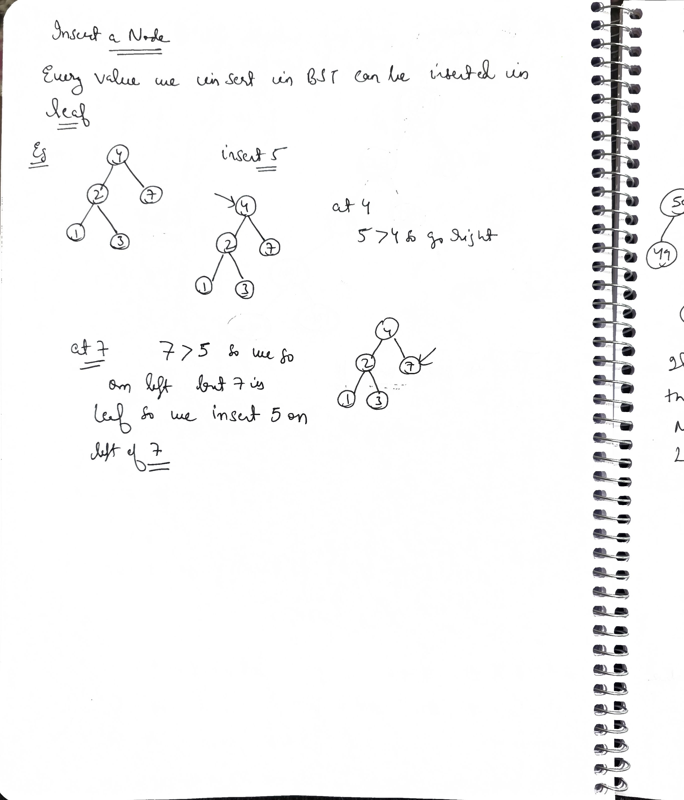
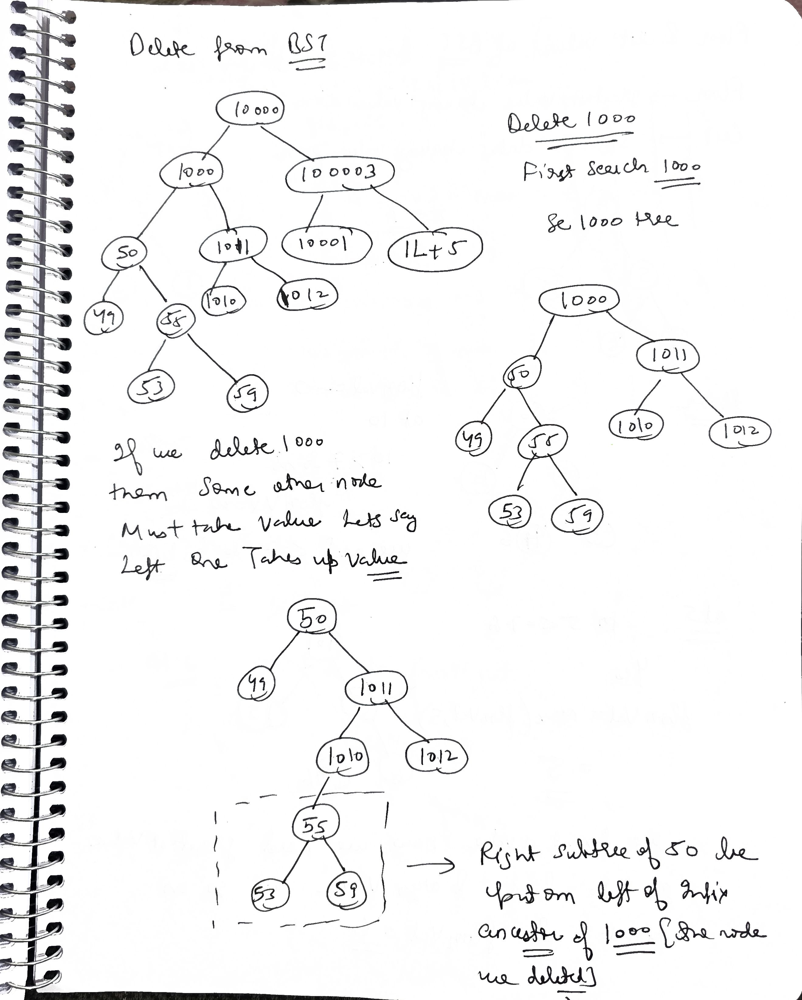
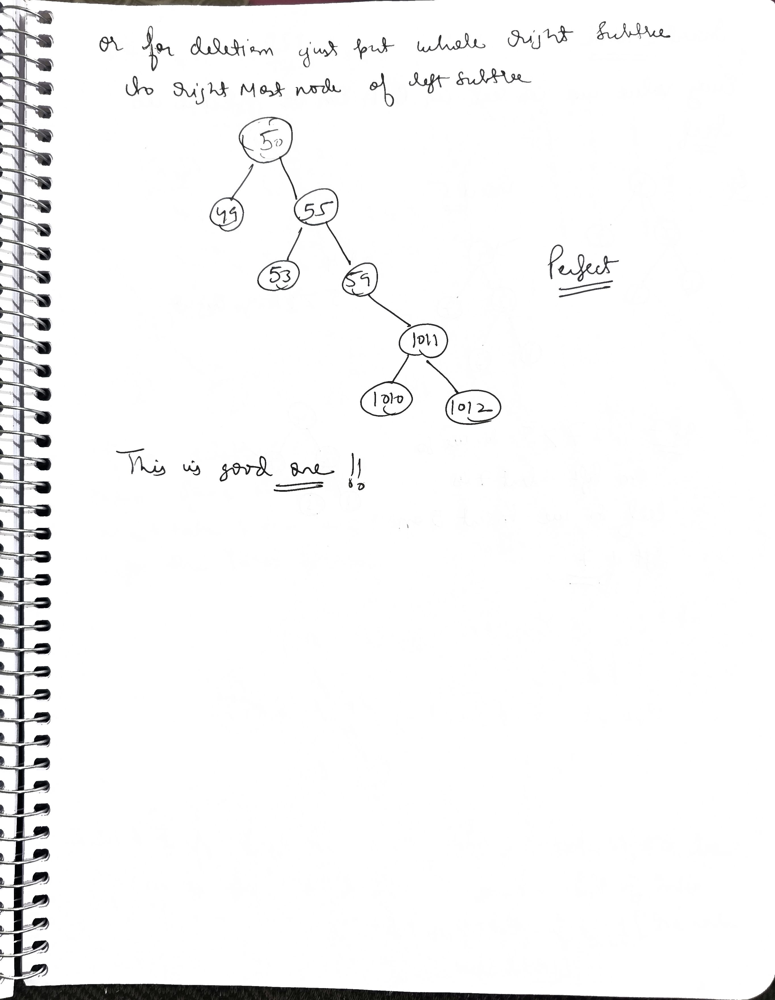
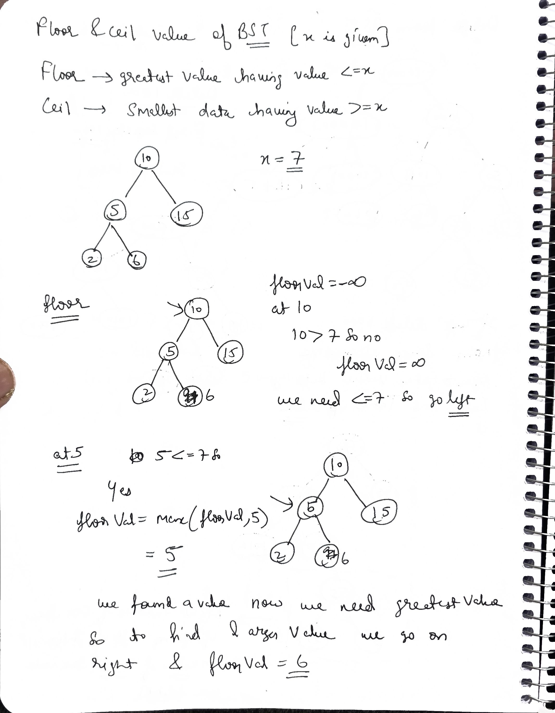
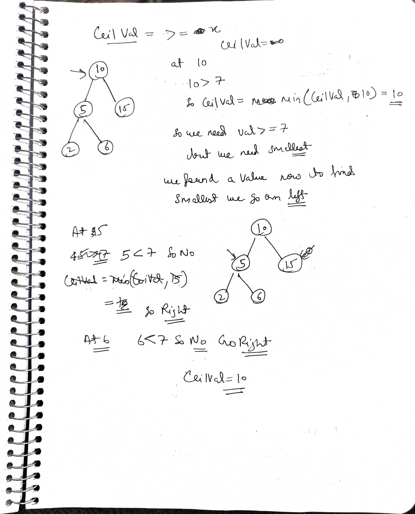

# Notes

# Q1 Add a node to BST


## My code 1

```cpp
/**
 * Definition for a binary tree node.
 * struct TreeNode {
 *     int data;
 *     TreeNode *left;
 *     TreeNode *right;
 *      TreeNode(int val) : data(val) , left(nullptr) , right(nullptr) {}
 * };
 **/

class Solution {
public:
    TreeNode* insertIntoBST(TreeNode* root, int val) {
        if(root==nullptr) return root;
        if(root->left==nullptr && root->right==nullptr){
            if(val>root->data) root->right=new TreeNode(val);
            else root->left=new TreeNode(val);
            return root;
        }
        if(root->right==nullptr && val>root->data){
            root->right=new TreeNode(val);
            return root;
        }
        
        if(root->left==nullptr && val<root->data){
            root->left=new TreeNode(val);
            return root;
        }
        if(val>root->data) insertIntoBST(root->right,val);
        else insertIntoBST(root->left,val);
        return root;
    }
};
```
## Perfect code

```cpp
/**
 * Definition for a binary tree node.
 * struct TreeNode {
 *     int data;
 *     TreeNode *left;
 *     TreeNode *right;
 *      TreeNode(int val) : data(val) , left(nullptr) , right(nullptr) {}
 * };
 **/

class Solution {
public:
    TreeNode* insertIntoBST(TreeNode* root, int val) {
// 1. Base Case: We reached the correct insertion point
        if (root == nullptr) {
            return new TreeNode(val);
        }

        // 2. Navigation: Choose left or right
        if (val > root->data) {
            // Re-assign right child to catch the newly created node
            root->right = insertIntoBST(root->right, val);
        } else {
            // Re-assign left child to catch the newly created node
            root->left = insertIntoBST(root->left, val);
        }

        // 3. Return: Return the original root back up the stack
        return root;
    }
};
```
# Q2 Deletion of node in BST 
 
 
  
 Ai given idea i just written code

```cpp
/**
 * Definition for a binary tree node.
 * struct TreeNode {
 *     int data;
 *     TreeNode *left;
 *     TreeNode *right;
 *      TreeNode(int val) : data(val) , left(nullptr) , right(nullptr) {}
 * };
 **/

class Solution {
public:
    TreeNode* deleteNode(TreeNode* root, int key) {
        if(root==nullptr) return root;
        if(root->data==key){
            if(root->left==nullptr) return root->right;
            if(root->right==nullptr) return root->left;
            TreeNode *leftnode=root->left;
            TreeNode *rnode=root->right;
            TreeNode * lnode=leftnode;
            while(lnode->right!=nullptr){
                lnode=lnode->right;
            }
            lnode->right=rnode;
            return leftnode;
        }
        if(key>root->data) root->right=deleteNode(root->right,key);
        else root->left=deleteNode(root->left,key);
        return root;
    }
};
```
# Q3 target sum or
# Two sum in BST

### Problem Statement
Given the root of a binary search tree and an integer `k`. Return `true` if there exist two elements in the BST such that their sum is equal to `k` otherwise `false`.

### Examples

**Example 1:**
```text
Input: root = [5, 3, 6, 2, 4, null, 7] , k = 9
Output: true
Explanation: The BST contains multiple pair of nodes that sum up to k.
3 + 6 => 9.
5 + 4 => 9.
2 + 7 => 9.
```

### Constraints
- $1 \leq \text{Number of Nodes} \leq 10^4$
- $-10^4 \leq \text{Node.val} \leq 10^4$
- $-10^5 \leq k \leq 10^5$

Bruteforce be get inorder and then apply 2 sum!!

For next approach see `BST itrator` in 001 notes

So here we use that approach 

My approach 
```cpp
/**
 * Definition for a binary tree node.
 * struct TreeNode {
 *     int data;
 *     TreeNode *left;
 *     TreeNode *right;
 *      TreeNode(int val) : data(val) , left(nullptr) , right(nullptr) {}
 * };
 **/
class BSTIterator {
    stack<TreeNode*> stk1;
    stack<TreeNode*> stk2;

   public:
    BSTIterator(TreeNode* root) {
        TreeNode* curr = root;
        while (curr != nullptr) {
            stk1.push(curr);
            curr = curr->left;
        }
        curr = root;
        while (curr != nullptr) {
            stk2.push(curr);
            curr = curr->right;
        }
    }

    bool hasNext() {
        if (!stk1.empty()) return true;
        return false;
    }
    bool hasPrev() {
        if (!stk2.empty()) return true;
        return false;
    }

    TreeNode * next() {
        if (stk1.empty()) return nullptr;
        TreeNode* node = stk1.top();
        stk1.pop();
        TreeNode* curr = node->right;
        while (curr != nullptr) {
            stk1.push(curr);
            curr = curr->left;
        }
        return node;
    }

    TreeNode * prev() {
        if (stk2.empty()) return nullptr;;
        TreeNode* node = stk2.top();
        stk2.pop();
        TreeNode* curr = node->left;
        while (curr != nullptr) {
            stk2.push(curr);
            curr = curr->right;
        }
        return node;
    }
};
class Solution {
   public:
    bool twoSumBST(TreeNode* root, int k) {
        if(root->left==nullptr && root->right==nullptr) return false;
        BSTIterator it(root);
        TreeNode * v1=it.next();
        TreeNode * v2=it.prev();
        while(v1->data+v2->data!=k){
            if(v1->data +v2->data <k ) v1=it.next();
            else v2=it.prev();
            if(v1==v2) return false;
        }
        return true;
    }
};
```
Approach given 

```cpp
#include <bits/stdc++.h>
using namespace std;

// Definition for a binary tree node.
struct TreeNode {
    int data;
    TreeNode *left;
    TreeNode *right;
    TreeNode(int val) : data(val), left(nullptr), right(nullptr) {}
};

// BST Iterator to iterate in the inorder and reverse inorder manner
class BSTIterator {
    stack<TreeNode*> st;
    bool reverse;
    
    // Helper function to push all left or right nodes
    void pushAll(TreeNode* node) {
        while (node != nullptr) {
            st.push(node);
            node = (reverse) ? node->right : node->left;
        }
    }
    
public:
    BSTIterator(TreeNode* root, bool isReverse) : reverse(isReverse) {
        pushAll(root);
    }
    
    // Check if there are more elements in the BST
    bool hasNext() {
        return !st.empty();
    }
    
    // Get the next element in the inorder or reverse inorder traversal
    int next() {
        TreeNode* node = st.top();
        st.pop();
        if (!reverse) pushAll(node->right);
        else pushAll(node->left);
        return node->data;
    }
};

class Solution {
public:
    bool twoSumBST(TreeNode* root, int k) {
        if (!root) return false;
        
        // Initialize two iterators
        BSTIterator l(root, false); // normal inorder
        BSTIterator r(root, true);  // reverse inorder
        
        int i = l.next();
        int j = r.next();
        
        while (i < j) {
            if (i + j == k) return true;
            else if (i + j < k) i = l.next();
            else j = r.next();
        }
        return false;
    }
};

int main() {
    // Create the tree
    TreeNode* root = new TreeNode(5);
    root->left = new TreeNode(3);
    root->right = new TreeNode(6);
    root->left->left = new TreeNode(2);
    root->left->right = new TreeNode(4);
    root->right->right = new TreeNode(7);

    // Create solution instance
    Solution solution;
    int k = 9;
    
    // Check if there exist two elements in the BST such that their sum is equal to k
    bool result = solution.twoSumBST(root, k);
    cout << (result ? "True" : "False") << endl;
    return 0;
}

```
Me: Compare both

AI :
You are comparing a **"Monolithic"** approach (Solution 1) vs. a **"Modular/Flag-based"** approach (Solution 2).

**Solution 2 is significantly better.** It is the standard, "Senior Engineer" implementation that you would be expected to write in an interview at Google, Meta, or Amazon.

Here is the deep dive into why Solution 1 is dangerous and why Solution 2 is the correct pattern.

### 1. The Critical Crash Risk in Solution 1
Look at your `while` loop in Solution 1:

```cpp
TreeNode * v1 = it.next();
TreeNode * v2 = it.prev();

// DANGER ZONE
while(v1->data + v2->data != k) {  // <--- SEGFAULT WAITING TO HAPPEN
    if(v1->data + v2->data < k) v1 = it.next();
    else v2 = it.prev();
    
    if(v1 == v2) return false; 
}
```
### The Bug
* **The Bug:** If `it.next()` runs out of nodes (or `it.prev()` does), it returns `nullptr`.
* The very next line `while(v1->data ...)` tries to access `data` on a `nullptr`.
* **Result:** Runtime Error (Segmentation Fault).
* Even if logic dictates they should meet, relying on that without a `nullptr` check is bad engineering practice.

### 2. Design Pattern: "Separation of Concerns"
* **Solution 1 (Bad):** You jammed two different logic flows (Forward and Backward) into a single class with two stacks.
    * **Memory Waste:** If I only need a forward iterator, I still carry the code/overhead for the backward stack logic.
    * **Complexity:** The class is harder to read. You have duplicated logic (`curr = curr->left` vs `curr = curr->right`) hardcoded in multiple places.
* **Solution 2 (Good):** It uses a single class `BSTIterator` that behaves differently based on a `reverse` flag.
    * **Reusability:** You create two instances: `l` (Forward) and `r` (Backward).
    * **Cleanliness:** The `pushAll` helper function removes code duplication.

### 3. The "Two Pointer" Logic
* **Solution 1:** uses `TreeNode*` pointers.
    * Comparing `v1 == v2` checks memory addresses. This works, but it's brittle.
* **Solution 2:** uses `int` values (data).
    * It uses `next()` to get the integer directly.
    * It maintains the iterator state internally.
    * The loop `while (i < j)` is standard Two Sum logic and much easier to reason about than pointer comparisons.

### Verdict: Adopt Solution 2
* Solution 2 is the canonical "Next Element" iterator pattern.

### Ai code

```cpp
class BSTIterator {
    stack<TreeNode*> st;
    // 'reverse' = true means we are doing "Right -> Root -> Left" (Decreasing order)
    // 'reverse' = false means we are doing "Left -> Root -> Right" (Increasing order)
    bool reverse; 

public:
    BSTIterator(TreeNode* root, bool isReverse) {
        reverse = isReverse;
        pushAll(root);
    }

    bool hasNext() {
        return !st.empty();
    }

    int next() {
        TreeNode* node = st.top();
        st.pop();
        
        // If we are going forward (!reverse), we went Left, processed Root, now go Right.
        // If we are going backward (reverse), we went Right, processed Root, now go Left.
        if (!reverse) pushAll(node->right);
        else pushAll(node->left);
        
        return node->data;
    }

private:
    void pushAll(TreeNode* node) {
        while (node != nullptr) {
            st.push(node);
            // Logic Flip:
            // If reverse is true, we want biggest first, so we keep going Right.
            // If reverse is false, we want smallest first, so we keep going Left.
            if (reverse) node = node->right;
            else node = node->left;
        }
    }
};

class Solution {
public:
    bool findTarget(TreeNode* root, int k) {
        if (!root) return false;

        // 1. Initialize Left Iterator (Smallest -> Largest)
        BSTIterator l(root, false);
        // 2. Initialize Right Iterator (Largest -> Smallest)
        BSTIterator r(root, true);

        int i = l.next(); // Smallest value
        int j = r.next(); // Largest value

        // 3. Standard Two Sum Loop
        // We compare values (i < j) because BST contains sorted distinct values (usually).
        // Note: If duplicates exist, this logic still holds for sum finding.
        while (i < j) {
            if (i + j == k) return true;
            
            if (i + j < k) {
                // Sum is too small? Need larger number. Move Left Iterator forward.
                if (!l.hasNext()) break; 
                i = l.next();
            } else {
                // Sum is too big? Need smaller number. Move Right Iterator backward.
                if (!r.hasNext()) break;
                j = r.next();
            }
        }
        return false;
    }
};
```
### Interview Tip
When the interviewer asks **"What is the Time and Space Complexity?"**

* **Time:** $O(N)$.
    * *Wait, isn't next() doing a while loop?* Yes, but mostly `next()` is $O(1)$.
    * **Amortized Analysis:** Each node is pushed onto the stack exactly once and popped exactly once. So for $N$ nodes, total operations are $2N$. Average per `next()` is $O(1)$.

* **Space:** $O(H)$ (Height of the tree).
    * We store the path from root to leaf in the stack. $O(\log N)$ for balanced, $O(N)$ for skewed.

 

# Q4 Floor and Ceil in a BST


### **Problem Statement**
Given a binary search tree (BST) and a key, find the **floor** and **ceil** values of that key in the BST.

- **Floor Value:** The largest value in the BST that is smaller than or equal to the key.
- **Ceil Value:** The smallest value in the BST that is greater than or equal to the key.

If either the floor or ceil value does not exist, return -1 for that specific value.

---

### **Example 1**
**Input:** `root = [10, 5, 15, 2, 6]`, `key = 7`  
**Output:** `Floor: 6, Ceil: 10`  
**Explanation:** - The values in the BST are `{2, 5, 6, 10, 15}`.
- The largest value $\le 7$ is 6.
- The smallest value $\ge 7$ is 10.

### **Example 2**
**Input:** `root = [10, 5, 15, 2, 6]`, `key = 1`  
**Output:** `Floor: -1, Ceil: 2`  
**Explanation:** - There is no value $\le 1$ in the BST, so Floor is -1.
- The smallest value $\ge 1$ is 2.

---

### **Constraints**
- The number of nodes in the tree is in the range `[1, 10^5]`.
- `1 <= Node.val <= 10^9`
- `1 <= key <= 10^9`

---

 

Two pass solution
```cpp
/**
 * Definition for a binary tree node.
 * class TreeNode {
 *     int data;
 *     TreeNode *left;
 *     TreeNode *right;
 *      TreeNode(int val) : data(val) , left(nullptr) , right(nullptr) {}
 * };
 **/

class Solution{	
    int floorval=-1;
    int ceilval=1e7+1;
    void getFloor(TreeNode* root,int val){
        if(root==nullptr){
            return;
        }
        if(root->data==val){
            floorval=val;
            return;
        }
        else if(root->data<val){
            floorval=max(floorval,root->data);
            getFloor(root->right,val);
        }else getFloor(root->left,val);
    }
      void getCeil(TreeNode* root,int val){
        if(root==nullptr){
            return;
        }
        if(root->data==val){
            ceilval=val;
            return;
        }
        else if(root->data>val){
            ceilval=min(ceilval,root->data);
            getCeil(root->left,val);
        }else getCeil(root->right,val);
    }
	
	public:
		vector<int> floorCeilOfBST(TreeNode* root,int key){
			getFloor(root,key);
            getCeil(root,key);
			ceilval=(ceilval==1e7+1)?-1:ceilval;
            return {floorval,ceilval};
		}
};
```

One pass solution

```cpp
/**
 * Definition for a binary tree node.
 * class TreeNode {
 *     int data;
 *     TreeNode *left;
 *     TreeNode *right;
 *      TreeNode(int val) : data(val) , left(nullptr) , right(nullptr) {}
 * };
 **/

class Solution{	
    int floorval=-1;
    int ceilval=1e7+1;
      void getCeil(TreeNode* root,int val){
        if(root==nullptr){
            return;
        }
        if(root->data==val){
            ceilval=val;
			floorval=val;
            return;
        }
        else if(root->data>val){
            ceilval=min(ceilval,root->data);
            getCeil(root->left,val);
        }else {
			floorval=max(floorval,root->data);
			getCeil(root->right,val);
		}
    }
	
	public:
		vector<int> floorCeilOfBST(TreeNode* root,int key){
			//getFloor(root,key);
            getCeil(root,key);
			ceilval=(ceilval==1e7+1)?-1:ceilval;
            return {floorval,ceilval};
		}
};
```
# Q5 Inorder Successor and Predecessor in BST


---

### **Problem Statement**
Given a binary search tree (BST) and a key, find the **Inorder Successor** and **Inorder Predecessor** of the given key in the BST.

- **Inorder Predecessor:** The node with the largest value that is strictly smaller than the key.
- **Inorder Successor:** The node with the smallest value that is strictly greater than the key.

If either the predecessor or successor does not exist, return -1 for that specific value.

---

### **Example 1**
**Input:** `root = [10, 5, 15, 2, 6, 12, 20]`, `key = 10`  
**Output:** `Predecessor: 6, Successor: 12`  
**Explanation:** - Inorder traversal: `[2, 5, 6, 10, 12, 15, 20]`
- Node before 10 is 6.
- Node after 10 is 12.

### **Example 2**
**Input:** `root = [10, 5, 15, 2, 6, 12, 20]`, `key = 2`  
**Output:** `Predecessor: -1, Successor: 5`  
**Explanation:** - Inorder traversal: `[2, 5, 6, 10, 12, 15, 20]`
- 2 is the first node, so Predecessor is -1.
- Node after 2 is 5.

---

### **Constraints**
- The number of nodes in the tree is in the range `[1, 10^5]`.
- `1 <= Node.val <= 10^9`
- `1 <= key <= 10^9`

---
Brute--> get inorder get inorder succesor and predecessor

Better--> 3 traversals 

See in morris traversal it is morris predecessor which we use, there we need to go from bottom left to next up!! But here we using general predecessor 

if we have child then normal morris predecessor 

if not then our parent is our predecesoor if we are on right of our parent ,and if we are on left than parent is our succesor

```cpp

/**
 * Definition for a binary tree node.
 * struct TreeNode {
 *     int data;
 *     TreeNode *left;
 *     TreeNode *right;
 *      TreeNode(int val) : data(val) , left(nullptr) , right(nullptr) {}
 * };
 **/

class Solution {
    TreeNode* ancpred = nullptr;
    TreeNode* ancsucc = nullptr;
    TreeNode* inorderPred(TreeNode* node) {
        if (node->left == nullptr) return nullptr;
        TreeNode* curr = node->left;
        while (curr->right != nullptr) curr = curr->right;
        return curr;
    }
    TreeNode* inorderSucc(TreeNode* node) {
        if (node->right == nullptr) return nullptr;
        TreeNode* curr = node->right;
        while (curr->left != nullptr) curr = curr->left;
        return curr;
    }
    TreeNode* find(TreeNode* root, int val) {
        if (root == nullptr) return root;
        if (val == root->data) return root;
        if (val > root->data) {
            ancpred = root;
            return find(root->right, val);
        } else {
            ancsucc = root;
            return find(root->left, val);
        }
    }

   public:
    vector<int> succPredBST(TreeNode* root, int key) {
        TreeNode* node = find(root, key);
        vector<int> res(2, -1);
		if(node==nullptr) return res;
        TreeNode* pred = inorderPred(node);
        TreeNode* succ = inorderSucc(node);
        if (pred != nullptr)
            res[0] = pred->data;
        else if (ancpred != nullptr)
            res[0] = ancpred->data;
        if (succ != nullptr)
            res[1] = succ->data;
        else if (ancsucc != nullptr)
            res[1] = ancsucc->data;
        return res;
    }
};
```


