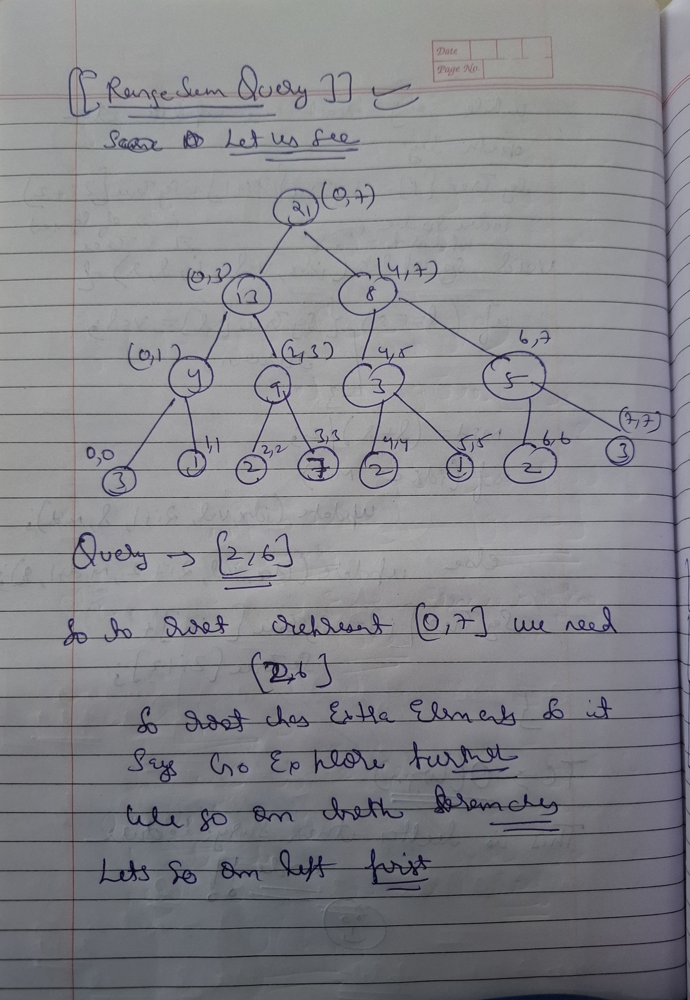
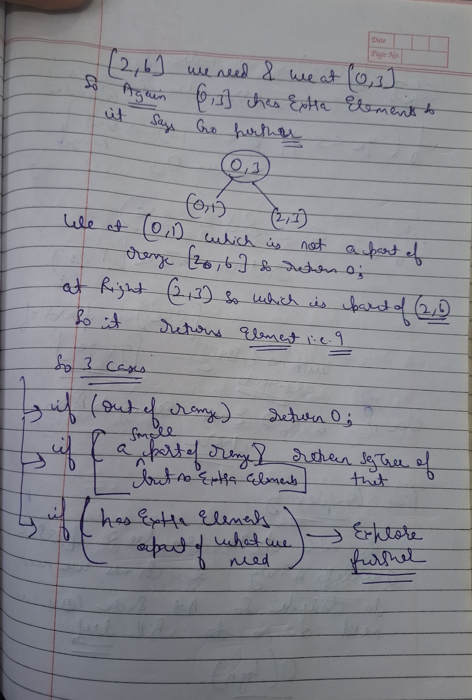
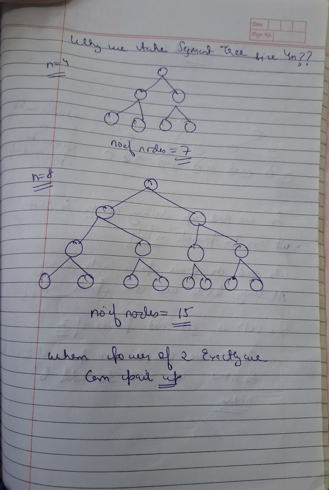
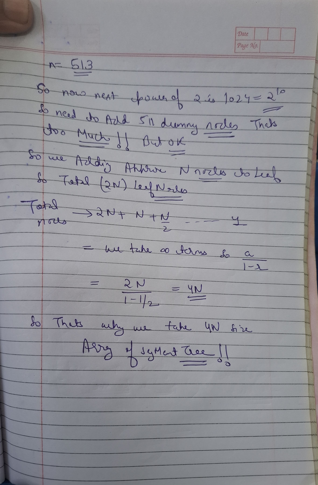

# Notes


 

 

 


```cpp

 void buildTree(vector<int>& nums,int s,int e,int i){

    if(s==e){
        segtree[i]=nums[s];
        return;
    }

    int mid=(s+e)/2;
    buildTree(nums,s,mid,2*i+1);
    buildTree(nums,mid+1,e,2*i+2);

    segtree[i]=segtree[2*i+1]+segtree[2*i+2];

 }
 ```

## Update Query


 

 

```cpp
 void updateTree(int idx,int val,int s,int e,int i){

    if(s==e){
        segtree[i]=val;
        return;
    }
    int mid=(s+e)/2;
    if(idx<=mid) updateTree(idx,val,s,mid,2*i+1);
    else updateTree(idx,val,mid+1,e,2*i+2);

    segtree[i]=segtree[2*i+1]+segtree[2*i+2];
 }

```

## GetValue


  


```cpp
int getSum(int l,int r,int s,int e,int i){

    if(r<s || e<l) return 0;

    if(l<=s && e<=r) return segtree[i];

    int mid=(s+e)/2;

    return getSum(l,r,s,mid,2*i+1)+getSum(l,r,mid+1,e,2*i+2);
}
```

## Why we take 4*n as size of tree??


  


  


